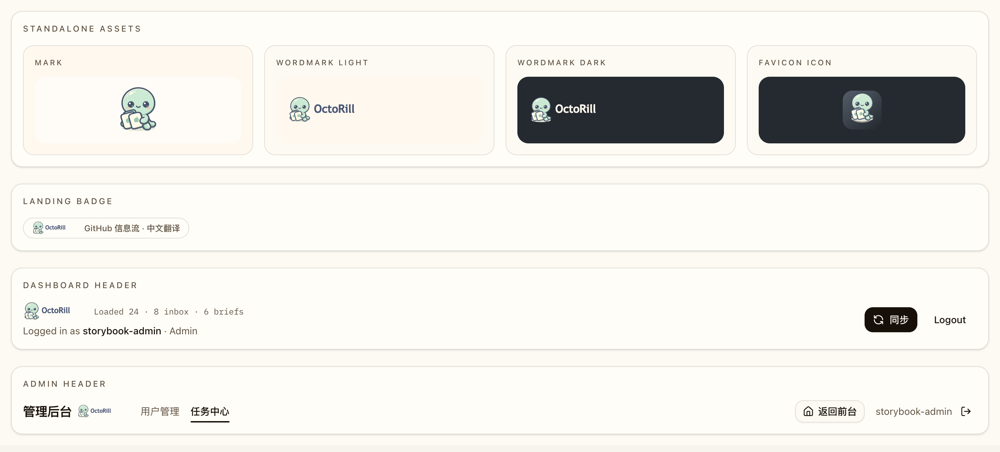
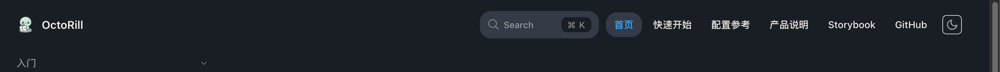
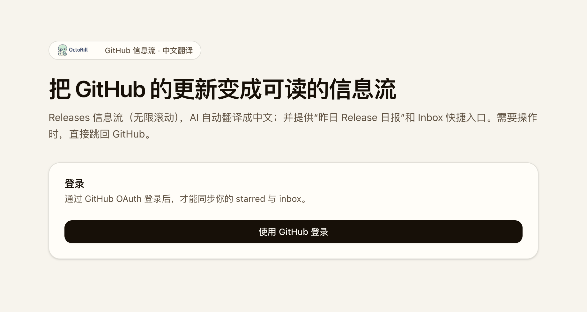

# OctoRill 品牌刷新：生成图接管 favicon / Web / Docs（#tvujt）

## 状态

- Status: 已完成
- Created: 2026-04-06
- Last: 2026-04-06

## 背景 / 问题陈述

- `origin/main` 当前仍缺少正式品牌资产链路：Web 继续使用 Vite 默认 favicon，README 只显示纯文本标题，docs-site 导航也未接入项目品牌图标。
- 主人已经确认一张更可爱的生成图作为新的品牌方向，但该图只是单张 PNG 参考图，不能直接承担 Web、文档站和 README 的长期运行时接入。
- 本次需要把这张最新生成图沉淀为仓库内可导出的主源资产，并统一替换 favicon、站点 Logo、文档 Logo 与公开露出面。

## 目标 / 非目标

### Goals

- 把主人确认的最新生成图归档到仓库内参考路径，并作为本轮品牌刷新视觉真相源。
- 交付 `mark`、`wordmark-light`、`wordmark-dark`、`app-icon-1024`、`favicon` 等正式资产，并保持 Web / docs-site 的消费路径稳定。
- 在 Web Landing、DashboardHeader、AdminHeader、README 与 docs-site 导航统一接入新的品牌家族。
- 补齐 Storybook 品牌展示面与 owner-facing 视觉证据，支撑后续 PR 验收。

### Non-goals

- 不扩展到 OG 图、社媒头像、启动图等额外渠道资产。
- 不调整产品命名、导航 IA 或业务文案。
- 不依赖外链图片作为运行时资源。

## 范围（Scope）

### In scope

- `brand/source/reference/` 中的新品牌参考图归档。
- `scripts/render_brand_assets.py` 导出链路与 `brand/exports/*` 正式品牌资产。
- `web/public/*`、`docs-site/docs/public/*` 的品牌副本与 favicon。
- `web` 中的 `BrandLogo` 组件、Landing / DashboardHeader / AdminHeader 品牌露出。
- `docs-site/rspress.config.ts` 与 `README.md` 顶部品牌接入。
- `docs/specs/tvujt-brand-generated-icon-refresh/assets/` 下的视觉证据。

### Out of scope

- 产品功能逻辑、接口、数据结构与权限模型改动。
- 任何外链热引用。
- 重新设计第二套独立吉祥物或新品牌命名。

## 需求（Requirements）

### MUST

- 必须归档最新生成图到仓库内，并由本地脚本派生所有 ship 资产。
- 必须交付 `brand/exports/mark.svg`、`brand/exports/wordmark-light.svg`、`brand/exports/wordmark-dark.svg`、`brand/exports/app-icon-1024.png`、`brand/exports/favicon.svg`、`brand/exports/favicon.ico`。
- Web、docs-site 与 README 必须停止使用默认图标 / 纯文本品牌露出，改用统一品牌家族。
- Storybook 必须提供稳定的品牌预览面，用于截图与后续回归。

### SHOULD

- app icon / favicon 保持圆角图标感，小尺寸仍能看出“小章鱼抱卡片”主题。
- 站点 Logo 与文档 Logo 维持透明主标 + 字标的分层策略，便于深浅色环境复用。

## 功能与行为规格（Functional/Behavior Spec）

### Core flows

- 开发者维护 `brand/source/reference/generated-brand-refresh-reference.png` 作为最新批准参考图，`scripts/render_brand_assets.py` 负责统一导出主标、字标、app icon、favicon 与 public 副本。
- Web 通过共享 `BrandLogo` 组件消费 `/brand/mark.svg` 与 `/brand/wordmark-*.svg`，在 Landing、DashboardHeader、AdminHeader 展示统一品牌。
- docs-site 通过 `logo + logoText + icon` 接入新的品牌图标与 favicon。
- README 顶部通过 light/dark 双字标显示品牌，确保 GitHub 深浅色主题都可读。

### Edge cases / errors

- favicon 若直接缩小后识别度不足，允许保留圆角底板并放大吉祥物占比，但不能偏离“小章鱼抱卡片”主题。
- 若深色背景下字标对比度不足，必须用 `wordmark-dark.svg` 提供独立浅色文字版本，而不是依赖 CSS 反色。

## 验收标准（Acceptance Criteria）

- Given 检查 `brand/exports/`，When 导出脚本执行完成，Then 至少存在 `mark.svg`、`wordmark-light.svg`、`wordmark-dark.svg`、`app-icon-1024.png`、`favicon.svg`、`favicon.ico`，且都来自仓库内参考图派生。
- Given 打开 Web 站点与 Storybook，When 查看 Landing、DashboardHeader、AdminHeader 和品牌 stories，Then 顶部品牌位与 favicon 都显示新的小章鱼抱卡片形象。
- Given 打开 docs-site，When 查看顶部导航与浏览器标签页，Then 导航品牌图标与 favicon 已切换为新的品牌资产。
- Given 在 GitHub 风格环境查看 `README.md`，When 切换 light/dark 模式，Then 顶部字标都能正确显示且不失真。
- Given 查看 16px / 32px favicon 预览，When 在浏览器标签页与导出文件中检查，Then 仍能辨认圆角图标里的小章鱼与卡片主题。

## 非功能性验收 / 质量门槛（Quality Gates）

### Testing

- `python3 scripts/render_brand_assets.py`
- `cd web && bun run build`
- `cd web && bun run storybook:build`
- `cd docs-site && DOCS_BASE=/octo-rill/ bun run build`

### UI / Storybook

- `web/src/stories/BrandLogo.stories.tsx` 必须提供独立资产和品牌露出 gallery。
- 视觉证据至少覆盖：品牌 gallery、Web Landing/Header 露出、docs-site navbar 露出。

## 文档更新（Docs to Update）

- `README.md`
- `docs-site/rspress.config.ts`
- `docs/specs/README.md`

## Visual Evidence

Storybook brand gallery：展示 mark、wordmark、favicon icon 与主要品牌露出面。

Docs-site navbar：展示文档导航品牌图标与标签页 favicon。

Web landing：展示 Landing 顶部 badge 与新 favicon 露出。

## 资产晋升（Asset promotion）

| Asset | Plan source (path) | Used by (runtime/test/docs) | Promote method (copy/derive/export) | Target (project path) | References to update | Notes |
| --- | --- | --- | --- | --- | --- | --- |
| 新品牌参考图 | `brand/source/reference/generated-brand-refresh-reference.png` | docs/render | copy | `brand/source/reference/generated-brand-refresh-reference.png` | 本 spec / render script | 主人确认的最新生成图，只作参考与派生源 |
| 正式品牌导出物 | `brand/exports/*` | runtime/docs | export | `brand/exports/*` | README / public copies | Web、docs-site、README 使用的正式资产 |
| Web public 品牌副本 | `brand/exports/*` | runtime | copy | `web/public/brand/*`, `web/public/favicon.*` | `web/index.html`, `BrandLogo` | 供 Vite / Storybook 消费 |
| docs-site public 品牌副本 | `brand/exports/*` | docs | copy | `docs-site/docs/public/brand/*`, `docs-site/docs/public/favicon.*` | `docs-site/rspress.config.ts` | 供 Rspress 消费 |

## 实现里程碑（Milestones / Delivery checklist）

- [x] M1: 归档新参考图并完成新的品牌导出链路。
- [x] M2: Web、docs-site 与 README 全部接入新的品牌家族。
- [x] M3: Storybook 与本地视觉证据刷新完成。

## 风险 / 假设

- 风险：生成图本身带有模糊背景与文字，需要在导出脚本里只提取吉祥物主视觉，避免把冗余背景带进 Logo。
- 假设：当前主人确认的“更可爱小章鱼抱卡片”形象就是本轮正式品牌方向。
