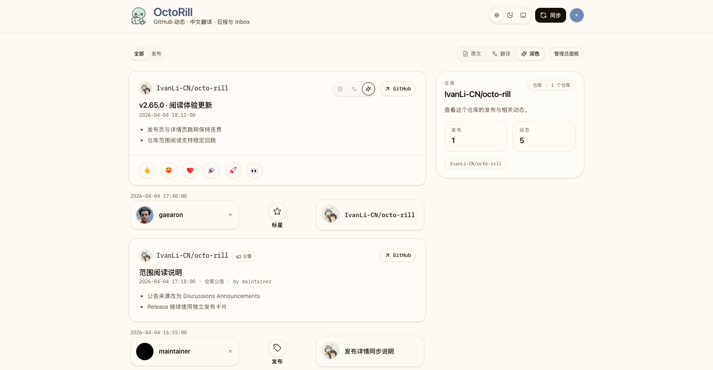
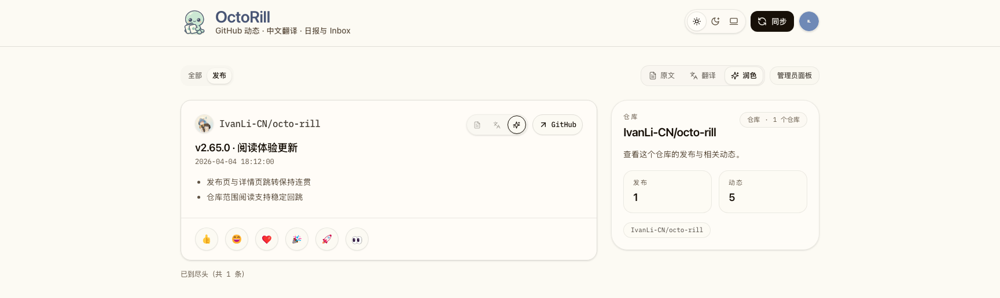
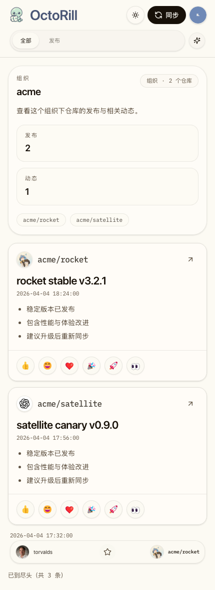
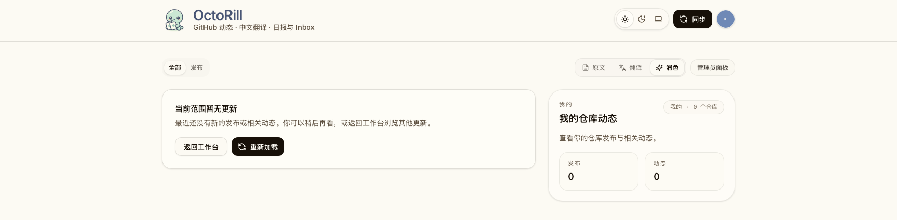
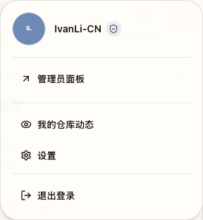

# Authenticated Scoped Focus Feed（#u1f6v）

## 背景 / 问题陈述

- 当前 Dashboard 只有全局工作台语义：用户可以在 `全部 / 发布 / 加星 / 关注 / 日报 / 收件箱` 之间切换，但没有一个专门聚焦单仓、多个仓库或单个组织的只读阅读页。
- feed 卡片已经能展示 repo identity，但点击后仍主要依赖 GitHub 外链，无法在站内快速切到“只看这个仓库/这组仓库”的上下文。
- 已有的 URL、release detail round-trip、warm startup 和 dashboard updates 都是按全局阅读面设计；如果直接拼一个新页面，容易出现返回上下文丢失、缓存串 scope、轮询提示串 scope 的问题。
- `#2x7av` 已经冻结了 Dashboard 顶部 tab 路径化与 release detail deep link 基础契约，`#w5gaz` 已经定义了“我的发布”背后的 owner baseline 语义；本轮需要在它们之上新增一个独立的 scoped 阅读主题，而不是回写旧 spec 边界。

## Goals

- 新增一个认证后可访问的 scoped 阅读面，支持 `repo`、`repos`、`org`、`mine` 四类 scope。
- 新阅读面复用现有 Dashboard shell、同步入口、lane selector 与 release detail surface，但顶部 tabs 只保留 `全部 / 发布`。
- scoped `全部` 只展示当前 scope 命中的 release 与带 repo 归属的社交项；`follower_received` 这类无 repo 归属项不进入新页。
- 让 route state、release detail close/restore、warm snapshot 与 dashboard updates 全部 scope-aware，避免不同 scope 串缓存或串提示。
- 所有带 repo identity 的 feed 卡片都提供一致的站内 focus 入口；账号菜单在“我的发布”开启时提供“我的仓库动态”快捷入口。

## Non-goals

- 不改变主 Dashboard 的 6 个全局 tabs、全局 Inbox 右栏或其语义。
- 不新增页内可编辑过滤器、saved views、scope 管理器或 query builder。
- 不把 org scope 扩展到当前可见仓库集合之外。
- 不新增第二套“我的仓库”判定逻辑；`mine` 必须严格复用 `#w5gaz` 的 owner baseline / `includeOwnReleases` 语义。

## 范围

### In scope

- `web/src/dashboard/routeState.ts`
- `web/src/pages/Dashboard.tsx`
- `web/src/pages/DashboardHeader.tsx`
- `web/src/pages/DashboardControlBand.tsx`
- `web/src/feed/useFeed.ts`
- `web/src/feed/FeedItemCard.tsx`
- `web/src/dashboard/useDashboardLiveUpdates.ts`
- `web/src/routes/focus/**`
- `web/src/auth/startupCache.ts`
- `src/api.rs`
- `web/src/stories/Dashboard.stories.tsx`
- `docs/specs/README.md`

### Out of scope

- Admin / Landing / Public release 页面
- GitHub 社交模型定义
- 全局 Inbox 数据结构或 `/api/notifications`

## 路由与 URL 契约

### Scoped routes

- 单仓：
  - `/focus/repo/:owner/:repo`
  - `/focus/repo/:owner/:repo/releases`
- 多仓：
  - `/focus/repos?items=ownerA/repoA,ownerB/repoB`
  - `/focus/repos/releases?items=ownerA/repoA,ownerB/repoB`
- 组织：
  - `/focus/org/:org`
  - `/focus/org/:org/releases`
- 我的：
  - `/focus/mine`
  - `/focus/mine/releases`

### Canonicalization

- scoped 页面内部 tab 只允许 `all | releases`。
- `repo` / `repos` / `org` / `mine` 进入 release detail 时，detail query 必须额外携带：
  - `scope`
  - 必要时的 `items`
  - 必要时的 `org`
  - `from`
- 关闭 release detail 后，必须回到原 scoped path 与原 scoped tab，而不是退回全局 Dashboard。

## 功能与行为规格

### Scoped shell

- scoped 页面沿用现有 authenticated Dashboard shell。
- 桌面端右侧不再显示全局 Inbox quick list，而是显示当前 scope 摘要卡。
- 移动端在 feed 顶部展示同等摘要信息。
- lane selector 继续复用 `全部 / 发布` 两个 feed-backed tab 的现有行为。

### Scoped `全部`

- 只允许出现：
  - `release`
  - `repo_star_received`
  - `announcement`
  - `release_update`
  - `repo_forked`
- 不允许出现：
  - `follower_received`
  - 任何没有 `repo_full_name` 且无法归属到当前 scope 的社交项

### Scope semantics

- `repo`：只匹配当前用户可见集合里该 `owner/repo`。
- `repos`：只匹配 `items` 指定的去重后仓库集合；最多 12 项；空集合不是 404，而是空范围。
- `org`：只匹配当前可见集合里 `owner_login == org` 的仓库。
- `mine`：复用 `includeOwnReleases` 背后的 owner baseline 语义；若开关关闭或当前无命中仓库，页面仍可访问，但为空态。

### Entry behavior

- Release 卡片 repo identity 区域点击后进入对应 repo focus 页。
- 所有带 `repo_full_name` 的社交卡片 repo identity / repo 目标段点击后进入对应 repo focus 页。
- GitHub 外链按钮保持原行为，不改成站内跳转。
- 账号菜单仅在 `include_own_releases = true` 时显示“我的仓库动态”，入口落到 `/focus/mine`。

### Empty state

- 合法 scope 无命中时返回 200 页面，展示当前范围说明与返回主工作台入口。
- 空态需要明确提示：该页只保留当前范围内的发布与带仓库归属的动态。

## 后端与数据契约

### `GET /api/feed`

- 接受统一 scope query：
  - `scope=repo|repos|org|mine`
  - `items`（repo / repos 需要）
  - `org`（org 需要）
- scoped 请求时：
  - release 读取必须基于 `user_release_visible_repos` 再做 scope 过滤
  - repo-bearing 社交项也必须先受当前可见 repo 集合约束，再做 scope 过滤
  - `followers` 在 scoped 模式下必须被排除

### `GET /api/dashboard/updates`

- 接受与 `/api/feed` 相同的 scope query。
- baseline token / changed detection 必须包含 scope signature，避免不同 scope 共用同一条更新基线。

### Warm startup / session cache

- Dashboard warm snapshot 与 in-memory session state 必须包含 scope signature。
- 不同 scope 间不得互相复用：
  - feed items
  - selected brief
  - sidebar bootstrap 完成态
  - updates baseline

## 验收标准

- Given 用户访问 `/focus/repo/owner/repo`
  When 页面加载完成
  Then 只显示该仓库命中的发布与带 repo 归属的动态，且右侧显示 repo 摘要而不是全局 Inbox。

- Given 用户从 scoped 页面打开 release detail
  When 关闭 detail
  Then 页面返回原 scoped path 与原 tab。

- Given 用户点击任一带 repo identity 的 release/social 卡片区域
  When 触发站内导航
  Then 进入对应 repo focus 页面，而 GitHub 外链按钮仍打开 GitHub。

- Given 用户访问 `/focus/mine`
  When `include_own_releases` 未开启
  Then 页面仍可访问，但显示 scoped empty state，不回退到全局 Dashboard。

- Given 多个 scope 页面先后访问
  When 页面 warm start 或 updates 轮询命中
  Then 不会出现跨 scope 的旧 feed、旧 summary 或错误的新内容提示。

## 非功能性验收 / 质量门槛

### Testing

- `cargo test`
- `cd web && bun run lint`
- `cd web && bun run build`
- `cd web && bun run storybook:build`
- `cd web && bun run e2e -- dashboard-scoped-focus.spec.ts settings.spec.ts release-detail.spec.ts`

### Storybook / Visual

- scoped 视觉证据路线锁定为 Storybook page/app-shell fallback。
- 至少覆盖：
  - scoped `全部`
  - scoped `发布`
  - 桌面 summary sidebar
  - 移动端 summary
  - scoped empty state
  - “我的仓库动态”入口显示 / 隐藏

## Visual Evidence

- source_type: `storybook_canvas`
  story_id_or_title: `pages-dashboard--scoped-focus-repo-all`
  scenario: `scoped repo all`
  evidence_note: 证明聚焦页桌面态只保留 `全部 / 发布`，右侧改为 scope 摘要卡，不再显示全局 Inbox。
  

- source_type: `storybook_canvas`
  story_id_or_title: `pages-dashboard--scoped-focus-repo-releases`
  scenario: `scoped repo releases`
  evidence_note: 证明 repo identity 在 `发布` 视图下保留 `/releases` 子页语义，且 scoped 页面只展示 release 项。
  

- source_type: `storybook_canvas`
  story_id_or_title: `pages-dashboard--scoped-focus-mobile-summary`
  scenario: `mobile summary`
  evidence_note: 证明移动端把 scope 摘要前置到 feed 顶部，而不是依赖桌面右侧栏。
  

- source_type: `storybook_canvas`
  story_id_or_title: `pages-dashboard--scoped-focus-empty-state`
  scenario: `scoped empty state`
  evidence_note: 证明合法但无命中的 `mine` scope 仍保持页面可访问，并展示范围说明与返回主工作台入口。
  

- source_type: `storybook_canvas`
  story_id_or_title: `pages-dashboard--scoped-focus-mine-menu-entry-visible`
  scenario: `mine menu entry visible`
  evidence_note: 证明“我的发布”开启后，账号菜单会出现“我的仓库动态”入口并落到 `/focus/mine`。
  

## 方案概述

- 继续以 `DashboardRouteState` 作为唯一前端阅读真相源，只扩展 `scope`，不再造第二套路由状态。
- 后端通过统一 `FeedScope` 与 `user_release_visible_repos` 做“先可见、后 scope”的过滤收口，避免不同 feed 分支各自发明规则。
- 新 focus 页面只是现有 Dashboard shell 的 scoped 变体：tabs 缩成两项、侧栏换成 summary、entries 指向 scoped route。

## 风险 / 假设

- 风险：若后续再增加新的 repo-bearing 社交类型，但没有同步加入 scoped `全部` allowlist，可能出现 scoped 页面漏项。
- 风险：多 scope warm/session 复用如果遗漏任何 key，会出现“页面打开正确但提示串 scope”的软错误。
- 假设：当前可见 repo 集合已经能稳定承载 `repo / repos / org / mine` 的过滤基底，不需要新增第二张权限表。

## References

- `docs/specs/2x7av-dashboard-tab-path-release-deep-link/SPEC.md`
- `docs/specs/w5gaz-owned-release-opt-in/SPEC.md`
- `docs/specs/r7q4d-dashboard-quasi-realtime-updates/SPEC.md`
