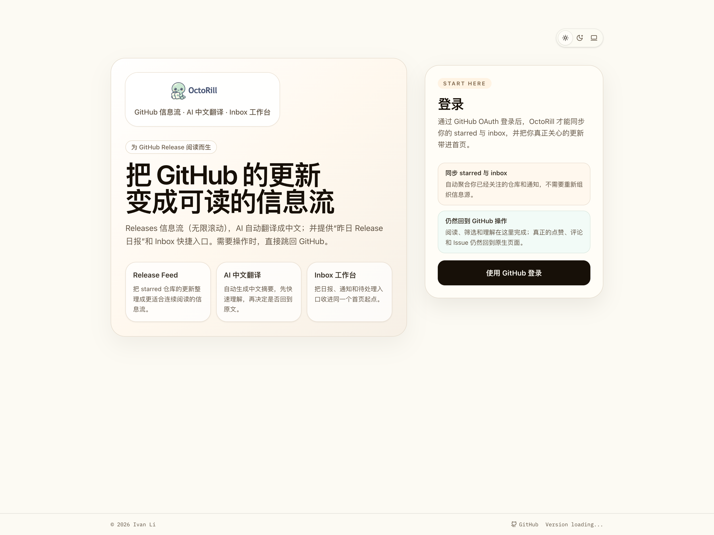
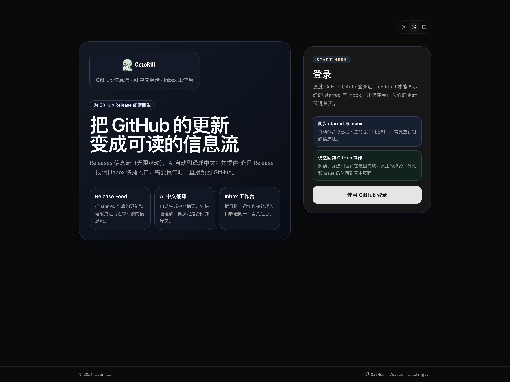
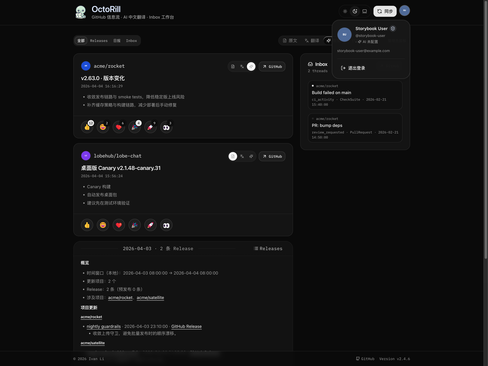
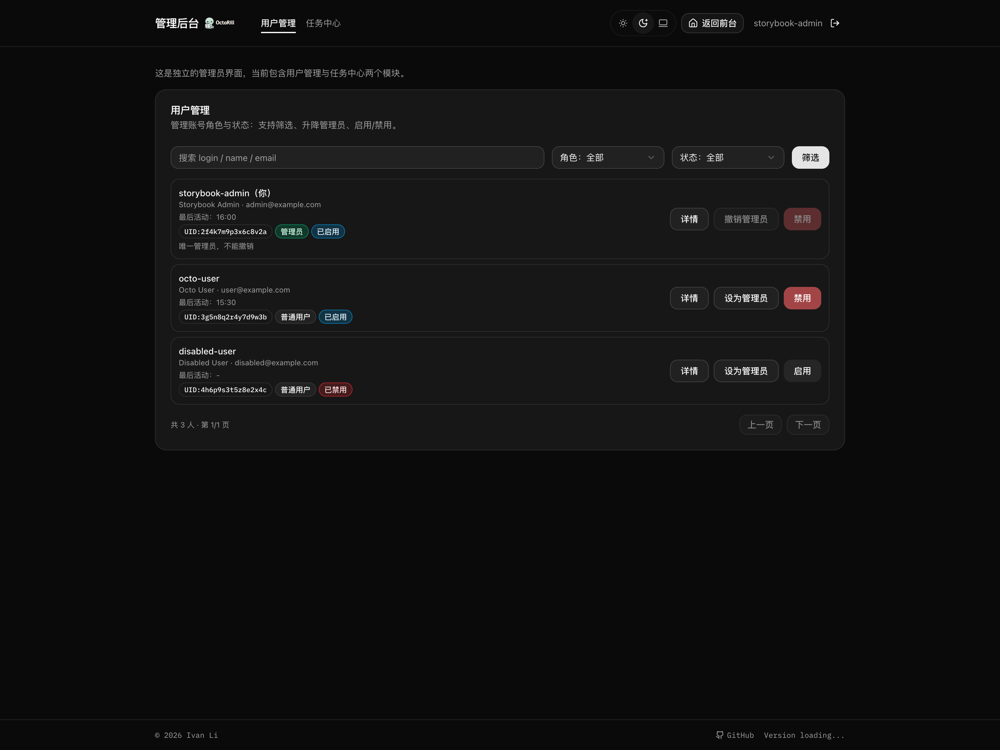

# Web 暗色模式接通（#u6b32）

## 背景 / 问题陈述

- 当前 Web 应用已经铺设了不少 `dark:` 样式与 `.dark` token，但缺少真正的主题状态源、根节点切换与用户入口。
- `BrandLogo(theme="auto")` 仍直接依赖 `prefers-color-scheme`，无法跟随应用内手动主题切换。
- Landing 仍保留多处浅色硬编码表面，导致即便根节点切到暗色，关键首屏仍然不完整。

## 目标 / 非目标

### Goals

- 为 `Landing / Dashboard / Admin` 接通真正可用的 Light / Dark / System 三态主题。
- 在 React 挂载前完成首屏主题解析，避免暗色系统下出现“先亮后暗”的闪烁。
- 提供共享 `ThemeProvider / useTheme / ThemeToggle`，并让主题偏好仅保存在浏览器本地。
- 让 Storybook 支持稳定的 light/dark/system 审阅与视觉证据输出。

### Non-goals

- 不实现服务端或账号级主题同步。
- 不把 `docs-site` 的运行时主题行为纳入本次交付。
- 不顺带做与暗色模式无关的全站视觉重设计。

## 范围（Scope）

### In scope

- `web/index.html` 与 `web/src/main.tsx` 的主题初始化与 Provider 接入。
- `BrandLogo` 自动主题逻辑、共享页头主题入口、Landing/Notice 等关键浅色硬编码面的暗色适配。
- Storybook 预览层主题工具栏、关键 stories/state gallery、主题交互覆盖。
- Playwright / build / storybook build / review-loop / spec visual evidence。

### Out of scope

- 后端接口、数据库或用户设置表。
- `docs-site` 独立主题切换入口。
- 任何需要新的设计体系或品牌换肤的改造。

## 需求（Requirements）

### MUST

- 提供 `ThemePreference = "system" | "light" | "dark"` 与 `ResolvedTheme = "light" | "dark"`。
- 首屏必须在 React 挂载前按偏好解析并同步 `.dark` 与 `color-scheme`。
- 提供唯一全局主题入口，覆盖登录前后全部 Web 页面。
- `BrandLogo(theme="auto")` 必须跟随应用已解析主题，而不是仅依赖原生 `prefers-color-scheme`。
- Landing、Dashboard、Admin、共享 notice/footer/header 在暗色下必须保持可读与可辨识层级。

### SHOULD

- Storybook 通过全局 toolbar 支持 light / dark / system 快速切换。
- 主题切换交互在 stories 与 e2e 中都要有稳定覆盖。

### COULD

- 为主题相关 stories 提供更适合视觉审阅的 gallery 状态面。

## 功能与行为规格（Functional/Behavior Spec）

### Core flows

- 初次进入页面时，若本地没有显式偏好，应用按系统颜色方案解析主题，并在首屏绘制前写入根节点状态。
- 用户可通过各关键页面页头中的统一主题入口切换为浅色、深色或跟随系统；显式偏好写入浏览器本地，刷新后保持一致。
- 当偏好为 `system` 时，应用需响应系统颜色方案变化；当偏好为 `light` / `dark` 时，不受系统变化影响。
- Storybook 需能用稳定方式切换主题，并让关键页面/壳层在 docs 或 gallery 中可直接审阅。

### Edge cases / errors

- 本地存储中的非法主题值必须回退到 `system`，不能让页面进入未知状态。
- 在没有 Provider 的受控环境（如极少数静态渲染入口）下，主题相关组件至少要安全降级，不得崩溃。
- 主题切换不应破坏现有版本轮询 notice、footer 版本文案与导航交互。

## 接口契约（Interfaces & Contracts）

### 接口清单（Inventory）

| 接口（Name） | 类型（Kind） | 范围（Scope） | 变更（Change） | 契约文档（Contract Doc） | 负责人（Owner） | 使用方（Consumers） | 备注（Notes） |
| --- | --- | --- | --- | --- | --- | --- | --- |
| `ThemeProvider / useTheme` | internal UI API | internal | New | None | web | shared layout/pages/stories | 主题状态源 |
| `ThemeToggle` | internal UI component | internal | New | None | web | page headers / stories | 唯一共享入口 |
| `BrandLogo(theme="auto")` | internal component contract | internal | Modify | None | web | landing/header/admin/storybook | 跟随已解析主题 |

## 验收标准（Acceptance Criteria）

- Given 浏览器系统颜色方案为 dark，When 用户首次打开页面且本地无显式偏好，Then 根节点在 React 挂载前即带有正确暗色状态，且页面不出现明显闪烁。
- Given 用户在 Landing、Dashboard 或 Admin 的页头中切换为 `浅色`、`深色` 或 `跟随系统`，When 当前页更新并刷新，Then 主题表现与用户选择一致。
- Given 用户选择 `跟随系统`，When 系统颜色方案发生变化，Then 页面主题会同步变化。
- Given `BrandLogo` 使用 `theme="auto"`，When 应用主题在浅色和深色之间切换，Then 字标资源与当前应用主题保持一致。
- Given 在 Storybook 中查看 Landing、Dashboard Header、App Shell / Footer，When 切换 light/dark/system，Then 审阅面可稳定复现，并能产出最终视觉证据。

## 实现前置条件（Definition of Ready / Preconditions）

- 主题三态行为与本地持久化策略已冻结。
- 全局唯一主题入口样式固定为页头中的共享主题胶囊，并覆盖登录前后关键 Web 页面。
- `docs-site` 不纳入本次运行时主题范围。

## 非功能性验收 / 质量门槛（Quality Gates）

### Testing

- E2E tests: 覆盖初次跟随系统、主题切换、本地持久化、`system` 模式响应系统变化。

### UI / Storybook (if applicable)

- Stories to add/update: Landing、Dashboard Header、Admin Header、必要的主题组件 stories。
- Docs pages / state galleries to add/update: Landing / dashboard / admin 页头主题入口与关键页面内容的稳定审阅面。
- `play` / interaction coverage to add/update: 主题切换交互与关键页面可见性。

### Quality checks

- `cargo test`
- `cd web && npm run build`
- `cd web && npm run storybook:build`
- `cd web && npx playwright test web/e2e/theme-mode.spec.ts`

## Visual Evidence

Landing（浅色）：验证公开入口页的 hero、登录卡片与页头主题胶囊在 light 下的最终表现。

Landing（深色）：验证公开入口页在 dark 下的层级、对比度与页头主题入口样式。

Dashboard（深色）：验证已登录主界面的页头主题胶囊、主内容区与侧栏在 dark 下的整体观感。

Admin Panel（深色）：验证管理后台页头中的主题胶囊、导航与用户表格在 dark 下的整体表现。

## 方案概述（Approach, high-level）

- 以共享主题状态源收口页面主题判断，避免多入口与裸 `prefers-color-scheme` 分叉。
- 优先复用现有 `dark:` token 与语义色，只对仍写死浅色的区域做最小必要重绘。
- 以 Storybook 作为主要视觉验收面，避免临时浏览器页面成为唯一证据来源。

## 风险 / 开放问题 / 假设（Risks, Open Questions, Assumptions）

- 风险：Landing 现有品牌渐变与浅色卡片较多，暗色适配若仅靠简单反色容易丢失层级。
- 风险：主题初始化若与 Storybook/本地存储处理不一致，容易导致 stories 与真实页面表现漂移。
- 需要决策的问题：None
- 假设（需主人确认）：None

## 参考（References）

- `web/src/index.css`
- `web/src/pages/Landing.tsx`
- `web/src/layout/AppMetaFooter.tsx`
