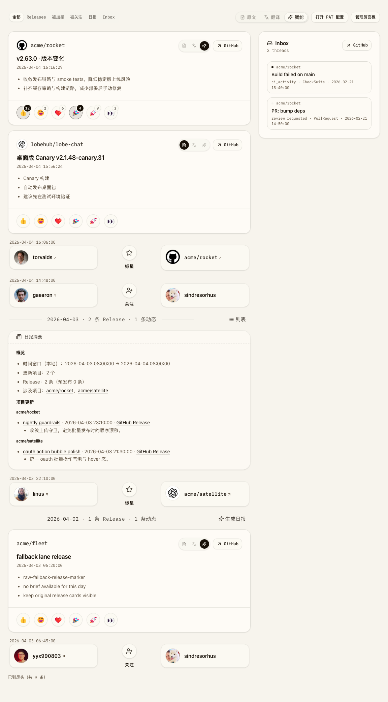
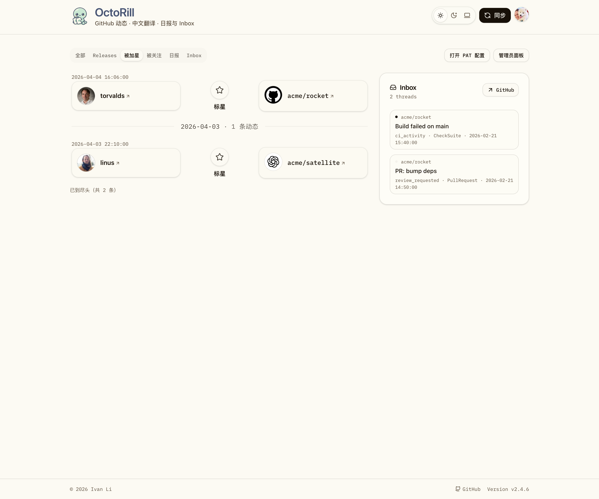
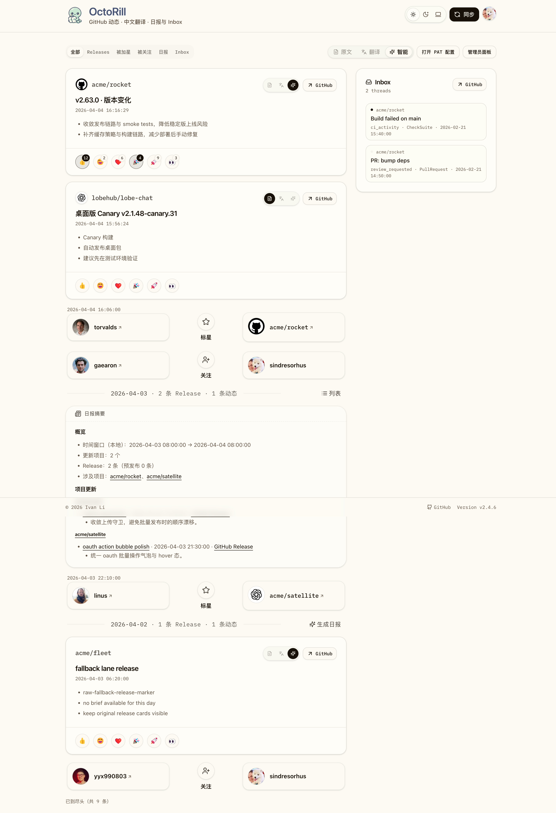
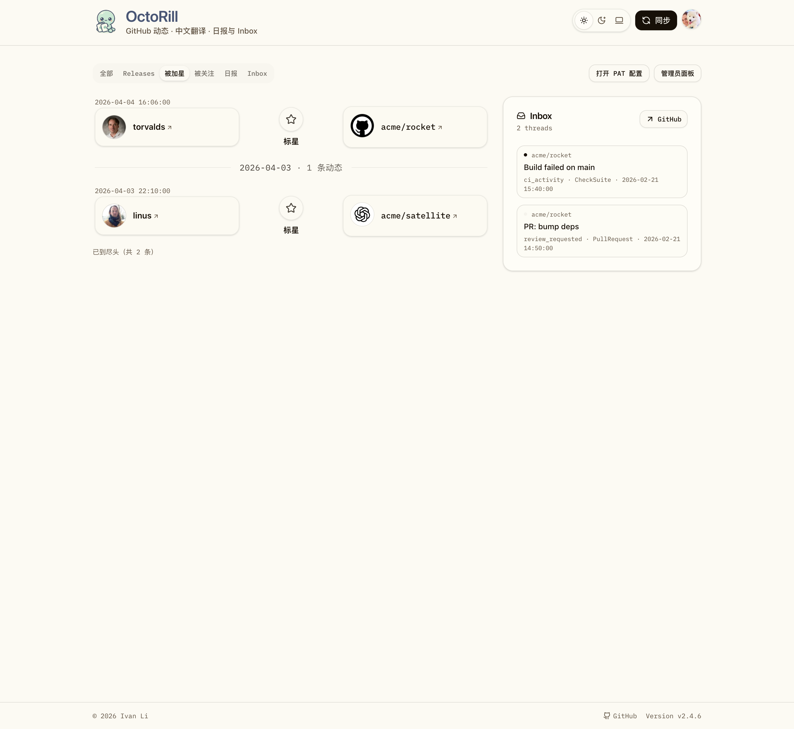
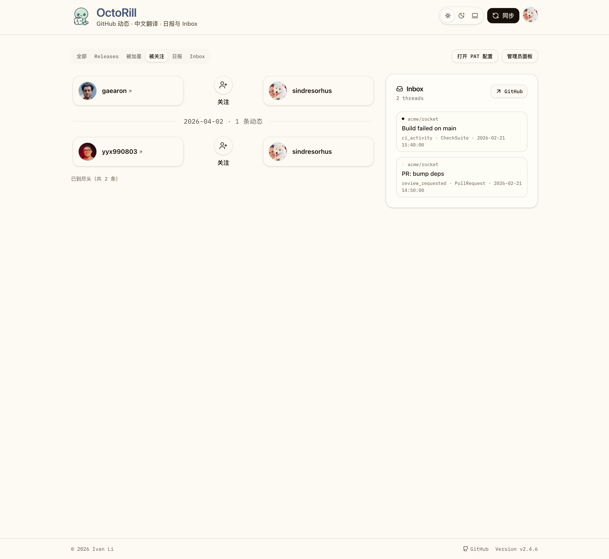
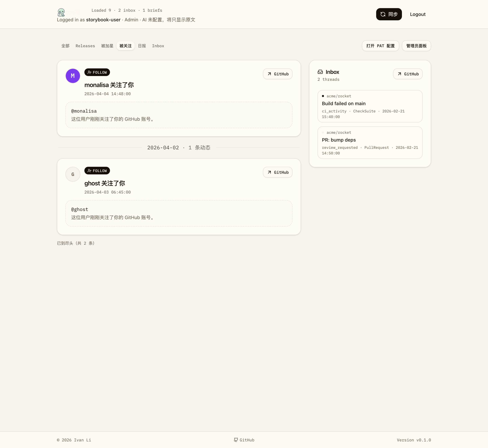

# Dashboard 社交活动记录扩展（含头像）（#vgqp9）

## 状态

- Status: 已完成
- Created: 2026-04-10
- Last: 2026-04-16

## 背景 / 问题陈述

- Dashboard 当前只展示 release feed，缺少“谁关注了我”“谁给我的仓库加星”的个人向动态，无法完整体现 GitHub 上与“我”直接相关的变化。
- 现有 `全部` tab 仍然是 release-only 阅读面，不能把 release 与个人社交动态混排到同一条时间线里。
- release card 已经有成熟的阅读与 AI lane 机制，但社交记录需要更轻量、只读、带头像的展示模型，避免把 release 的复杂交互误套到社交活动上。

## 目标 / 非目标

### Goals

- 新增 `加星`、`关注` 两个 Dashboard 顶层 tab。
- 将 `全部` tab 改为 `release + repo_star_received + follower_received` 三类记录按统一时间倒序混排。
- `/api/feed` 支持返回混合活动流，并支持 `types=releases|stars|followers` 过滤。
- 社交记录在写入时快照 `actor.login`、`actor.avatar_url`、`actor.html_url`，前端直接渲染头像，不额外查询 GitHub 用户资料。
- 自动 access refresh 与顶部 `同步` / `sync.all` 纳入社交活动同步。
- 首次成功获取 social snapshot 时，当前 followers / stargazers 必须直接落入同一条事件流。
- `repo_star_received` 继续显示 GitHub `starred_at`；`follower_received` 只保留内部排序时间，UI 不显示时间文案。
- 为 UI 改动补齐 Storybook 场景、视觉证据与回归测试。

### Non-goals

- 不统计组织仓库被加星或组织成员变更。
- 不引入 GitHub Events API、Webhook 或其他实时推送机制。
- 不在 `日报` / `收件箱` tab 内复用社交活动列表。
- 不给 `Sync starred` 单独增加“加星 / 关注”能力。
- 不追加“空 social tab 再自动触发一次同步”的前端策略。
- 不做一次性生产 SQL 补写；旧账号通过下一次正常 social sync 自动完成可见性迁移。

## 范围（Scope）

### In scope

- `src/api.rs`
- `src/sync.rs`
- `src/jobs.rs`
- `migrations/0027_dashboard_social_activity.sql`
- `migrations/0028_social_activity_event_dedupe.sql`
- `migrations/0029_owned_repo_star_baseline_snapshot_state.sql`
- `migrations/0030_owned_repo_visuals.sql`
- `migrations/0031_social_activity_event_repo_visuals.sql`
- `migrations/0032_repo_star_sync_baselines.sql`
- `web/src/feed/**`
- `web/src/pages/Dashboard.tsx`
- `web/src/stories/Dashboard.stories.tsx`
- `web/e2e/**`
- `docs/specs/vgqp9-dashboard-social-activity/SPEC.md`
- `docs/specs/s8qkn-subscription-sync/SPEC.md`

### Out of scope

- GitHub org repos / org followers / enterprise account 活动
- 非 Dashboard 页面
- release detail / briefs 内容模型变更

## 需求（Requirements）

### MUST

- `全部` tab 必须混排 `release`、`repo_star_received`、`follower_received` 三类记录。
- `发布` tab 必须继续只展示 release cards，保留原文 / 翻译 / 智能 lane 与 reactions。
- `加星` tab 必须只展示 `repo_star_received` 记录；`关注` tab 必须只展示 `follower_received` 记录。
- 社交记录卡片必须展示对方头像、login 与单个 GitHub CTA。
- `repo_star_received` 记录必须展示目标仓库名。
- `repo_star_received` 记录必须展示真实 `starred_at`。
- `follower_received` 记录不得显示时间文案；内部仍保留检测时间用于排序与去重。
- actor 头像缺失或加载失败时，必须回退到稳定占位头像，且布局不抖动。
- 首次成功获取的 follower / repo star snapshot 必须直接写入 `social_activity_events`，而不是只留在 current membership 快照。
- `sync.access_refresh` 与 `sync.all` 必须在 release 阶段后继续执行社交活动同步。
- `/api/feed` 必须支持 `types=releases|stars|followers`，并在分页时保持去重和顺序稳定。
- 历史日组的 brief 逻辑只能概括 release；社交记录不得折叠进 brief 正文。

### SHOULD

- 社交记录卡片应与 release card 复用同一时间线容器，但视觉上弱化为更轻量的动态卡片。
- 社交活动数据模型应保留 append-only 事件表与 current membership 快照，方便后续增量同步扩展。
- `全部` tab 的历史日组若存在 brief，社交记录应继续在同日组里按时间显示。

### COULD

- 无。

## 功能与行为规格（Functional/Behavior Spec）

### Core flows

- 用户打开 Dashboard 默认进入 `全部` tab 时，主列按统一日边界分组，并在每个日组内按 `ts DESC` 混排三类记录。
- 用户切到 `加星` tab 时，只看到“谁给哪个个人仓库加了星”的记录列表；release 与 follower 记录不会出现。
- 用户切到 `关注` tab 时，只看到“谁关注了当前登录账号”的记录列表，且卡片不显示时间文案。
- 用户点击顶部 `同步` 时，系统继续沿用既有 `starred -> releases -> notifications` 主体验，并在 release 同步完成后补跑社交活动 diff，再刷新页面。
- access refresh 在服务端拿到首次或增量 social snapshot 后，会把 follower / repo stargazer 写入 append-only event，并在下次 `/api/feed` 返回时显示到 `全部` 与对应筛选 tab。
- 若账号在升级前已经持有 `follower_current_members` 或 `repo_star_current_members`，但历史 `social_activity_events` 为空，则下一次正常 social sync 必须自动把当前快照补齐成可见事件。

### Edge cases / errors

- followers API 没有 `followed_at` 字段时，`follower_received` 事件内部使用本次检测到差异的 `detected_at` 排序，但 UI 不显示时间。
- repo stargazers API 返回 `starred_at` 时，首次与增量 snapshot 都直接写事件，并继续展示真实 `starred_at`。
- owned-repo GraphQL 若返回 `usesCustomOpenGraphImage = null`，同步必须按 `false` 容忍而不是整轮降级失败。
- notifications list / thread 若返回 `unread = null`，同步必须按可容忍空值处理，且 thread repair 不得把已有 unread 状态抹成错误值。
- 若社交同步中某个 repo 暂时不可访问，不能影响 release feed 读取；同步失败按既有 task error/reporting 机制上报。
- 历史日组只含社交记录时，不显示“生成日报”入口。

## 接口契约（Interfaces & Contracts）

### `GET /api/feed`

- 默认返回三类记录的时间倒序混排。
- `types` 支持：`releases|release|stars|star|followers|follower`。
- 记录结构扩展为 discriminated union：

```json
{
  "kind": "release | repo_star_received | follower_received",
  "ts": "2026-04-10T08:00:00Z",
  "id": "...",
  "repo_full_name": "owner/repo | null",
  "html_url": "https://github.com/... | null",
  "actor": {
    "login": "octocat",
    "avatar_url": "https://avatars.githubusercontent.com/u/583231?v=4",
    "html_url": "https://github.com/octocat"
  }
}
```

- `translated` / `smart` / `reactions` 仅对 `kind=release` 返回有效内容；社交记录固定为 `null`。

### 社交活动持久化

- `owned_repo_star_baselines`：记录某个用户的某个个人仓库是否已完成 baseline。
- `repo_star_current_members`：记录当前 stargazer membership 快照。
- `follower_sync_baselines`：记录某个用户是否已完成 follower baseline。
- `follower_current_members`：记录当前 follower membership 快照。
- `social_activity_events`：append-only 历史事件流，供 `/api/feed` 读取。

## 验收标准（Acceptance Criteria）

- Given `/api/feed` 不带 `types`
  When 接口返回第一页结果
  Then 结果按统一时间倒序混排 release、repo star、follower 三类记录，且分页 cursor 不重复不漏项。

- Given `/api/feed?types=stars`
  When 接口返回数据
  Then 结果只包含 `repo_star_received` 记录。

- Given Dashboard `发布` tab
  When 页面渲染完成
  Then 只显示 release cards，且仍支持原文 / 翻译 / 智能 lane 与 reactions。

- Given Dashboard `全部` tab 某日既有 release 又有社交记录
  When 页面渲染完成
  Then 历史日组的 brief 只概括 release，社交记录仍在同日组中单独显示。

- Given 某条 `repo_star_received` 记录
  When 卡片渲染完成
  Then 必须可见 stargazer 头像、login、目标仓库名、发生时间与单个 GitHub CTA。

- Given 某条 `follower_received` 记录
  When 卡片渲染完成
  Then 必须可见 follower 头像、login 与 GitHub 个人页 CTA，且不显示时间文案。

- Given 当前用户第一次完成 followers / stargazers 同步
  When 页面刷新
  Then 首次 social snapshot 中已有的 followers / repo stars 会立即出现在 feed 里。

## 实现前置条件（Definition of Ready / Preconditions）

- [x] 已确认本仓库 `docs/specs/` 为规格根目录。
- [x] 已确认 Storybook 已可用，且 Web UI 改动必须补稳定 stories。
- [x] 已确认社交活动首版只覆盖“当前登录账号被 follow”与“自己个人仓库被 star”。

## 非功能性验收 / 质量门槛（Quality Gates）

### Testing

- `cargo test`
- `cd /Users/ivan/.codex/worktrees/a311/octo-rill/web && bun run build`
- `cd /Users/ivan/.codex/worktrees/a311/octo-rill/web && bun run storybook:build`
- 相关 Playwright 套件通过

### Visual verification

- 必须提供 Storybook 稳定场景覆盖：All 混排、Stars tab、Followers tab、头像 fallback。
- 最终视觉证据必须写入本 spec 的 `## Visual Evidence`。

## 文档更新（Docs to Update）

- `docs/specs/vgqp9-dashboard-social-activity/SPEC.md`
- `docs/specs/s8qkn-subscription-sync/SPEC.md`

## 计划资产（Plan assets）

- Directory: `docs/specs/vgqp9-dashboard-social-activity/assets/`

## Visual Evidence

### All mixed timeline



### Stars tab



### Followers tab


### Legacy recovered / All mixed timeline



### Legacy recovered / Stars tab



### Legacy recovered / Followers tab



### Avatar fallback



## 实现里程碑（Milestones / Delivery checklist）

- [x] M1: 冻结 spec、tab 口径、baseline 规则与 feed mixed contract。
- [x] M2: 落地后端 social activity schema、同步链路与 mixed feed API。
- [x] M3: 落地 Dashboard 新 tabs、社交卡片、头像 fallback 与日组行为。
- [x] M4: 完成 Storybook、视觉证据、回归测试与 merge-ready 收口。

## 方案概述（Approach, high-level）

- 在同步层新增“本人个人仓库 stargazers + 本人 followers”的快照拉取与写入，首次与增量 snapshot 都进入 append-only `social_activity_events`。
- `/api/feed` 改为 release + social events 的统一 union query，并让分页 cursor 以 `sort_ts + kind_rank + id_key` 稳定排序；`发布 / 加星 / 关注` 通过 `types` 请求服务端专属数据集，避免跨 tab 分页串味。
- 前端保持 release card 行为不变，为社交记录新增轻量只读卡片，并在头像缺失或加载失败时回退到稳定占位头像；followers 卡片不渲染时间行。
- 历史日报组继续只概括 release，社交记录在同日组中以原始卡片单独呈现。

## 风险 / 开放问题 / 假设（Risks, Open Questions, Assumptions）

- 风险：GitHub stargazers / followers 分页拉取在大量数据下会增加同步耗时，需要依赖现有 task + refresh 机制承接。
- 风险：若同一秒出现多条跨类型活动，cursor 排序必须稳定，否则分页会抖动。
- 开放问题：无。
- 假设：个人仓库集合以 GitHub `/user/repos?type=owner` 的当前返回结果为准，不依赖本地缓存 login。

## 参考（References）

- `src/api.rs`
- `src/sync.rs`
- `src/jobs.rs`
- `web/src/pages/Dashboard.tsx`
- `web/src/feed/FeedGroupedList.tsx`
- `web/src/stories/Dashboard.stories.tsx`
