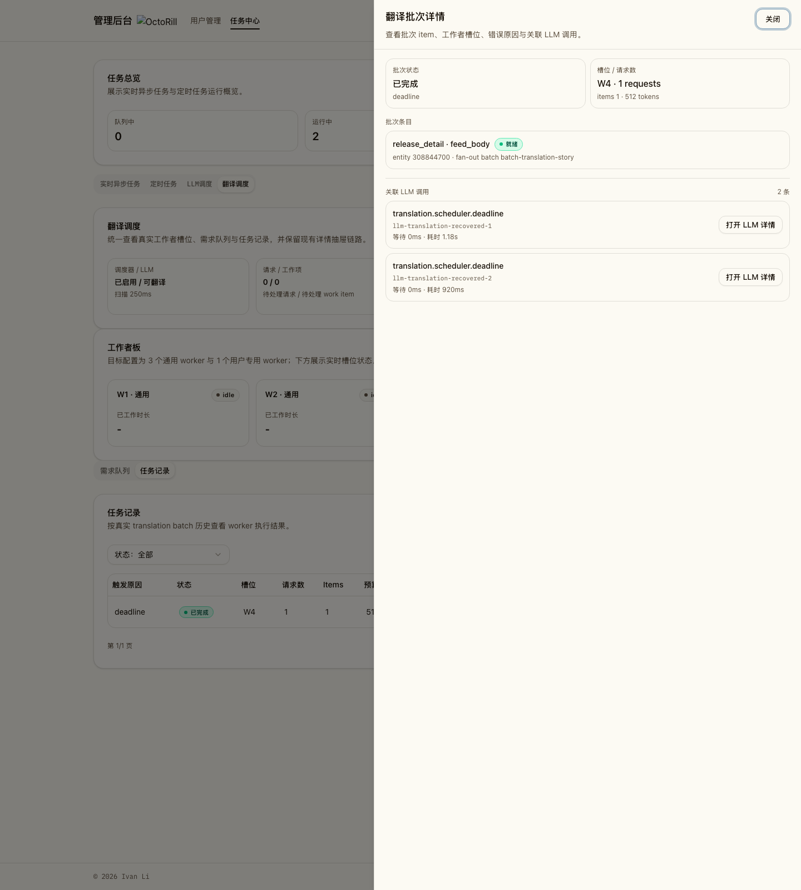
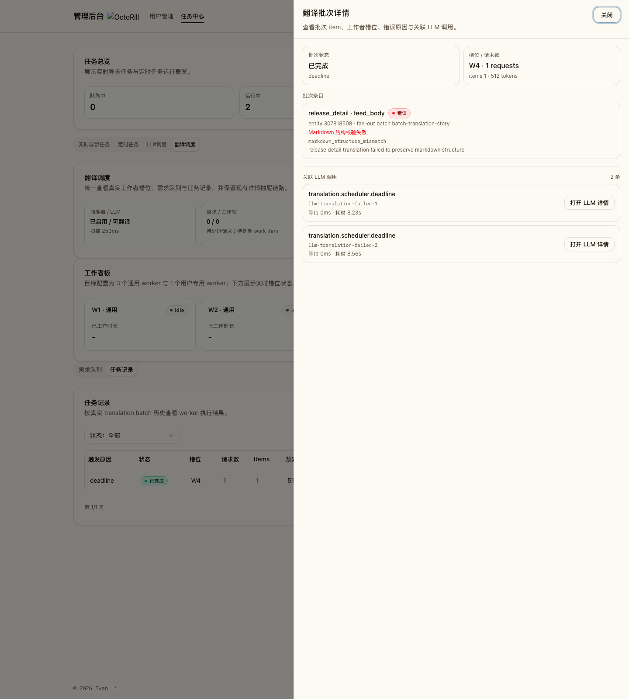
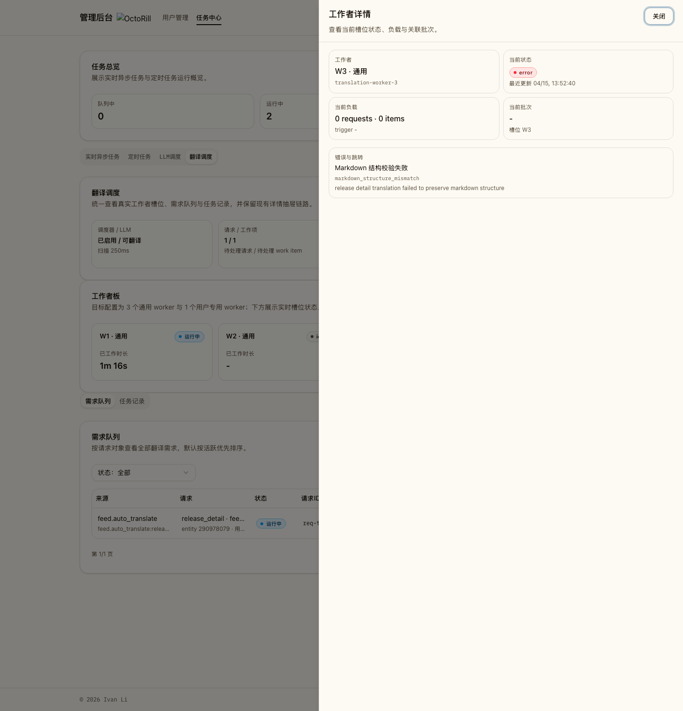

# 管理端任务详情可观测性增强（#vj7sr）

## 背景 / 问题陈述

当前管理员任务中心详情页存在“技术状态与业务状态混淆”的可观测性缺口：

- `translate.release.batch` 的 `task.progress(stage=release)` 未被语义化展示，时间线出现泛化文案。
- 批量翻译“最后阶段”受事件倒序影响，详情页出现错误阶段结论。
- 任务 `status=succeeded` 无法体现 `ready=0,error>0` 这类业务失败。
- `brief.daily_slot` 缺少用户级执行结果，定位失败用户成本高。
- 任务详情中缺少可直接进入关联 LLM 调用详情的路径，排障链路存在跳转割裂。

## 目标 / 非目标

### Goals

- 将“任务运行状态”与“业务结果状态”分开展示，减少误判。
- 为任务详情接口增加 `event_meta` 与 `diagnostics`，支持结构化展示。
- 强化 `translate.release.batch` 与 `brief.daily_slot` 的事件与结果可观测性。
- 任务详情抽屉升级为路由出口，支持在同一抽屉内切换“任务详情”与“LLM 调用详情”。
- 保持旧接口兼容：新增字段可选，前端具备回退逻辑。

### Non-goals

- 不引入任务事件分页能力（维持 `LIMIT 200`）。
- 不做跨接口深度核验（例如主动查询前台每条 release 当前展示状态）。
- 不重构任务中心整体布局，仅增强详情面板与时间线语义。

## 范围（Scope）

### In scope

- `GET /api/admin/jobs/realtime/{task_id}` 增加 `event_meta` 与 `diagnostics`。
- `GET /api/admin/jobs/llm/calls` 增加 `parent_task_id` 过滤能力，用于按任务回查关联调用。
- `translate.release.batch` 事件新增 `item_error` 字段。
- `brief.daily_slot` 事件新增 `stage=user_succeeded` 与 `stage=summary`。
- 前端任务详情面板改造：结构化业务结果、分项明细、截断提示、业务结果警示。
- 翻译 worker / batch 详情对齐分类后的 `error_code`、`error_summary`、`error_detail` 展示，避免管理员只看到裸 `translation failed`。
- 任务详情抽屉支持路由态：`/admin/jobs/tasks/:taskId` 与 `/admin/jobs/tasks/:taskId/llm/:callId`。
- Storybook 与自动化测试补齐。

### Out of scope

- 新增后台任务明细跨页浏览能力。
- 调整任务调度逻辑与队列执行策略。

## 接口契约（Interfaces & Contracts）

### 接口清单（Inventory）

| 接口（Name） | 类型（Kind） | 范围（Scope） | 变更（Change） | 契约文档（Contract Doc） | 负责人（Owner） | 使用方（Consumers） |
| --- | --- | --- | --- | --- | --- | --- |
| `GET /api/admin/jobs/realtime/{task_id}` | HTTP API | external | Modify | `./contracts/http-apis.md` | backend | web-admin |
| `GET /api/admin/jobs/llm/calls` | HTTP API | external | Modify | `./contracts/http-apis.md` | backend | web-admin |
| `job_task_events` payload for `translate.release.batch` | Event payload | internal | Modify | `./contracts/http-apis.md` | backend | web-admin |
| `job_task_events` payload for `brief.daily_slot` | Event payload | internal | Modify | `./contracts/http-apis.md` | backend | web-admin |

### 契约文档（按 Kind 拆分）

- [contracts/http-apis.md](./contracts/http-apis.md)

## 验收标准（Acceptance Criteria）

- Given `translate.release.batch` 任务 `status=succeeded` 且 `summary.error > 0`
  When 管理员打开详情
  Then 页面显示“业务失败/部分成功”警示，并显示 release 维度明细（含失败原因）。

- Given `translate.release.batch` 包含 `task.progress(stage=release)`
  When 管理员查看时间线
  Then 每条事件显示 release 编号与 item 状态，不再出现泛化“记录了一条任务事件”。

- Given `brief.daily_slot` 包含 `stage=user_succeeded` 与 `stage=user_failed`
  When 管理员查看详情
  Then 页面展示用户级执行结果（user_id、状态、key_date、错误信息）。

- Given 任务事件总数大于 200
  When 管理员查看详情
  Then 页面展示“仅展示最近 200 条事件”提示。

- Given 任务详情里的 recent events 返回 RFC3339 UTC `created_at`
  When 管理员查看最近关键事件
  Then 页面按浏览器当前时区显示本地 `YYYY-MM-DD HH:mm:ss`，不再直接展示原始 UTC 字符串。

- Given 后端尚未返回 `diagnostics/event_meta`
  When 管理员打开详情
  Then 页面可正常展示并回退到旧逻辑，无崩溃。

- Given 任务存在关联 LLM 调用
  When 管理员在任务详情点击“查看 LLM 详情”
  Then 页面在同一抽屉内跳转到 `/admin/jobs/tasks/:taskId/llm/:callId` 并展示调用详情，可返回任务详情视图。

- Given 任务类型为 `sync.*`
  When 管理员查看任务详情
  Then 不展示“查看 LLM 详情”入口，避免产生无关联的排障链路。

- Given 翻译 worker 或 batch item 带原始 `error_text`
  When 管理员打开对应详情抽屉
  Then 页面优先显示分类后的短提示，并同时展示错误码与原始错误原因。

## Visual Evidence

### 翻译批次详情（围栏修复后成功）

- source_type: `storybook_canvas`
- target_program: `mock-only`
- capture_scope: `element`
- sensitive_exclusion: `N/A`
- submission_gate: `pending-owner-approval`
- story_id_or_title: `admin-admin-jobs--translation-batch-detail-recovered`
- state: `batch-detail-recovered`
- evidence_note: 验证 `release_summary.feed_body` 在围栏 Markdown 被规范化后，批次详情保持完成态且不再显示错误提示。

### 翻译批次详情（结构仍失败）

- source_type: `storybook_canvas`
- target_program: `mock-only`
- capture_scope: `element`
- sensitive_exclusion: `N/A`
- submission_gate: `pending-owner-approval`
- story_id_or_title: `admin-admin-jobs--translation-batch-detail-failed`
- state: `batch-detail-failed`
- evidence_note: 验证批次条目会同时展示错误短提示、错误码与原始错误原因，不再只剩 `translation failed`。

### 翻译工作者错误抽屉

- source_type: `storybook_canvas`
- target_program: `mock-only`
- capture_scope: `element`
- sensitive_exclusion: `N/A`
- submission_gate: `pending-owner-approval`
- story_id_or_title: `admin-admin-jobs--translation-worker-error-drawer`
- state: `worker-error-drawer`
- evidence_note: 验证工作者详情抽屉可直接显示分类后的错误摘要、错误码与原始错误原因。

