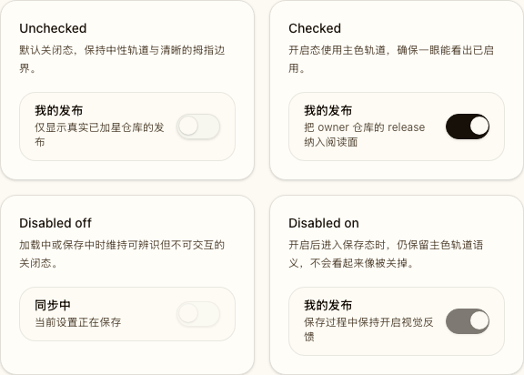
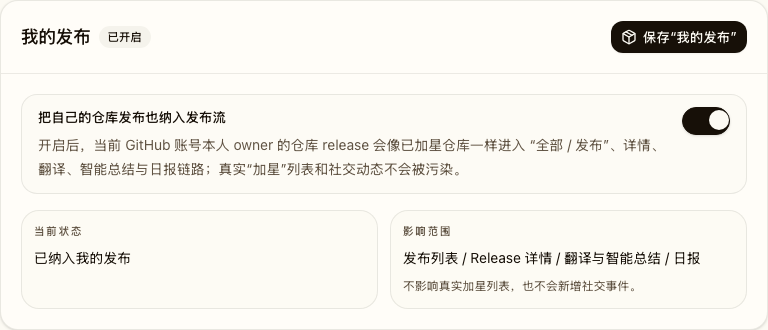
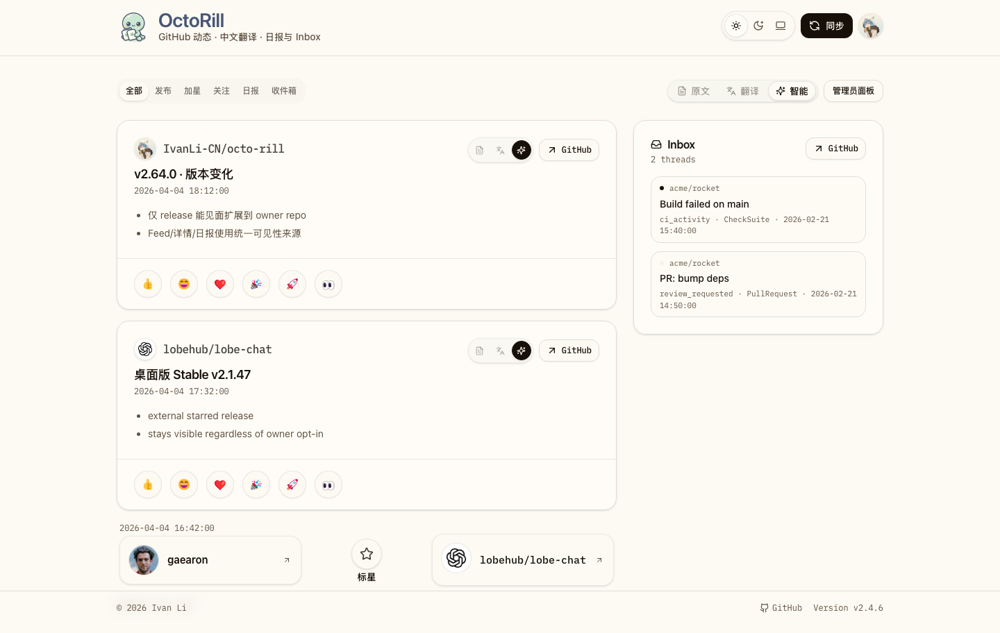

# “我的发布”开关与自有仓库 Release 可见性扩展（#w5gaz）

## 状态

- Status: 部分完成（3/4）
- Created: 2026-04-20
- Last: 2026-04-20

## 背景 / 问题陈述

- 当前 Release 相关能力只认真实 `starred_repos`，因此用户自己的个人仓库如果没有手动加星，就不会进入 `发布 / 全部`、Release 详情、翻译、润色与日报链路。
- 产品需要一个前台可控的“我的发布”开关，让用户可以把“本人 owner 的个人仓库 Release”纳入阅读面，但不能污染真实加星列表与社交动态语义。
- 现有后端已经维护 `owned_repo_star_baselines`，但还没有把这份 owner 仓库基线统一接入 Release 可见性判定。

## 目标 / 非目标

### Goals

- 在 `/settings?section=my-releases` 新增“我的发布”开关，并通过现有 `/api/me/profile` / `/api/admin/users/{user_id}/profile` 契约持久化 `include_own_releases`。
- 将 Release 可见性统一改为：`starred_repos` +（开关开启时）`owned_repo_star_baselines` 的去重并集。
- 让 `发布 / 全部`、Release 详情、翻译、润色、reaction、日报、手动同步与定时同步都使用同一套 Release 可见性来源。
- 保持 `/api/starred`、社交 `加星` tab、真实 starred snapshot 语义不变。

### Non-goals

- 不把 org-owned 仓库纳入“我的发布”范围。
- 不篡改真实加星列表，不把 owner 仓库伪装成真实 GitHub star 事件。
- 不新增后台单独开关页面，也不改 LinuxDO / PAT 的产品语义。

## 范围（Scope）

### In scope

- `users.include_own_releases` 数据库存储与 profile API 契约扩展。
- `user_release_visible_repos` 统一视图，以及 Release 读取/同步链路改接这份来源。
- `/settings` 新 section、“我的发布”开关、状态回显、保存态与错误态。
- Storybook、后端测试、Playwright 设置页回归、视觉证据与 spec/index 更新。

### Out of scope

- 组织仓库 Release 可见性。
- `/api/starred`、社交 feed `加星` tab 的真实 star 语义。
- 非 Release 维度的社交模型重构。

## 需求（Requirements）

### MUST

- `users` 表必须新增 `include_own_releases INTEGER NOT NULL DEFAULT 0`。
- `GET /api/me/profile` 与 `GET /api/admin/users/{user_id}/profile` 必须返回 `include_own_releases`。
- `PATCH /api/me/profile` 与 `PATCH /api/admin/users/{user_id}/profile` 必须接受可选 `include_own_releases`，未传时保留原值。
- `/settings` 必须新增 `section=my-releases`，并展示独立“我的发布”开关、保存按钮、说明文案与状态摘要。
- Release 相关读取路径必须统一基于 `user_release_visible_repos`，不得继续只查 `starred_repos`。
- 同一 repo 若同时存在真实 star 与 owned baseline，只能出现一次，并优先使用真实 star 元数据。
- `/api/starred` 与 Dashboard `加星` tab 必须继续只展示真实 star 数据。

### SHOULD

- 定时订阅同步应在聚合 Release 仓库前 best-effort 刷新 owner repo baseline。
- Storybook 应提供稳定的 Settings / Dashboard 场景，能直接证明开关开启后的 UI 效果。

## 功能与行为规格（Functional / Behavior Spec）

### Release 可见性统一来源

- 新增 `user_release_visible_repos` view：
  - 基础来源：`starred_repos`
  - 增量来源：`owned_repo_star_baselines`（仅当 `users.include_own_releases = 1`）
  - 去重规则：若某 repo 已在 `starred_repos` 中存在，则忽略同 repo 的 owned baseline 行。
- Release 列表、详情、翻译、润色、reaction、日报与润色预热都从该 view 获取 repo membership。

### 前台“我的发布”开关

- 设置页新增 `我的发布` section，并支持 `?section=my-releases` 深链。
- 开关关闭时：用户只能看到真实加星仓库的 Release。
- 开关开启时：当前 GitHub 账号本人 owner 的个人仓库 Release 会像已加星仓库一样进入 Release 阅读面。
- 该开关只影响 Release 维度，不影响 `加星` tab、`/api/starred` 与社交事件。

### 同步链路

- `sync.releases` 与 `sync.all` 的交互式链路在计算 Release 差集前，若开关开启，必须先刷新 owner repo baseline。
- 订阅同步在聚合 repo release work items 之前，按用户 best-effort 刷新 owner repo baseline，再从 `user_release_visible_repos` 聚合 repo 列表。
- Repo release worker 选择 candidate user 时，也要基于 `user_release_visible_repos`，保证 owned-only repo 能找到可用 token。

## 验收标准（Acceptance Criteria）

- Given 用户未开启“我的发布”
  When 访问 `发布 / 全部`、Release 详情、翻译、润色或日报
  Then owned-but-unstarred 仓库 Release 不可见。

- Given 用户开启“我的发布”
  When 访问 `发布 / 全部`
  Then 本人 owner 的个人仓库 Release 会进入 Release 时间线，并与真实 star 仓库一起按时间排序。

- Given 某 repo 同时属于真实 star 与 owned baseline
  When 访问 Release 时间线或详情
  Then 该 repo 只出现一次，并优先展示真实 star 元数据。

- Given 用户切到 Dashboard `加星` tab 或访问 `/api/starred`
  When 开关开启
  Then 仍只显示真实加星仓库，不新增 owner-only repo。

- Given 用户访问 `/settings?section=my-releases`
  When 切换开关并保存
  Then 页面会回显最新状态，且下次加载保持一致。

## 非功能性验收 / 质量门槛（Quality Gates）

### Testing

- `cargo test`
- `cd /Users/ivan/.codex/worktrees/a75b/octo-rill/web && bun run lint`
- `cd /Users/ivan/.codex/worktrees/a75b/octo-rill/web && bun run build`
- `cd /Users/ivan/.codex/worktrees/a75b/octo-rill/web && bun run storybook:build`
- `cd /Users/ivan/.codex/worktrees/a75b/octo-rill/web && bun run e2e -- settings.spec.ts`

### Storybook / Visual

- Settings 必须提供 `Pages/Settings / Deep Linked My Releases` 场景。
- Dashboard 必须提供 owner-only release 开 / 关与 `加星` 隔离的稳定场景。
- 最终 owner-facing 视觉证据写入本 spec 的 `## Visual Evidence`。

## 文档更新（Docs to Update）

- `docs/specs/README.md`
- `docs/specs/w5gaz-owned-release-opt-in/SPEC.md`

## 计划资产（Plan assets）

- Directory: `docs/specs/w5gaz-owned-release-opt-in/assets/`

## Visual Evidence

- source_type: storybook_canvas
  story_id_or_title: `UI/Switch / Gallery`
  state: switch color gallery
  evidence_note: 单独的开关 Gallery 验证 unchecked / checked / disabled 四种状态，确保开启态使用明确主色轨道，不再看起来像“未开启”。

- source_type: storybook_canvas
  story_id_or_title: `Pages/Settings / Deep Linked My Releases`
  state: my releases enabled
  evidence_note: 设置页新增独立“我的发布”section，并复用统一 Switch primitive；开启后会回显“已纳入我的发布”，只影响 Release 阅读面。

- source_type: storybook_canvas
  story_id_or_title: `Pages/Dashboard / Evidence / Owner Releases All Tab`
  state: owned release visible in all feed
  evidence_note: 开启“我的发布”后，owner-only repo release 会进入 `全部` 时间线，与真实 starred repo release 并列展示。

## 实现里程碑（Milestones / Delivery checklist）

- [x] M1: 新增 spec、README 索引、`include_own_releases` migration 与 profile 契约扩展。
- [x] M2: Release 可见性统一改到 `user_release_visible_repos`，并接通同步 / 详情 / 翻译 / 润色 / 日报。
- [x] M3: Settings / Dashboard Storybook、Playwright 与 owner-facing 视觉证据完成。
- [ ] M4: 提交、推送、PR、review-loop 收敛到 merge-ready。

## 方案概述（Approach, high-level）

- 通过数据库 view 把“真实 star 可见性”和“owner repo opt-in 可见性”合并成一个统一读面，避免在每个 Release 接口里各自拼接条件。
- 继续把真实社交模型留在 `starred_repos` / social activity 体系里，保证“我的发布”只扩展 Release 能力，不扩展社交语义。
- 复用已有 `/api/me/profile` 持久化用户偏好，避免再开新 settings API namespace。

## 风险 / 开放问题 / 假设（Risks, Open Questions, Assumptions）

- 风险：若 owner baseline 刷新失败，订阅同步会暂时退回旧缓存视图；因此定时链路采用 best-effort 刷新，交互式链路则要求显式刷新成功。
- 风险：Storybook / Dashboard 场景必须维持稳定 mock 数据，否则容易让 owner-only repo 与真实 star repo 视觉语义混淆。
- 假设：本轮“自己的仓库”仅指当前 GitHub viewer-owned personal repos，不扩大到组织仓库。
