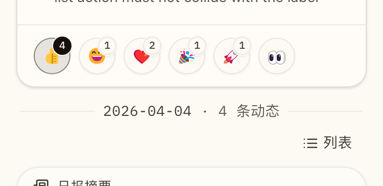

# Dashboard 移动端日分组标题防重叠修复（#w9by9）

## 背景 / 问题陈述

- Dashboard 分组 feed 的日分隔标题在移动端窄宽度下，容易被上一张 Release 卡片底部的 reaction footer 压得过近。
- 当历史日组同时存在标题文本与右侧 action（如“日报 / 列表 / 生成日报”）时，现有 divider header 仍按桌面端单行对齐策略收缩，导致窄屏下可读性不稳定。
- 当前 `FeedDayHeader` 使用 `leading-none`、固定宽度 action slot 与紧凑 flex 行布局，在 `375px / 390px` 宽度下缺少足够的横向与纵向安全余量。

## 目标 / 非目标

### Goals

- 修复 grouped feed 的日分隔标题在移动端窄宽度下与上一张 Release 卡片、reaction footer 或 action slot 的重叠风险。
- 让移动端日分隔标题文本可以稳定换行，并让 action 在窄屏下不再抢占固定横向宽度。
- 保持桌面端 divider header 的视觉语言与 action slot 对齐口径不回退。
- 补齐 Storybook 移动端证据场景、Playwright 几何回归与 spec 视觉证据。

### Non-goals

- 不改 Rust 后端、API、数据库、权限或路由契约。
- 不重做 Briefs tab、Release detail modal 或 Admin 页面布局。
- 不扩大到非 grouped-feed 的其他排版问题。

## 范围（Scope）

### In scope

- `web/src/feed/FeedGroupedList.tsx`
- `web/src/stories/Dashboard.stories.tsx`
- `web/e2e/dashboard-access-sync.spec.ts`
- `docs/specs/README.md`
- `docs/specs/w9by9-dashboard-mobile-day-divider-overlap/SPEC.md`

### Out of scope

- `src/**` Rust backend
- Dashboard 以外页面
- grouped-feed 之外的卡片信息架构调整

## 需求（Requirements）

### MUST

- 在 `375px` 与 `390px` 宽度下，下一日 divider 的标题文本不得与上一张 Release 卡片或其 reaction footer 发生几何重叠。
- 若该日组存在 action，action 与标题文本必须要么同排安全分离，要么稳定换到独立行，不得互相覆盖或裁切。
- 移动端 divider title 文本必须允许自然换行，不再依赖 `leading-none` 的单行压缩策略。
- action slot 在移动端不得继续占用桌面端固定宽度。
- 桌面端 divider 文字、分隔线与 action slot 对齐口径保持现有视觉语言。
- Storybook 必须提供稳定的移动端回归场景与 owner-facing 视觉证据。
- Playwright 必须补齐 grouped-feed divider 的移动端几何回归。

### SHOULD

- 新增 DOM hooks 仅限内部 `data-*` selector，不扩展公开 props 或数据契约。
- 视觉证据优先复用现有 Dashboard grouped-feed mock，而不是新建临时 demo 页面。

## 功能与行为规格（Functional/Behavior Spec）

### Core flows

- 用户在移动端进入 `全部` 或 `发布` 视图时，当前日 Release 卡片下方若接着出现新的日 divider，divider header 仍保持完整可读。
- 当历史日组存在 `生成日报` 或 `日报 / 列表` action 时，移动端 divider header 会自动切到安全布局：标题文本可换行，action 不再挤压文本。
- 桌面端保持现有单行 divider 视觉语言与 action slot 位置。

### Edge cases / errors

- 当前日与历史日之间只有一张带 reaction 的 Release 卡片时，divider 仍要保留清晰间距。
- 历史 raw group 没有 brief、需要展示 `生成日报` action 时，action 也不能与标题发生重叠。
- 没有 action 的 divider 继续沿用弱化分隔线语言，但在窄屏下允许文本多行展示。

## 验收标准（Acceptance Criteria）

- Given `375px` 宽度下的 grouped feed 窄屏视图
  When 当前日的 Release 卡片下方出现历史日 divider
  Then divider label 仍完整可读，且与上一张卡片 footer 保持可见间距。

- Given `390px` 宽度下的 grouped feed 历史 raw group
  When divider header 同时展示 label 与 `生成日报` action
  Then label 与 action 不发生几何重叠，且任一元素都不压到上一张卡片上。

- Given 桌面端 Dashboard grouped feed
  When divider header 渲染完成
  Then divider 的 action slot 与标题分隔线语言保持现有视觉口径，不出现新的换行抖动。

## 非功能性验收 / 质量门槛（Quality Gates）

### Testing

- `cd web && bun run build`
- `cd web && bun run storybook:build`
- `cd web && bun run e2e -- dashboard-access-sync.spec.ts`

### Visual verification

- 使用 Storybook 移动端稳定场景生成至少一张 owner-facing 视觉证据。
- 最终视觉证据写入本 spec 的 `## Visual Evidence`。

## Visual Evidence

- source_type: storybook_canvas
  target_program: mock-only
  capture_scope: element
  sensitive_exclusion: N/A
  submission_gate: approved
  story_id_or_title: Pages/Dashboard / Evidence / Mobile Mixed Activity Day Divider No Overlap
  state: 375px mobile grouped feed with mixed historical activity
  evidence_note: 证明当前日 reaction footer 下方的历史 divider 已缩短为 `4 条动态`，并且右侧 `列表` action 与标题文本保持安全分离，桌面端对齐口径不回退。
  image:
  

## 风险 / 开放问题 / 假设（Risks, Open Questions, Assumptions）

- 风险：若 divider header 只做样式微调但不处理 action slot 的移动端宽度占用，历史 raw group 仍可能在窄屏下压缩标题。
- 风险：若视觉证据绑定的实现 SHA 后续因 review-loop 更新，需要重新回图与补证。
- 开放问题：无。
- 假设：当前问题集中在 grouped-feed divider header 的移动端布局本身，不需要扩大到 release detail 或 briefs 流程。
