# OctoRill Web Demo 与悬浮 Inspector Contract

## 背景 / 问题陈述

- 当前仓库把组件级 QA、页面级视觉证据和临时 mock 入口混杂在 Storybook、Playwright patch 与零散 `ui_demo` 证据里，缺少一个稳定、公开、可深链复现的页面级 demo surface。
- 页面验收需要 mock-only、无登录、无真实 `/api/**` 泄漏的运行面，同时又要尽量复用正式页面组件、正式 route suffix 与真实 UI 组合。
- 现有 pages build 只装配 docs-site 与 Storybook，没有把页面级 demo 作为 GitHub Pages 的一级入口正式发布。

## 目标 / 非目标

### Goals

- 冻结 `/demo/` 为公开 `web demo` 子应用前缀，使用 `demo=<scene-id>` 作为 scene 入口，`d_*` 作为分享态命名空间。
- 让 demo runtime 在 `AuthBootstrap` 之前完成模式识别与 MSW worker 启动，确保 mock-only 模式不会命中真实 `/api/**`、真实登录或真实后端写路径。
- 页面级 surface 覆盖 `Landing / Dashboard / Settings / Public Release / Admin Panel / Admin Dashboard / Admin Repos / Admin Jobs / Bind GitHub / Announcement Detail / Not Found / App Boot / App Shell`，并为每个 surface 提供稳定深链。
- 交付结构化 inspector：常规桌面宽度保持可悬浮、可吸边、可收起；当浏览器宽度足够容纳 Web App 最宽版心时，默认切换为固定贴住视口最左边、占满全高的 pinned left rail，但仍支持收起成 bubble 以恢复正常 Web App layout；同时支持 scene、persona、network、关键 data toggles、share link 与 recent simulated writes。
- 把 GitHub Pages 装配扩展为 `docs-site + /storybook/ + /demo/`，并在根 `404.html` 上只对 `/demo/**` 开启 deep-link recovery。

### Non-goals

- 不移除 Storybook，也不把所有组件级故事迁出 Storybook。
- 不把真实 GitHub OAuth、真实 SQLite、真实 Rust 后端或 production 写路径接进 demo。
- 不改变 docs-site 的公开根路径，也不改变正式 live app 的部署方式。

## 范围（Scope）

### In scope

- `web/src/demo/**`：scene registry、mock data、MSW/SSE transport、inspector、share state、simulated writes。
- `web` demo build target、`mockServiceWorker.js`、router basepath `/demo`、app bootstrap 顺序。
- `.github/workflows/docs-pages.yml` 与 `.github/scripts/assemble-pages-site.sh` 的 demo 产物装配。
- `docs-site/docs/web-demo.mdx`、`docs-site/docs/index.mdx`、`docs-site/docs/quick-start.md`、README / `web/README.md` / 产品文档中的 demo 入口与说明。

### Out of scope

- 所有历史 page stories 的一次性全量迁移。
- 真实后端集成测试替代 demo runtime。
- 非页面级组件的额外 demo surface。

## 功能与行为规格（Functional / Behavior Spec）

### Demo runtime

- demo mode 在以下任一条件下激活：
  - demo build (`/demo/` 子应用)
  - 常规 build 下 URL 含 `demo=<scene-id>`
- demo mode 激活后必须先清空 warm startup caches，再启动 MSW worker，再渲染 React app。
- demo build 的 router basepath 固定为 `/demo`；公开资产 base 固定为 `/demo/`。
- `mockServiceWorker.js` 必须随 demo build 一起产出，并从 demo base 注册。

### Scene registry

- scene ids：
  - `landing-welcome`
  - `app-boot`
  - `app-shell`
  - `dashboard-repo-publish`
  - `settings-my-releases`
  - `public-release-ready`
  - `admin-panel-users`
  - `admin-dashboard-overview`
  - `admin-repos-overview`
  - `admin-jobs-running`
  - `bind-github-pending`
  - `announcement-detail`
  - `not-found`
- scene 需要绑定正式 route suffix，并允许通过 `d_persona`、`d_net`、`d_own`、`d_pub` 复现关键状态。
- demo 中的写操作只更新内存态，并在 inspector 中记录为 simulated write。
- demo fixtures 中的 owner / repo / 邮箱 / PAT mask / API key 必须使用明显的合成样例；secret-like 输入在 demo UI 中不得回显原始值或前缀。

### Inspector

- 桌面端：
  - 常规桌面宽度下可拖拽
  - 常规桌面宽度下拖拽结束后吸附到左右边缘
  - 常规桌面宽度下可收起为气泡
  - 常规桌面宽度下布局位置持久化到 localStorage
  - 当浏览器宽度足够容纳 Web App 最宽版心时，默认切换为 root-level 双栏：左侧 inspector 固定贴住视口最左边并占满全高；收起后退回 bubble，右侧 Web App layout 恢复正常版心以便确认一般效果
- 移动端：
  - 默认只显示 bubble
  - 点击 bubble 后打开 drawer
- inspector 默认提供结构化 sections：
  - Scene
  - Persona / 权限
  - Network
  - Data
  - Actions
  - Share
- raw JSON 仅作为折叠式调试入口。

### Admin Jobs surface state

- `Scene` 继续是页面级 route preset。它选择 `admin-jobs-running` 等 Demo 场景，不能承担 Admin Jobs 内部读取面的选择。
- Admin Jobs Inspector 提供一个独立的 `Surface` 选择器：
  - 内容处理：采集记录的列表、活动格和记录详情读取面。
  - LLM 调度：scheduler status、活动格、调用列表和调用详情读取面。
- `Surface` 从正式 Admin Jobs 子路由派生；Inspector 选择内容处理时导航到 `/admin/jobs/ai-records`，选择 LLM 调度时导航到 `/admin/jobs/llm`。不得新增 `d_surface` 或以 share-state 重复表达 pathname。
- 两个 surface 的 state 独立存在。Inspector 只显示当前 surface 的 data case 与 network profile 控件；切换 surface 不重置另一面的 state。
- 每个 surface 都有 `loaded`、`empty`、`many` 与 `loading` data case：
  - `loaded` 返回代表性、相互一致的 fixture。
  - `empty` 返回空的集合和活动数据。LLM 调度仍返回有效 scheduler status，因为 status 是配置与容量事实，不是 LLM 逻辑调用集合。
  - `many` 是密度 fixture：内容处理在所选 tab 的同一小时包含至少 128 个采集记录，且列表超过 20 条；LLM 调度至少有三个模型覆盖完整十二小时活动窗，且 calls 列表超过 20 条。
  - `loading` 保持请求 pending；只有改选 `loaded`、`empty` 或 `many`、离开兼容 surface 或卸载页面才会取消该请求。
- 每个 surface 都有 `normal`、`slow` 与 `faulty` network profile。`slow` 延迟非 `loading` fixture 后再返回；`faulty` 优先于 data case 并返回可重试读取错误。
- 选择 data case 或 network profile、切换 surface、离开 Admin Jobs 或卸载页面时，必须 abort 旧请求并递增该 surface 的 request epoch。旧响应不得渲染到新配置。
- 离开 Admin Jobs 的全局 Scene 时，两个 surface state 复位到 `loaded` / `normal` 并从 URL 移除。既有全局 `d_net` 保持非 Admin Jobs scene 的网络合同，不替代 surface network profile。

### Pages 装配

- GitHub Pages 根路径继续由 docs-site 占用。
- Storybook 继续装配到 `/storybook/`。
- demo build 装配到 `/demo/`。
- 根 `404.html` 必须注入 demo recovery shim：只对 `/demo/**` 深链做恢复，不影响 docs-site 的正常 404 文案。

## 接口契约（Interfaces & Contracts）

### Public URLs

- `/demo/`
- `/demo/<route-suffix>?demo=<scene-id>&d_*`
- `/storybook/`
- `/storybook.html`

### Demo share-state query contract

- `demo=<scene-id>`
- `d_persona=guest|member|admin`
- `d_net=normal|slow|faulty`
- `d_own=1`
- `d_pub=published`
- `d_shell=steady|update|install|update-install|unknown`
- `d_content_case=loaded|empty|many|loading`
- `d_content_net=normal|slow|faulty`
- `d_llm_case=loaded|empty|many|loading`
- `d_llm_net=normal|slow|faulty`
- `d_restore=<encoded-path>`：仅供 404 recovery 内部回跳使用

### Admin Jobs demo endpoint mapping

| Surface state | Route | Read endpoints |
| --- | --- |
| `d_content_case` / `d_content_net` | `/admin/jobs/ai-records` | `GET /api/admin/jobs/ai-records/:kind`、`GET /api/admin/jobs/ai-records/:kind/activity`、`GET /api/admin/jobs/ai-records/:kind/:recordId` |
| `d_llm_case` / `d_llm_net` | `/admin/jobs/llm` | `GET /api/admin/jobs/llm/status`、`GET /api/admin/jobs/llm/activity`、`GET /api/admin/jobs/llm/calls`、`GET /api/admin/jobs/llm/calls/:callId` |

`empty` fixture 中不存在的详情 deep link 返回 `404`。每个 data case 与 network profile 只影响同一行的 endpoint family；翻译 worker 的 `translations/*` 和其他 Admin Jobs API 不受这些 controls 影响。

### Request and cache isolation

- 请求、内存缓存与 session handoff 至少按 `surface + data case + network profile + endpoint + filters/page` 区分。
- 只有 `normal` 下的 `loaded`、`empty`、`many` 可以按完整 identity 短暂缓存或 handoff。
- `loading`、`slow`、`faulty` 从不读取或写入缓存。切换配置时当前可见数据必须清空，不能用先前 case 的成功结果垫底。

## Related ADRs

- [ADR 0016: Demo Inspector Admin Jobs Surface State Isolation](../../adr/0016-demo-inspector-admin-jobs-surface-state-isolation.md)

## 验收标准（Acceptance Criteria）

1. Given Pages 站点已构建，When 打开 `/demo/` 与六个目标 route 的 scene deep link，Then 页面都进入 mock-only runtime，且不依赖真实认证或真实 `/api/**`。
2. Given demo 处于常规桌面宽度，When 拖拽 inspector 并释放，Then 面板会吸附左右边缘且位置被记住；When 收起后，Then 会变成可点击恢复的气泡。Given demo 处于足够宽的桌面视口，When 页面进入 wide layout，Then inspector 会默认展开为固定贴住视口最左边且占满全高的 pinned left rail；When 在该状态下点击收起，Then inspector 会退回 bubble，且页面恢复正常 Web App layout。
3. Given demo 处于移动端，When 点击 bubble，Then inspector 以 drawer 打开。
4. Given Settings / Dashboard / Admin 页面触发保存、发布、取消、重试等动作，When 操作完成，Then UI 立即回显 mock-only 结果，且 recent mutations 中留下 simulated 记录。
5. Given GitHub Pages 直接访问 `/demo/**` 深链，When GitHub Pages 回落到根 `404.html`，Then 404 shim 会恢复到对应 demo route，而 docs-site 其它 404 路径保持普通文档站行为。
6. Given Admin Jobs demo，When 对任一 surface 选择 `loaded`、`empty`、`many` 或 `loading`，Then 该 surface 的完整 endpoint family 与可见列表、活动格、详情保持一致；另一 surface 不受影响。
7. Given Admin Jobs demo，When 复制含两个 surface state 的 share URL 并在新页面加载或刷新，Then 两面均恢复相同 case/profile。When 在 `loading`、`slow`、`faulty` 与正常 fixture 间双向切换，Then 旧请求和缓存均不渲染；desktop 与 mobile 各保留一个 mock-only browser evidence 截图，并由自动化断言 URL、请求与关键可见状态。

## 非功能性验收 / 质量门槛（Quality Gates）

- `cd web && bun run lint`
- `cd web && bun run build`
- `cd web && bun run build:demo`
- `cd web && bun run storybook:build`
- `cd web && bun run e2e`
- `cd docs-site && bun run build`
- `bash ./.github/scripts/assemble-pages-site.sh <docs_build> <storybook_build> <demo_build> <output_dir>`

## Visual Evidence

- source_type: `ui_demo`
  target_program: `mock-only`
  capture_scope: `browser-viewport`
  submission_gate: `captured`
  captured_at: `2026-07-09`
  route: `/demo/focus/repo/octo-demo/release-lab?demo=dashboard-repo-publish`
  state: `dashboard-repo-publish`
  evidence_note: 桌面态 deep-link 恢复后，模拟“发布公开页”写操作会同步更新 Published share state，并在 inspector 的 Advanced badge 中暴露 simulated write 计数。owner-facing 截图使用更高的桌面视口完整展示 inspector 全栈内容；`1366x768` 的 toast 避让与短视口钳制、`1798x1360` 的 tall-desktop 完整展示均由 Playwright 回归测试覆盖。

- source_type: `ui_demo`
  target_program: `mock-only`
  capture_scope: `browser-viewport`
  submission_gate: `captured`
  captured_at: `2026-07-09`
  route: `/demo/focus/repo/octo-demo/release-lab?demo=dashboard-repo-publish`
  state: `dashboard-repo-publish`
  evidence_note: 短视口桌面态（`1366x768`）下触发“发布公开页”toast 后，inspector 仍会避让顶部 toast、保持底边在视口内；同时通过 compact density 让 `Actions & Share`、share URL 与 `Advanced` 摘要都留在首屏，不再呈现“底部像溢出视口”的观感。该场景与 `demo boot failure`、native anchor `/demo` share-state 保真一起由新增 Playwright 回归覆盖。

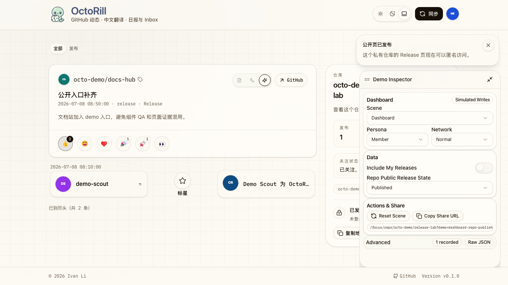

- source_type: `ui_demo`
  target_program: `mock-only`
  capture_scope: `browser-viewport`
  submission_gate: `captured`
  captured_at: `2026-07-09`
  route: `/demo/focus/repo/octo-demo/release-lab?demo=dashboard-repo-publish`
  state: `dashboard-repo-publish`
  evidence_note: 常规桌面宽度下，Dashboard demo inspector 保持真正的悬浮覆盖层：repo summary 与公开页卡片会继续铺到 inspector 下方，而不是为了 inspector 额外挤出版心。该场景由 Playwright 几何回归断言 `summaryRight > panelLeft` 保护。

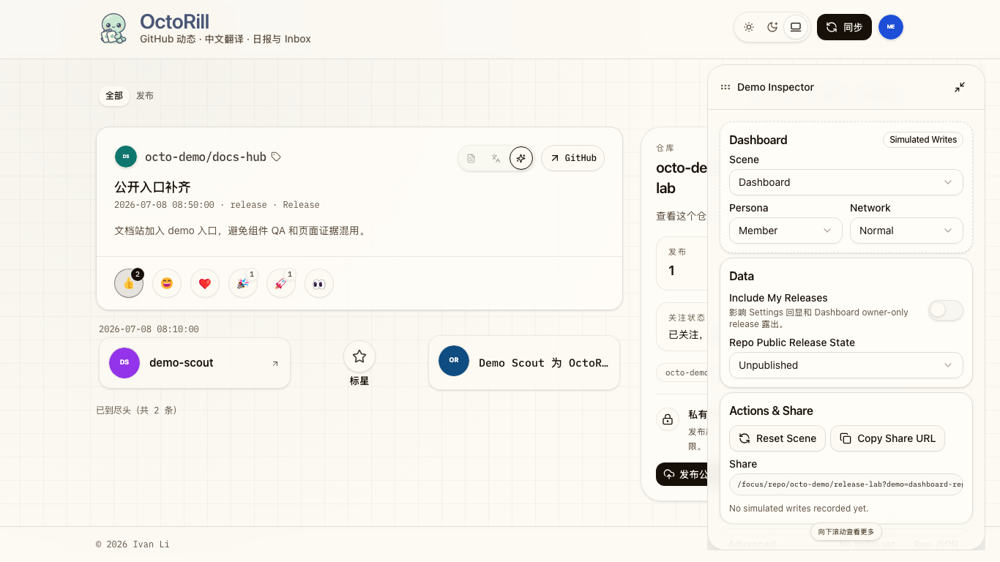

- source_type: `ui_demo`
  target_program: `mock-only`
  capture_scope: `browser-viewport`
  submission_gate: `captured`
  captured_at: `2026-07-09`
  route: `/demo/focus/repo/octo-demo/release-lab?demo=dashboard-repo-publish`
  state: `dashboard-repo-publish`
  evidence_note: 超宽桌面宽度下，根层会默认切成 root-level 双栏：左侧 inspector 固定贴住视口最左边并占满全高，右侧继续承载现有 Web App 最宽版心；此时 footer 必须跟随右侧 Web App Layout 的 left/right gutter，而不是继续铺到 pinned rail 后方。该场景由 Playwright 几何回归断言保护：`data-demo-root-frame="wide"` 必须出现，且 inspector 需要满足 `left=0`、`top=0`、`height=viewportHeight`、存在 collapse button，同时 `footerLeft === contentLeft`、`footerRight === contentRight` 且 `summaryLeft > inspectorRight + 16`。

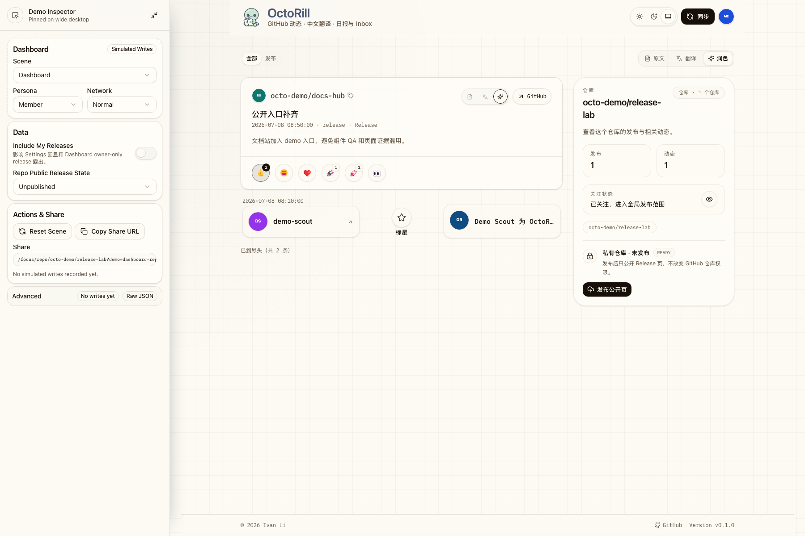

- source_type: `ui_demo`
  target_program: `mock-only`
  capture_scope: `browser-viewport`
  submission_gate: `captured`
  captured_at: `2026-07-09`
  route: `/demo/focus/repo/octo-demo/release-lab?demo=dashboard-repo-publish`
  state: `dashboard-repo-publish`
  evidence_note: 超宽桌面宽度下收起 pinned rail 后，inspector 会退回左上 bubble，根层双栏 frame 消失，页面恢复正常 Web App layout，方便确认无调试面板占位时的一般效果。该场景由 Playwright 回归断言保护：collapse 后 `data-demo-root-frame="wide"` 消失、bubble 出现，且 footer 会回到普通 viewport 宽度。

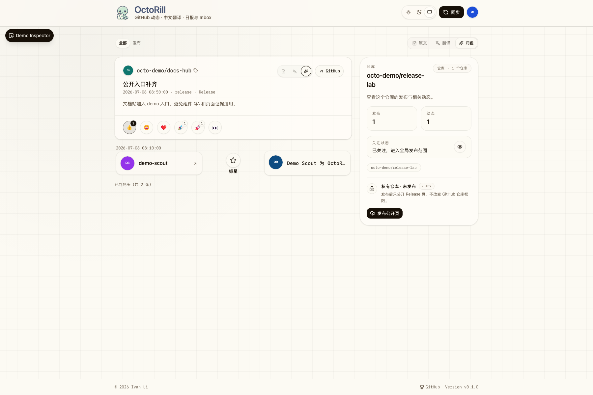

- source_type: `ui_demo`
  target_program: `mock-only`
  capture_scope: `browser-viewport`
  submission_gate: `captured`
  captured_at: `2026-07-09`
  route: `/demo/settings?section=api-keys&demo=settings-my-releases`
  state: `settings-my-releases`
  evidence_note: 桌面态 Settings 不再为了 inspector 改写正文版心；inspector 保持真正的悬浮覆盖层，同时该 scene 默认停靠在左侧，确保 `创建 API Key` 等 simulated write 主操作在首屏内仍可直接点击；同一路径下保存 GitHub PAT 时也只回显固定 demo mask，不泄漏用户输入的 secret 前缀。

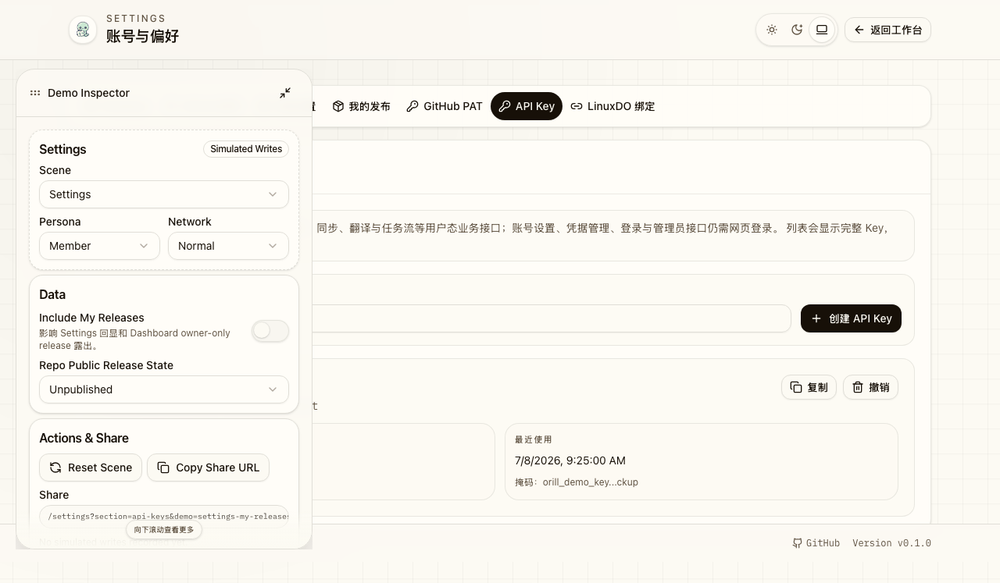

- source_type: `ui_demo`
  target_program: `mock-only`
  capture_scope: `drawer-surface`
  submission_gate: `captured`
  captured_at: `2026-07-09`
  route: `/demo/settings?section=my-releases&demo=settings-my-releases`
  state: `settings-my-releases`
  evidence_note: 移动端默认 bubble 展开为 drawer；drawer surface 中可直接编辑 scene / persona / network / data 分享态，并复制当前 share deep link。

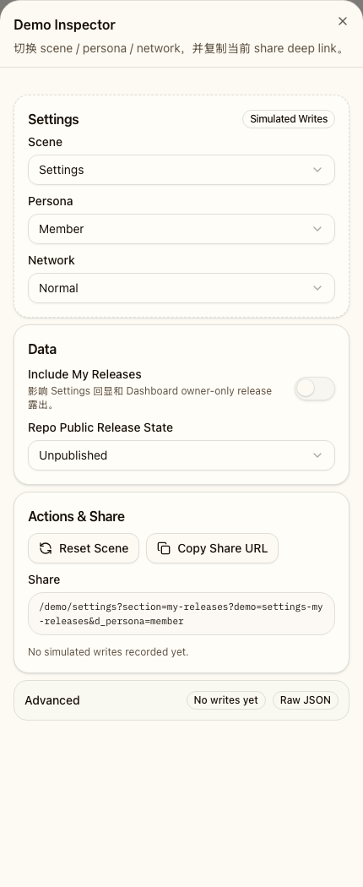

- source_type: `ui_demo`
  target_program: `mock-only`
  capture_scope: `browser-viewport`
  submission_gate: `captured`
  captured_at: `2026-07-09`
  route: `/demo/focus/repo/octo-demo/release-lab?demo=dashboard-repo-publish&d_persona=member`
  state: `dashboard-repo-publish`
  evidence_note: `Actions & Share` 的 share deep link 已从横向滚动文本块收口为只读单行 input。常规桌面宽度下不再出现额外的横向滚动条；owner 可以像普通 input 一样聚焦、移动光标、局部选择并复制当前 deep link，而不需要先拖动滚动条找尾部。

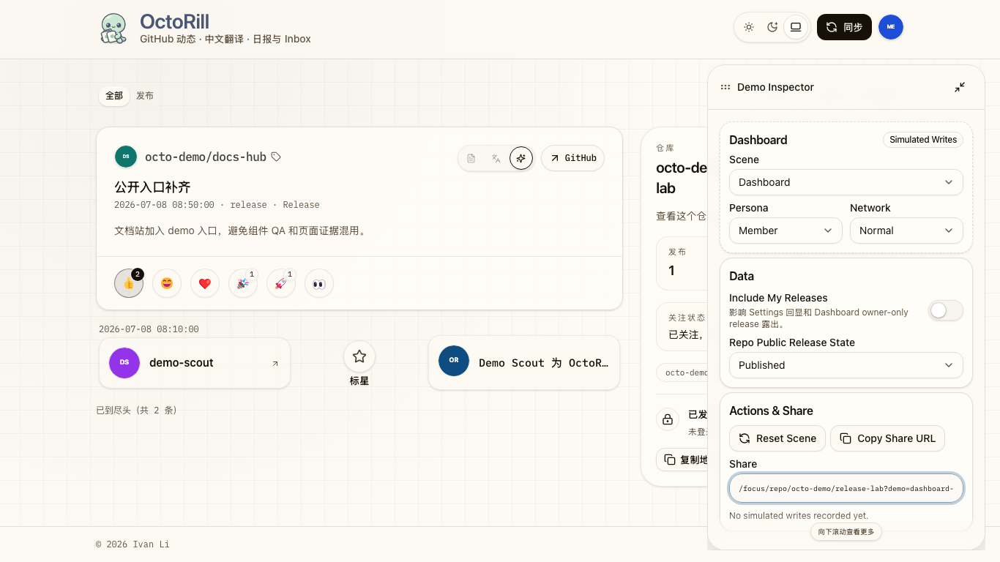

- source_type: `ui_demo`
  target_program: `mock-only`
  capture_scope: `browser-viewport`
  submission_gate: `captured`
  visual_comparison: `current-only`
  captured_at: `2026-09-09`
  requested_viewport: `1440x900`
  viewport_strategy: `browser-emulation`
  route: `/demo/focus/repo/octo-demo/release-lab?demo=app-shell&d_shell=update-install&d_controls=hidden`
  state: `app-shell / update-install`
  evidence_note: App Shell Demo 在无真实 service worker 的条件下稳定展示新版本提示、安装入口、刷新动作与固定仓库内容；该新增场景没有历史同路径基线，因此保留为 current-only 证据，不覆盖既有 Dashboard 资产。

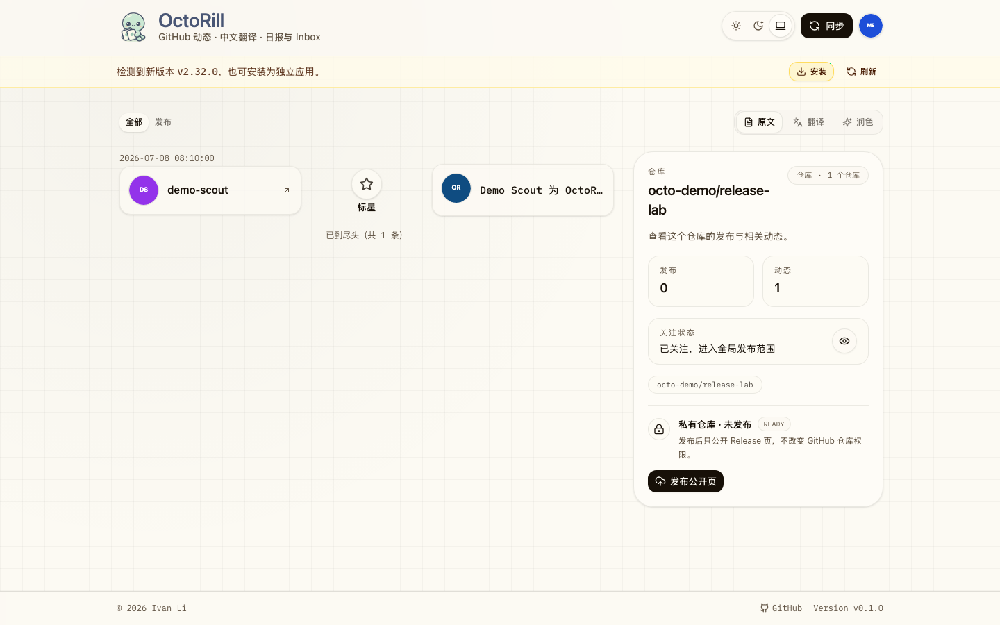

- source_type: `ui_demo`
  target_program: `mock-only`
  capture_scope: `browser-viewport`
  submission_gate: `captured`
  visual_comparison: `current-only`
  captured_at: `2026-09-09`
  requested_viewport: `393x852`
  viewport_strategy: `browser-emulation`
  route: `/demo/focus/repo/octo-demo/release-lab?demo=app-shell&d_shell=update-install&d_controls=hidden`
  state: `app-shell / update-install`
  evidence_note: 同一 App Shell 场景在默认移动验收视口 `393x852` 下保持更新提示、安装按钮、刷新入口与仓库卡片可读，无真实认证或后端依赖。

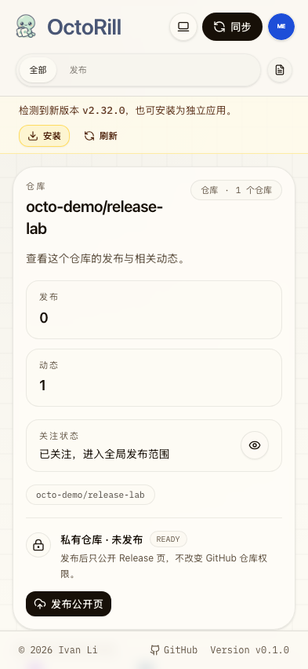

- source_type: `ui_demo`
  target_program: `mock-only`
  capture_scope: `browser-viewport`
  submission_gate: `captured`
  visual_comparison: `current-only`
  captured_at: `2026-09-24`
  requested_viewport: `1280x720`
  viewport_strategy: `playwright-controlled`
  route: `/admin/jobs/ai-records?demo=admin-jobs-running&d_persona=admin&d_content_case=empty&d_llm_case=many`
  state: `Admin Jobs Inspector / content empty`
  evidence_note: `Admin Jobs Inspector 在 content surface 选择 empty 时只显示当前 surface 的 case/profile 控件，share URL 同时保留 LLM surface 的 many 状态。`

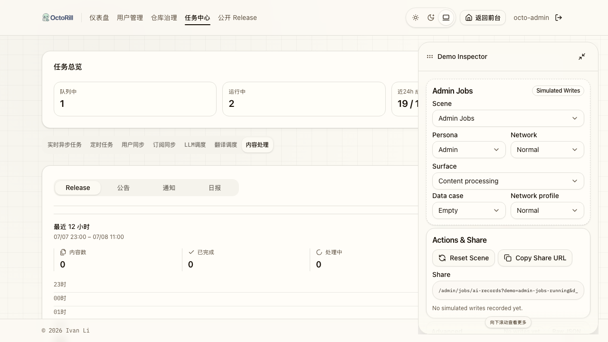

- source_type: `ui_demo`
  target_program: `mock-only`
  capture_scope: `browser-viewport`
  submission_gate: `captured`
  visual_comparison: `current-only`
  captured_at: `2026-09-24`
  requested_viewport: `393x852`
  viewport_strategy: `playwright-controlled`
  route: `/admin/jobs/ai-records?demo=admin-jobs-running&d_persona=admin&d_content_case=empty&d_llm_case=many`
  state: `Admin Jobs Inspector / mobile drawer`
  evidence_note: `393x852 CSS px 下 Inspector drawer 的 surface、data case 与 network profile 控件保持可读且无横向溢出。`

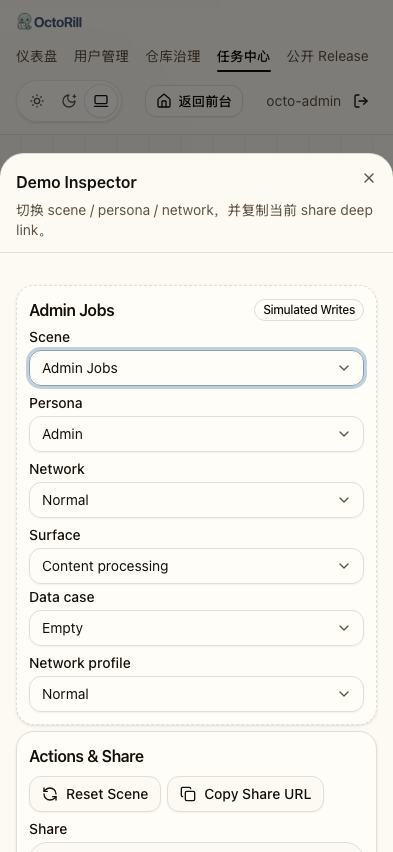

## 风险 / 开放问题 / 假设（Risks, Open Questions, Assumptions）

- 风险：Admin Jobs 页面请求面较宽，若后续新增 tab 初始加载逻辑，demo handler 需要同步补齐。
- 风险：`/demo/` build 目前仍共享正式页面 chunk，若继续扩展 scene data，可能需要额外的 manual chunk 策略。
- 假设：页面级最终视觉证据优先来自 `/demo/`，Storybook 仅补 reusable inspector / fragment / play 覆盖。
