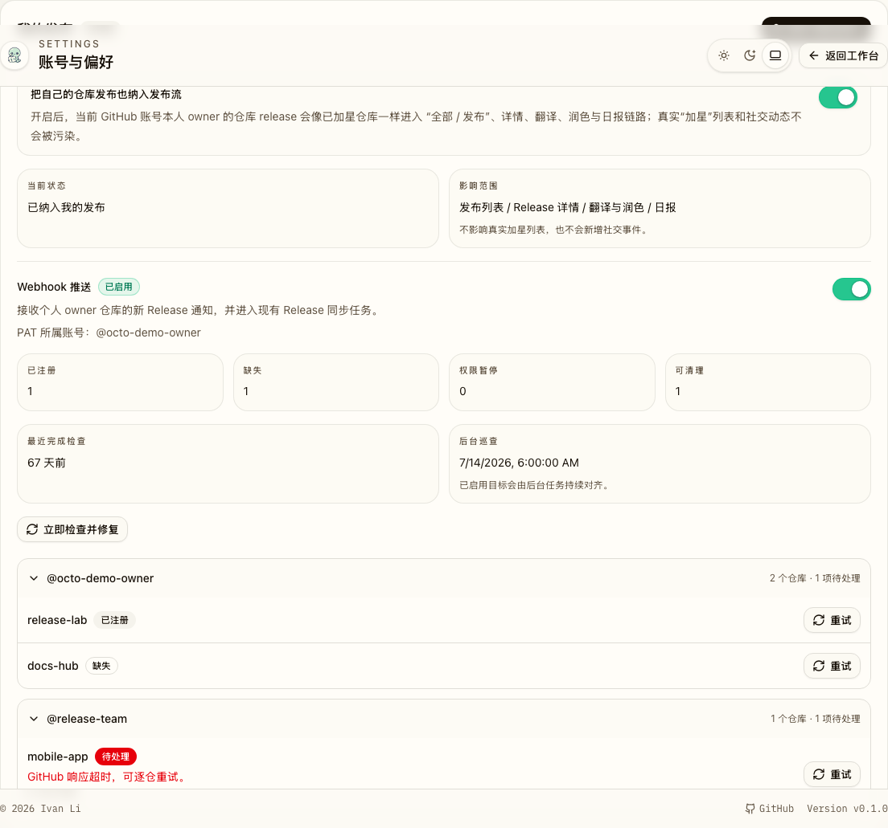
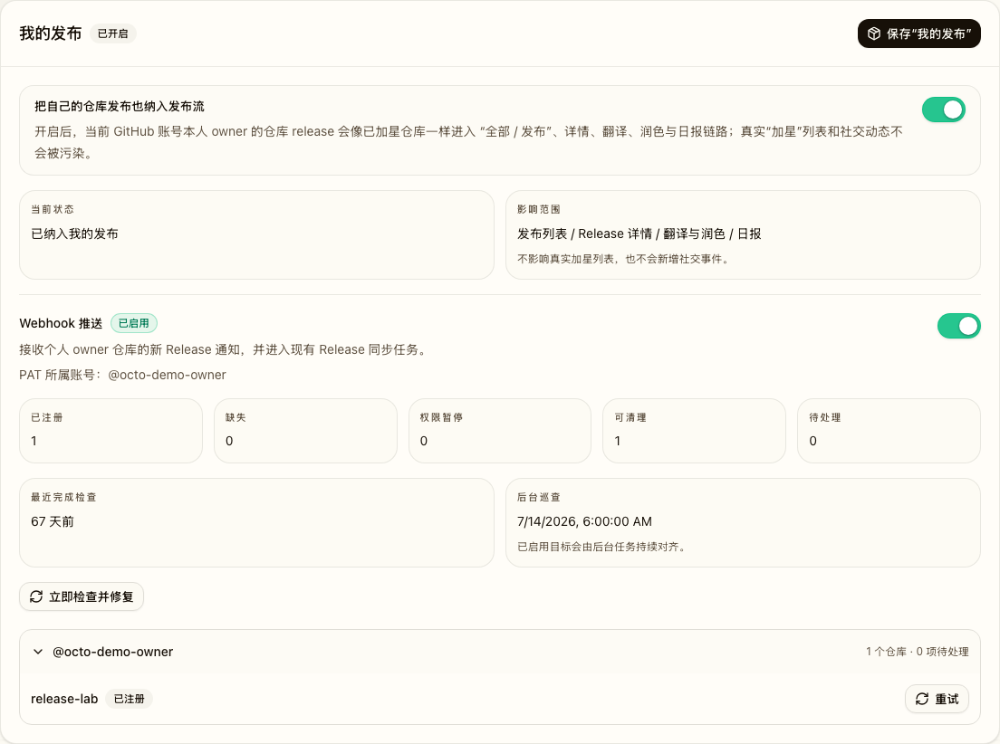
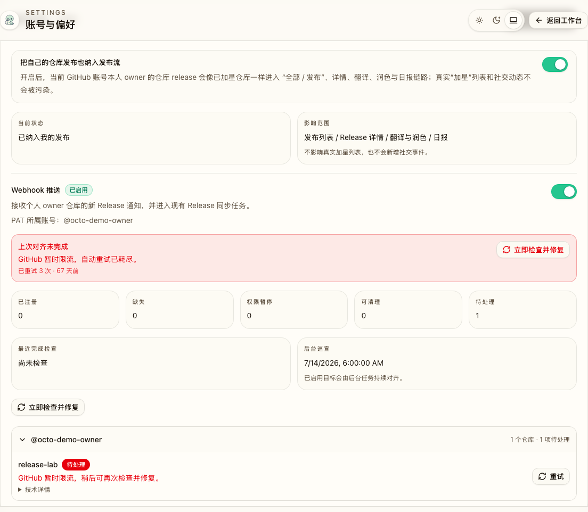
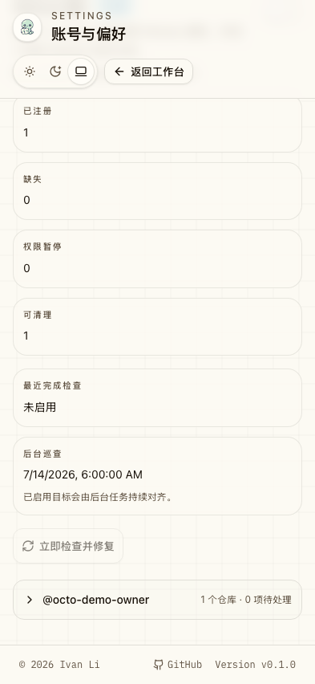
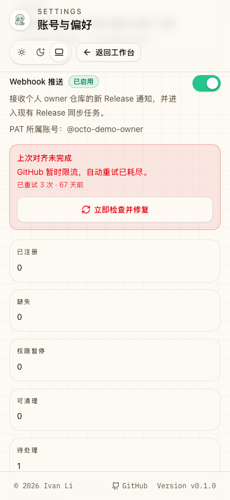
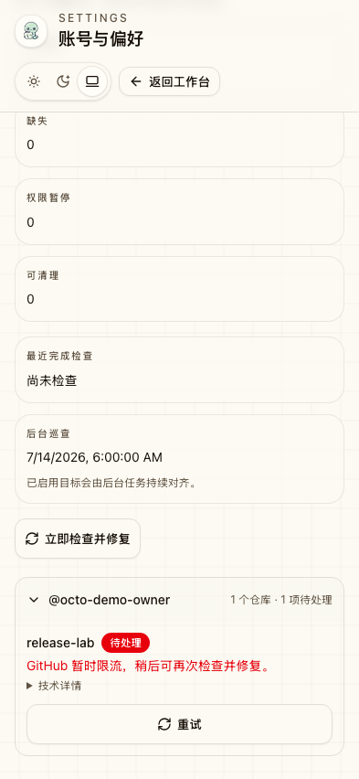

# Webhook 推送

## 背景 / 问题陈述

“我的发布”当前通过访问刷新和定时拉取发现用户个人仓库的新 Release。两次拉取之间的新发布无法及时进入共享 Release 缓存，且新增仓库没有主动建立上游通知通道。

本能力允许用户显式授权 OctoRill 使用其已保存的 classic PAT，为该 PAT 所属 GitHub 账号的个人 owner 仓库注册 Release webhook。Webhook 是快速发现信号，现有 Release 同步仍是数据写入路径。

## Context and Scope

本主题覆盖用户“我的发布”页面中的 Webhook 目标状态、GitHub Hook 对齐任务、本地接收门禁、持久化任务恢复，以及面向用户的状态展示。Release 同步、签名验证和 delivery 去重仍沿用现有语义；本主题只改变 Hook 的管理边界和状态表达。

## Requirements

- `REQ-WP-001`: 系统 MUST 将用户意图持久化为 `enabled`、`paused` 或 `deleted`，并且运行时观察结果不得反向改写该意图。
- `REQ-WP-002`: 所有 GitHub Hook 的创建、激活、暂停、删除和检查 MUST 由可恢复的后台对齐任务异步执行，HTTP mutation 不得直接调用 GitHub。
- `REQ-WP-003`: 目标为 `paused` 或 `deleted` 时，系统 MUST 在任何远端调用前关闭本地接收门禁；远端失败不得改变持久化目标。
- `REQ-WP-004`: 每名用户 MUST 同时最多存在一项未终态的 manage 操作；全局 audit 只能投递每用户 manage 任务。单仓远端结果不得中止其余目标的处置；临时 GitHub 或 SQLite 失败 MUST 仅保留受影响工作，并按 `1/5/15` 分钟退避且尊重更晚的 `Retry-After`。部分用户派发失败时 audit MUST 继续处理其余用户并重排同一 audit 任务，避免重复投递。
- `REQ-WP-005`: worker 仅可变更已验证为 OctoRill 管理、Hook ID、callback URL、`release` event 和仓库身份均匹配的 GitHub Hook。
- `REQ-WP-006`: 用户 API MUST 暴露目标状态、当前 operation、最近完成检查时间、Owner 分组和派生仓库状态，并移除旧的扁平管理路由合同。
- `REQ-WP-007`: 设置页 MUST 按 Owner 分组仓库，并区分健康目标状态、等待/执行进度和仓库错误；删除选择不得要求第二次确认。
- `REQ-WP-008`: 启用目标 MUST 显示本用户最近一次全量检查完成时间；定时 audit 只在没有人工任务时投递对齐任务，人工重试不得与上一轮重叠。
- `REQ-WP-009`: API MUST 暴露待处理数量与最新终态失败；新的 queued/running 或成功任务出现后 MUST 隐藏旧失败。
- `REQ-WP-010`: GitHub 明确报告仓库已归档或只读时，系统 MUST 将仓库标记为 `archived` 终态错误，不得提示用户修改 PAT 或自动修改 Hook。
- `REQ-WP-011`: 已归档仓库 MUST 作为可见、不可操作的仓库处置结果保留；它不计入待处理、不提供重试入口，也不阻塞全量检查完成。
- `REQ-WP-012`: 已知为私有但不受当前 classic PAT scope 覆盖的自有仓库 MUST 显示 `pat_scope_excluded`，不得显示为等待注册或重复发起 GitHub Hook 请求。
- `REQ-WP-013`: 首次成功持久化的、属于已启用目标用户的合格自有仓库基线 MUST 在同一 SQLite 事务中创建或推进 Webhook 对齐需求。系统 MUST 在提交后投递对齐；已有操作运行时，需求 MUST 保留并在该操作结束后触发一次跟进对齐。
- `REQ-WP-014`: 不再属于当前 PAT owner 的仓库 MUST 停止本地 Release 接收并显示为 `out_of_scope`。系统不得因所有权移出范围而自动删除远端 Hook。

### Goals

- 在“我的发布”中提供默认未启用的“Webhook 推送”目标状态。
- 提供统一的“立即检查并修复”入口，以及逐仓修复入口；Hook 的注册、暂停、恢复和删除全部由异步对齐任务执行。
- 开启后立即注册，并由管理员配置的后台定时巡查查漏补缺；默认周期 7 天。
- 权限错误按仓库暂停自动巡查，直到人工注册成功；归档仓库作为不可修复的终态观察错误保留。
- 验证 GitHub HMAC 签名并幂等接收新发布 Release 事件，再复用共享 Release 同步队列。

## Non-goals

- 不支持 fine-grained PAT、组织仓库或非 PAT 所属账号的仓库。
- 不接收非 Release 事件，不处理 Release 编辑、撤回或删除。
- 不新增任何名为“巡查”或“立即巡查”的按钮；巡查仅指后台定时任务。
- 不删除或修改非 OctoRill 管理的 GitHub webhook。

## Interfaces & Contracts

- HTTP API：[`contracts/http-apis.md`](./contracts/http-apis.md)
- DB：[`contracts/db.md`](./contracts/db.md)

## Functional Contract

### 开关与前置条件

- `users.webhook_push_desired_state` 默认 `deleted`，合法值为 `enabled|paused|deleted`。
- `users.webhook_push_enabled` 是本地接收门禁；目标为 `paused` 或 `deleted` 时必须先置为 `0`。
- “Webhook 推送”依赖 `include_own_releases=1`。关闭“我的发布”时必须进入同一“暂停或删除 Hook”选择流程，不得隐式删除 GitHub hooks。
- 开启前必须确认本地已持久化的前置条件：
  - 已保存 PAT 且最近校验有效；
  - PAT owner 是当前用户已绑定的 GitHub 账号；
  - classic PAT scope 包含 `public_repo` 或 `repo`；
  - `OCTORILL_PUBLIC_BASE_URL` 是 GitHub 可访问的 HTTPS 地址。
- 开启必须经过二次确认。确认内容只说明当前授权动作：权限用途、仅监听新发布 Release 和 secret 加密保存。关闭时在同一选择弹窗中选择保留并暂停或删除 Hook；选择删除后直接提交，不再二次确认。
- 启用目标成功后立即排队一次全量注册。单仓失败不回滚目标；页面显示“等待注册”或“注册中”，不显示异常。
- HTTP mutation 不调用 GitHub；worker 在任何 Hook 变更前实时复核 PAT owner、scope 和 GitHub 身份，失败时保留目标并按任务状态展示。

### 仓库范围

- 目标仓库来自 PAT owner 对应 GitHub connection 刷新的 `owned_repo_star_baselines`。
- 仅处理 `owner_login` 与 PAT owner login 一致的个人 owner 仓库。
- `public_repo` PAT 仅选择公开仓库；`repo` PAT 可覆盖公开与私有仓库。
- 已知私有但不受当前 PAT scope 覆盖的基线保留在列表中，并派生为 `pat_scope_excluded`；它不是 `waiting_registration`，不触发远端调用。PAT scope 覆盖变化后重新进入对齐范围。
- 移出当前 PAT owner 范围的已观察仓库保留为 `out_of_scope`，不再接收 Release，也不触发自动远端删除。

### 注册、检查和删除

- 注册先列出仓库 hooks，按 callback URL 与 `release` event 识别 OctoRill hook。
- 没有匹配项时创建；恰好一个匹配项时确保 active、JSON content type、Release event 与当前 secret；多个匹配项标记冲突，不自动删除。
- 交互式全量注册包含 `permission_paused` 仓库并在成功后解除暂停；定时巡查跳过这类仓库，直到 PAT 权限或 owner 校验恢复，避免无效远端请求。
- 检查并修复核对 hook，并按目标状态创建、激活、暂停或删除；所有远端调用均由后台任务执行。
- worker 必须为每个目标记录独立处置结果，并在单仓 GitHub 错误、归档或 scope 排除后继续处理后续目标。归档、`pat_scope_excluded` 与需要人工处理的单仓结果不得使批次本身失败；只要全部目标已得到处置，`last_completed_check_at` 必须更新。
- 临时失败重试必须只覆盖未完成或临时失败的仓库，不能重新对健康仓库发起不必要的 GitHub Hook 请求。无法持久化单仓处置结果的 SQLite 故障按基础设施故障重排，不得静默跳过该仓库。
- 批量删除仅在目标为 `deleted` 时执行，只删除数据库记录了 hook ID 且通过身份校验的 OctoRill hooks。
- 关闭后接收端忽略事件。删除失败保留 hook 记录和错误，允许再次删除。

### 定时巡查

- 管理员配置 `webhook_push_audit_interval_days`，合法范围 `1..=30`，默认 `7`。
- 定时巡查处理启用目标用户，并恢复处理暂停或删除目标中仍保留远端 Hook 的用户。
- 每轮刷新 PAT owner 的个人仓库基线，按持久目标检查并修复缺失、未激活或应暂停/删除的 hooks。
- 每名用户只投递一个带 `scheduled=true` 的 manage 任务；已有 queued/running manage 时复用该任务，不在 audit 任务内执行 GitHub 请求。
- `permission_paused` 仓库必须跳过；401、403、仍存在基线时的 404，以及 GitHub 明确返回的权限错误进入该状态。归档或只读错误进入 `archived`，不进入 `permission_paused`。
- 网络、限流和 GitHub 5xx 为暂时错误，不进入权限暂停。

### 新仓库对齐需求

- 自有仓库发现以实际持久化的 `owned_repo_star_baselines` 为准；尚未完成基线持久化的 GitHub snapshot 不得触发 Webhook 注册。
- 基线事务为已启用目标用户首次写入合格仓库时，必须原子地推进该用户的 Webhook 对齐需求 generation。事务提交后，调度器立即尝试投递全量对齐。
- 每个对齐任务携带其消费的 generation。任务仅在已处置完整目标集后确认该 generation；运行期间出现更高 generation 时，调度器必须在当前任务终态后投递一次跟进对齐。
- 需求投递失败、进程重启或已有任务占用时，未确认 generation 必须保留并由调度器恢复；周期 audit 是审计兜底，不是新仓库注册的唯一触发器。

### Webhook 接收

- 接收端必须先要求提供格式有效的 `X-Hub-Signature-256`；对于能匹配 hook 记录的请求，必须使用该用户的 secret 验证签名并拒绝签名错误请求。hook 记录不存在时没有可用 secret，按下述忽略语义返回接受但不入队。
- `X-GitHub-Delivery` 全局去重；`ping` 安全返回成功。
- 只处理 `X-GitHub-Event: release` 且 `action=published`、`release.draft=false` 的 payload。
- 有效事件通过 repo ID 挂入现有共享 Release 队列；HTTP 请求不得等待 GitHub Release 拉取完成。
- 用户或子开关关闭、hook 记录不存在、repo 不匹配、其他 action 均返回接受但不入队。

## UI Contract

- “Webhook 推送”位于 `/settings?section=my-releases` 现有卡片内，使用独立 Switch。
- 卡片必须展示启用状态、PAT owner、已注册/缺失/权限暂停/可删除/待处理数量、最近与下次定时巡查。
- 卡片必须展示最新基础设施终态失败的简短原因、重试次数和可行动的“立即检查并修复”；单仓处置结果显示在对应行内，不能把已完成但有需关注仓库的批次误报为失败。
- 归档仓库只显示归档原因，不提供重试或 PAT 修复指引，且不计入待处理。`pat_scope_excluded` 显示当前 PAT 未覆盖的原因，不显示为等待注册；`out_of_scope` 显示仓库已不在当前 owner 管理范围。
- 固定全量按钮名称：`立即检查并修复`。
- 仓库行提供逐仓 `重试`；页面不得出现“注册 Webhook”“删除 Webhook”或可点击的“巡查”。
- 页面按 Owner 分组显示仓库，行内不重复显示 Owner。
- 启用目标显示本用户最近完成检查时间；首次显示“尚未检查”。
- 权限错误必须给出 repo、失败原因与 classic PAT 修复指引；无 PAT 时链接到同一设置页的 GitHub PAT section。
- 仓库归档错误必须显示 `仓库已归档`，不得显示“权限暂停”或 PAT 修复链接。

## Verification

- `VER-WP-001` (covers: `REQ-WP-001`): SQLite migration and state-machine tests prove the three target states persist, historical rows map without external calls, and task failures never overwrite the target.
- `VER-WP-002` (covers: `REQ-WP-002`): API route tests and mock GitHub transport prove mutations enqueue work and every Hook mutation runs only in the worker.
- `VER-WP-003` (covers: `REQ-WP-003`): receiver and operation tests prove paused/deleted delivery is ignored before remote work and failed remote work preserves the target.
- `VER-WP-004` (covers: `REQ-WP-004`): job lease, delayed retry, `Retry-After`, cancellation-boundary, and worker-recovery tests prove one inflight operation per user and three scheduled retries at `1/5/15` minutes.
- `VER-WP-005` (covers: `REQ-WP-005`): managed-hook identity tests prove unmatched Hook ID, callback, event, or repository identity is reported and never mutated.
- `VER-WP-006` (covers: `REQ-WP-006`): HTTP contract tests prove the new GET/PATCH/reconcile routes return operation snapshots, derived states, check timestamps, and Owner groups without the old flat management contract.
- `VER-WP-007` (covers: `REQ-WP-007`): Settings Playwright and mock-only visual tests prove Owner grouping, waiting/working/error states, healthy colors, the close-choice dialog, and direct delete submission on desktop and mobile.
- `VER-WP-008` (covers: `REQ-WP-008`): audit scheduling and Settings tests prove the last completed check is shown with relative/local-time detail and manual retry is blocked while the prior operation is active.
- `VER-WP-009` (covers: `REQ-WP-004`, `REQ-WP-011`): mocked multi-repository worker tests prove archived and repository-local failures do not skip later targets, healthy repositories are not retried, and a completed sweep updates the completion timestamp.
- `VER-WP-010` (covers: `REQ-WP-012`, `REQ-WP-014`): API and Settings tests prove PAT-scope exclusions and ownership-scope exits are distinct from waiting registration, permission pauses, and archived repositories.
- `VER-WP-011` (covers: `REQ-WP-013`): transaction and restart tests prove a newly persisted baseline and its reconciliation demand commit atomically, active work produces exactly one follow-up pass, and an unconsumed demand is dispatched after restart.

## Related ADRs

- [0010 Webhook Push Desired State](../../adr/0010-webhook-push-desired-state.md)

## Visual Evidence

证据来源为 mock-only Web Demo（`settings-my-releases`），通过 `d_webhook` 深链复现状态，桌面使用页面级截图，移动使用 `393x852` CSS 视口。

