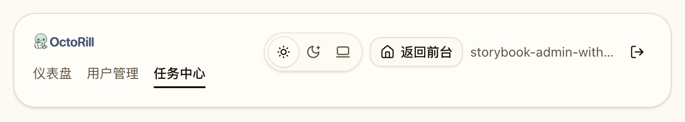
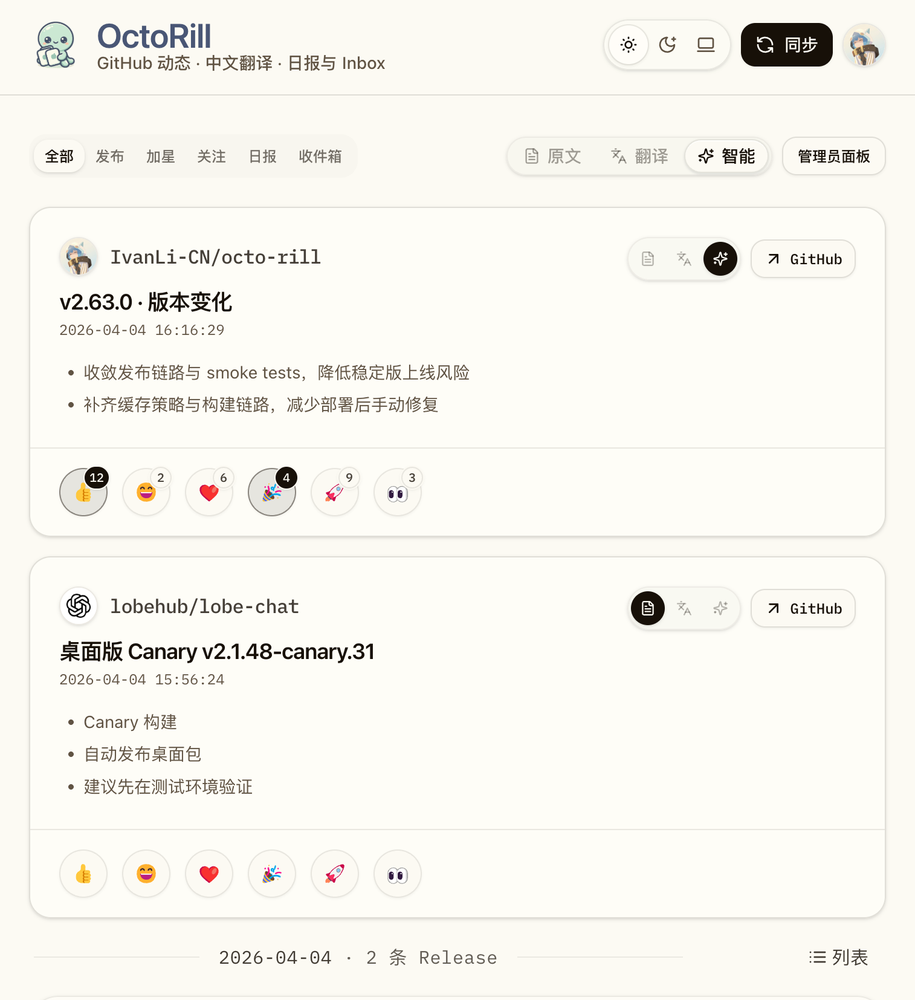
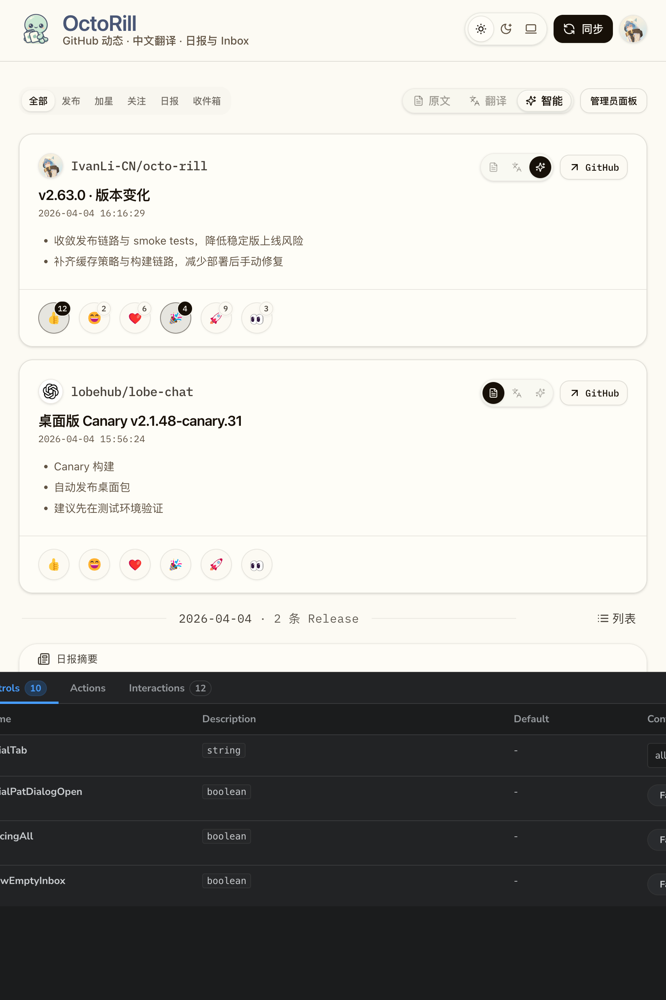

# Dashboard / Admin 窄平板断点补齐与自动化验证收口（#whda5）

## 背景 / 问题陈述

- 已完成的 `#cuz3w` 只冻结了 `768–1023px` 的平板页头合同，`640–767px` 仅被视为“顺带改善”，没有被真正纳入验收范围。
- 主人在 `757x827` 下复现到 Dashboard 页头仍然退回纵向堆叠：`ThemeToggle / 同步 / avatar` 掉到品牌块下方，说明当前断点仍把窄平板 / 大横屏手机口径漏在外面。
- Dashboard 内容区虽然已移除平板上的 Inbox 快捷侧栏，但新的回归合同需要明确扩展到整个 `640–1023px` 区间，避免再次出现某个子区间“看起来像移动端”的半修状态。
- 本轮还需要把 Storybook build、Storybook play 与 Playwright 一起收口；仅有单一实机截图不足以证明响应式合同已经稳定。

## 目标 / 非目标

### Goals

- 把 Dashboard / Admin 页头的平板同排合同从 `768–1023px` 扩大到 **`640–1023px`**。
- 把 `640 / 757 / 853 / 1023` 固化为新的窄平板回归宽度，其中 `757x827` 作为主复现口径。
- 保持 Dashboard 内容区在 `640–1023px` 全段都是单主列，不显示 `Inbox Quick List` 侧栏，只保留顶部 `收件箱` tab。
- 为 DashboardHeader、Dashboard 页面、AdminHeader 增加稳定 Storybook viewport 入口与 `play` 几何断言。
- 为 dashboard/admin Playwright 回归增加四档宽度，并验证长 login 文本不会把 Admin utility actions 挤出视口。
- 把 `bun run storybook:build` 纳入本轮验收门禁，与 `build`、e2e 一起完成自动化收口。

### Non-goals

- 不改动 `<640px` 的 mobile compact shell、手势与 footer auto-hide 语义。
- 不改动 `>=1024px` 的 desktop 品牌 / 导航 / 信息架构语义。
- 不新增公开 props、路由、API、schema、数据库或权限逻辑。
- 不回写或重定义历史 `#cuz3w` 的完成状态；本规格只作为新的 follow-up 追踪。

## 范围（Scope）

### In scope

- `web/src/pages/DashboardHeader.tsx`
- `web/src/layout/AdminHeader.tsx`
- `web/src/pages/Dashboard.tsx`
- `web/src/stories/DashboardHeader.stories.tsx`
- `web/src/stories/AdminHeader.stories.tsx`
- `web/src/stories/Dashboard.stories.tsx`
- `web/e2e/dashboard-access-sync.spec.ts`
- `web/e2e/admin-users.spec.ts`
- `web/e2e/admin-jobs.spec.ts`
- `docs/specs/README.md`
- `docs/specs/whda5-dashboard-admin-narrow-tablet-header-coverage/SPEC.md`

### Out of scope

- Rust backend 与任何服务端接口
- Landing、Settings 与非 Dashboard/Admin 页头 UI
- 非响应式合同相关的视觉重设计

## 需求（Requirements）

### MUST

- DashboardHeader 在 `640–1023px` 必须采用两列主行：左列品牌 / 副标题，右列 `ThemeToggle + 同步 + avatar`。
- AdminHeader 在 `640–1023px` 必须采用两列主行：左列品牌 + 管理员导航块，右列 `ThemeToggle + 返回前台 + login/logout`。
- Dashboard 与 Admin 页头在 `640 / 757 / 853 / 1023` 四档宽度下都不得出现 utility actions 掉到品牌 / 导航块下方的错位。
- Dashboard feed 在 `640–1023px` 全段必须保持单主列，不得显示右侧 `Inbox Quick List` 侧栏。
- 长 login 文本只能截断自身，不能把 `返回前台` 或退出登录按钮挤出可视区。
- Storybook 必须提供稳定的窄平板 viewport 入口，并通过 `play` 断言验证“主行同排 + 无横向溢出 + Dashboard 无 Inbox 侧栏”。
- `cd web && bun run build`、`cd web && bun run storybook:build`、`cd web && bun run e2e -- dashboard-access-sync.spec.ts admin-users.spec.ts admin-jobs.spec.ts` 都必须通过。

### SHOULD

- 继续复用既有 `data-dashboard-*` / `data-admin-*` 布局锚点，只补最少的新内部 `data-*` 钩子。
- 让 Storybook 证据入口直接绑定对应 viewport，避免靠人工缩放浏览器窗口复现。

### COULD

- 无。

## 功能与行为规格（Functional/Behavior Spec）

### Core flows

1. **Dashboard 窄平板页头**
   - 当视口宽度进入 `640–1023px` 时，DashboardHeader 立即切入两列主行。
   - 左列保留品牌、标题、副标题；右列固定 `ThemeToggle / 同步 / avatar`。
   - tabs 与次级控制带继续落在主行下方，不与主行 action cluster 混排。

2. **Dashboard 窄平板内容区**
   - `640–1023px` 下所有 tab 都维持单主列。
   - `Inbox Quick List` 侧栏不再渲染；查看收件箱改走顶部 `收件箱` tab 主列表。

3. **Admin 窄平板页头**
   - `640–1023px` 下 AdminHeader 进入两列主行。
   - 左列保留品牌与管理员导航；右列固定 `ThemeToggle / 返回前台 / login/logout`。
   - login 过长时只允许 label 自身截断，不得把 utility cluster 挤到下一行。

4. **自动化验证**
   - Storybook 为 DashboardHeader、Dashboard 页面、AdminHeader 分别暴露 `640 / 757 / 853 / 1023` 入口。
   - Playwright 对 Dashboard / Admin header 几何约束做参数化回归，而不是只看文案。

### Edge cases / errors

- `757x827` 必须作为主复现口径保留在 Storybook 与 Playwright 中。
- `1023px` 仍属于平板合同上边界，不能提前退回桌面专属布局。
- 如果 Storybook build 失败，本轮不算验收通过。

## 接口契约（Interfaces & Contracts）

### 接口清单（Inventory）

| 接口（Name） | 类型（Kind） | 范围（Scope） | 变更（Change） | 契约文档（Contract Doc） | 负责人（Owner） | 使用方（Consumers） | 备注（Notes） |
| --- | --- | --- | --- | --- | --- | --- | --- |
| `DashboardHeader` narrow-tablet layout contract | React component | internal | Modify | None | web | Dashboard / Storybook / Playwright | 从 `640px` 起固定为两列主行 |
| `AdminHeader` narrow-tablet layout contract | React component | internal | Modify | None | web | Admin pages / Storybook / Playwright | 长 login 仅截断自身 |
| `Dashboard` narrow-tablet content contract | React page shell | internal | Modify | None | web | Dashboard / Storybook / Playwright | `640–1023px` 全段单主列，无 Inbox 侧栏 |

### 契约文档（按 Kind 拆分）

- None

## 验收标准（Acceptance Criteria）

- Given `640 / 757 / 853 / 1023` 打开 Dashboard
  When 页头与顶部控制带完成渲染
  Then 品牌块与 `ThemeToggle / 同步 / avatar` 处于同一顶层主行，控制带位于主行下方，且页面不显示 `Inbox Quick List` 侧栏。

- Given `640 / 757 / 853 / 1023` 打开 Admin Users 或 Admin Jobs
  When 页头完成渲染
  Then utility actions 固定在品牌 / 导航块右侧，`返回前台` 可见可点，长 login 仅截断自身。

- Given Storybook 对应窄平板入口
  When 运行 `play`
  Then 必须断言主行对齐、无横向溢出，并且 Dashboard 页面级入口断言 `data-dashboard-sidebar-inbox` 不存在。

- Given 运行目标 build 与 e2e
  When 所有命令结束
  Then `build`、`storybook:build` 与三条目标 Playwright spec 全部通过。

## 实现前置条件（Definition of Ready / Preconditions）

- Storybook 已启用 `storybook/viewport`，可新增稳定 viewport 入口。
- 当前仓库允许为页头和 e2e 增补内部 `data-*` 测试锚点。

## 非功能性验收 / 质量门槛（Quality Gates）

### Testing

- `cd web && bun run build`
- `cd web && bun run storybook:build`
- `cd web && bun run e2e -- dashboard-access-sync.spec.ts admin-users.spec.ts admin-jobs.spec.ts`

### UI / Storybook (if applicable)

- Stories to add/update: `web/src/stories/DashboardHeader.stories.tsx`、`web/src/stories/Dashboard.stories.tsx`、`web/src/stories/AdminHeader.stories.tsx`
- Visual evidence source: Storybook canvas
- Visual evidence sink: `## Visual Evidence`

## Visual Evidence

- source_type: `storybook_canvas`
  target_program: `mock-only`
  capture_scope: `element`
  requested_viewport: `757x827`
  viewport_strategy: `storybook-viewport`
  sensitive_exclusion: `N/A`
  submission_gate: `approved`
  story_id_or_title: `Pages/Dashboard Header / Regression / Narrow Tablet 757`
  state: `dashboard-header-narrow-tablet-757`
  evidence_note: 验证 `757x827` 主复现宽度下，DashboardHeader 已在 `640–1023px` 合同内切到两列主行，品牌块与 `ThemeToggle / 同步 / avatar` 保持同排。
  PR: include
  image:
  

- source_type: `storybook_canvas`
  target_program: `mock-only`
  capture_scope: `element`
  requested_viewport: `757x827`
  viewport_strategy: `storybook-viewport`
  sensitive_exclusion: `N/A`
  submission_gate: `approved`
  story_id_or_title: `Layout/Admin Header / Regression / Narrow Tablet 757`
  state: `admin-header-narrow-tablet-757`
  evidence_note: 验证 AdminHeader 在 `757x827` 下把 utility cluster 固定到右列，`返回前台` 保持可见，长 login 只截断自身。
  PR: include
  image:
  

- source_type: `storybook_canvas`
  target_program: `mock-only`
  capture_scope: `element`
  requested_viewport: `757x827`
  viewport_strategy: `storybook-viewport`
  sensitive_exclusion: `N/A`
  submission_gate: `approved`
  story_id_or_title: `Pages/Dashboard / Regression / Narrow Tablet 757`
  state: `dashboard-page-narrow-tablet-757`
  evidence_note: 验证 Dashboard 页面在 `757x827` 下维持单主列与页头同排合同，且 `Inbox Quick List` 侧栏仍保持隐藏。
  PR: include
  image:
  

- source_type: `storybook_canvas`
  target_program: `mock-only`
  capture_scope: `element`
  requested_viewport: `853x1280`
  viewport_strategy: `storybook-viewport`
  sensitive_exclusion: `N/A`
  submission_gate: `approved`
  story_id_or_title: `Pages/Dashboard / Evidence / Tablet Header Inline`
  state: `dashboard-page-tablet-853`
  evidence_note: 保留 `853x1280` canonical tablet 证据，证明原平板口径仍保持页头同排与单主列内容区，不因窄平板 follow-up 回退。
  image:
  

## 方案概述（Approach, high-level）

- 把两个页头从 `sm (640px)` 起切入 grid 两列主行，同时保留 `<640px` 的 mobile compact 特判与 `>=1024px` 的 desktop 语义。
- 让 Dashboard 页面与 Storybook 页面级 mock 一起把 sidebar 阈值收敛到 `1024px`，确保 `640–1023px` 全段单主列。
- 用 Storybook + Playwright 共同锁住 `640 / 757 / 853 / 1023` 的窄平板合同，避免再次出现“某个宽度没进合同”的漏网区间。

## 风险 / 开放问题 / 假设（Risks, Open Questions, Assumptions）

- 风险：如果后续继续往 utility cluster 增加新按钮，窄平板区间可能再次被挤压，需要继续守住截断与几何断言。
- 开放问题：无。
- 假设：`640–1023px` 可以统一视为本轮要彻底补齐的窄平板 / 大横屏手机合同区间。
