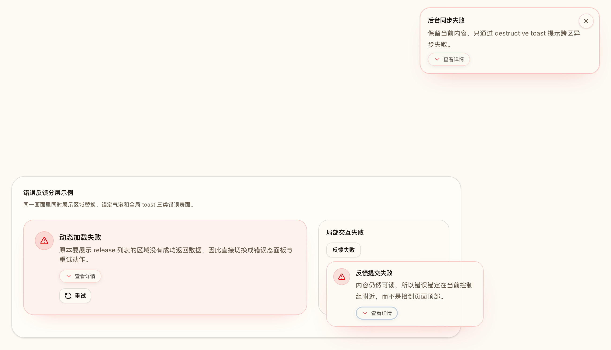
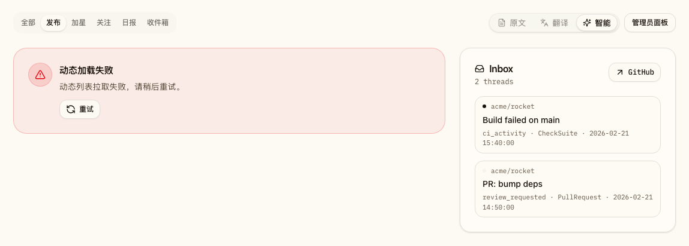
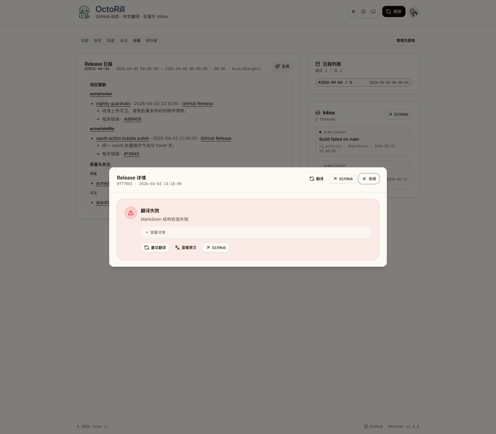

# 前台错误呈现分层改造（#wt8rb）

## 背景 / 问题陈述

当前 Dashboard 会把 feed 首载失败、后台同步失败、release detail 翻译失败、reaction 失败等不同粒度的异常统一堆到页面顶部，导致错误位置和实际出错点脱节；一旦原内容区域失败，用户也看不到明确的补救动作。

同时，翻译相关公开接口会把原始英文错误直接暴露到前台主界面，既不友好，也无法稳定复用已有的错误分类能力。

## 目标 / 非目标

### Goals

- 用固定规则把前台错误分流为 **区域替换 / 锚定气泡 / 全局 toast** 三类呈现。
- 停止 Dashboard 顶部总线式红字错误，让错误回到实际失败位置。
- 复用现有 Radix 体系，引入稳定的 `Popover` 与 `Toast` wrapper，不额外引入新的通知库。
- 公开翻译错误的 `error_code / error_summary / error_detail`，前台默认显示中文短摘要，把原始英文原因降到次级详情。
- 保持 Landing 登录卡与 Settings 卡片内错误继续 inline，并推进到 PR merge-ready。

### Non-goals

- 不改动 `/admin*` 页面。
- 不改动成功态与中性提示（例如版本更新 notice）。
- 不重写翻译/同步业务语义，也不新增额外后端任务类型。

## 范围（Scope）

### In scope

- `web/src/pages/Dashboard.tsx`
- `web/src/feed/*`
- `web/src/sidebar/ReleaseDetailCard.tsx`
- `web/src/pages/Landing.tsx`
- `web/src/pages/Settings.tsx`
- `web/src/components/ui/*` 与新增共享 feedback primitives
- `web/src/stories/*` 中与 Dashboard / Landing / Settings / primitives 相关的稳定故事
- `src/api.rs`
- `src/translations.rs`
- `web/src/api.ts`
- `docs/specs/README.md`

### Out of scope

- `web/src/admin/**`
- 非错误态的文案或样式重设计
- GitHub PAT / LinuxDO / 日报设置的业务逻辑调整

## 需求（Requirements）

### MUST

- **阻塞内容区** 失败时，原区域必须切换为错误态面板，并提供与当前上下文相关的动作按钮。
- **局部交互** 失败但原内容仍可读时，必须使用锚定到触发点或控制组的错误气泡，不得再把错误抬到页面顶部。
- **后台/跨区/已有内容之上的异步失败** 必须使用 destructive toast，且 toast 必须避开 sticky header 与安全区。
- `Tooltip` 继续只承载标签提示；新的可操作错误气泡必须基于可靠的 `Popover` 实现。
- `GET /api/feed` 的 `translated` / `smart`、`GET /api/releases/{id}/detail` 的 `translated`、以及 `POST/GET /api/translate/requests*` 的 `result` 必须新增 `error_code`、`error_summary`、`error_detail`。
- `result.error` 对外必须优先返回中文短摘要；原始英文原因只放在 `error_detail`。
- Landing 登录卡与 Settings 各卡片内错误继续 inline，不得提升为顶部横幅或 toast。
- Storybook 必须提供至少一组稳定入口同时展示区域替换、气泡与 toast 三类错误，并写入本 spec 的 `## Visual Evidence`。

### SHOULD

- Dashboard 与 Release detail 的错误摘要应尽量复用后端统一错误分类，避免前台散落硬编码英文文案。
- 气泡与 toast 应支持窄视口自动翻边/避障，并保留 ESC / outside click 关闭行为。

## 功能与行为规格（Functional/Behavior Spec）

### 错误分流规则

- **区域替换（ErrorStatePanel）**
  - 适用场景：feed 首次加载失败且列表为空、release detail 详情加载失败、release detail 翻译失败后正文区无法展示预期内容。
  - 呈现：在原内容区域内显示标题、中文短摘要、可选详情展开与相关动作（如 `重试` / `查看原文` / `GitHub`）。
- **锚定气泡（ErrorBubble）**
  - 适用场景：reaction toggle、load-more、类似局部交互失败。
  - 呈现：气泡锚定到触发按钮或控制组；正文优先显示中文短摘要，可选展开原始详情。
- **全局 toast（AppToast）**
  - 适用场景：后台同步、SSE 断流、已有内容上的后台刷新失败、跨区异步异常。
  - 呈现：固定在安全区内，不遮挡 sticky header；支持 destructive 视觉样式与关闭动作。

### Dashboard 路径

- 顶部 `bootError` 红字横幅必须移除。
- Feed 首载失败且当前 tab 列表为空时，主列显示区域错误态，不影响页头和 tab 壳层。
- 已有 feed / inbox / brief 内容时的后台刷新失败，不替换内容，只发 destructive toast。
- `loadMore` 失败需要回到列表底部的控制组，支持重新尝试。
- reaction 错误需要锚定在对应 reaction 控制组附近；PAT 缺失仍维持现有对话框流。

### Release detail 路径

- 详情加载失败时，modal 正文区切换为 ErrorStatePanel。
- 翻译失败或翻译结果校验失败时，正文区显示中文短摘要；英文原始错误只放在次级详情。
- 错误态仍需保留 `重试`、`查看原文/中文切换（若可用）` 与 `GitHub` 动作中的合法子集。

### Landing / Settings 边界

- Landing 的 `bootError` 继续留在登录卡内。
- Settings 的 LinuxDO / GitHub PAT / 日报设置错误继续在对应卡片内显示，不参与 toast 分流。

### Public API 契约

- Feed / release detail 的 `translated` 与 `smart` 响应对象为 additive 扩展：保留现有字段，新增可选错误元数据。
- `/api/translate/requests*` 的 `result.error` 规范为中文摘要优先；`error_detail` 保存原始细节，供前台气泡/错误态二级展示。
- 对结构校验失败等运行时可推导错误，服务端应返回稳定 `error_code` 与 `error_summary`，而不是让前台推断英文字符串。

## 验收标准（Acceptance Criteria）

- Given feed 首次加载失败且当前列表为空
  When Dashboard 完成错误渲染
  Then 主列显示错误态卡片和 `重试` 动作，而不是页面顶部孤立红字。

- Given feed 或 inbox 已有内容
  When 后台刷新或同步任务失败
  Then 原内容保持不变，并出现避开 sticky header 的 destructive toast。

- Given release detail 详情加载失败或翻译失败
  When modal 打开后进入失败态
  Then 正文区切换为错误态面板，默认展示中文短摘要，英文原始原因只出现在次级详情。

- Given reaction / load-more 等局部操作失败
  When 用户仍停留在当前内容上下文
  Then 错误气泡锚定到触发按钮或控制组，并支持关闭与自动翻边。

- Given Landing 登录卡或 Settings 卡片内发生错误
  When 页面渲染错误提示
  Then 错误仍显示在原卡片内，而不是挪到顶部横幅或 toast。

- Given Storybook 错误态故事
  When 以 docs 或 canvas 方式打开
  Then 可以同时审阅区域替换、气泡、toast 三类错误样式，并通过关键 `play` 断言。

## 非功能性验收 / 质量门槛（Quality Gates）

### Testing

- `cd /Users/ivan/.codex/worktrees/7289/octo-rill/web && bun run build`
- `cd /Users/ivan/.codex/worktrees/7289/octo-rill/web && bun run storybook:build`
- 补齐相关 Storybook `play` 校验；若现有 web 测试覆盖受影响路径，也必须保持通过。

### Visual verification

- 必须通过稳定 Storybook 场景生成 owner-facing 视觉证据。
- 最终视觉证据统一写入本 spec 的 `## Visual Evidence`。

## Visual Evidence

- source_type: storybook_canvas
  story_id_or_title: UI/Primitives · Error Feedback Surfaces
  state: 区域替换 + 锚定气泡 + destructive toast 同屏审阅
  evidence_note: 统一验证 ErrorStatePanel、ErrorBubble 与 AppToast 的最终层级与样式，不再把错误统一抬到顶部红字。
PR: include

- source_type: storybook_canvas
  story_id_or_title: Pages/Dashboard · Evidence / Feed Initial Failure Surface
  state: feed 首载失败且当前列表为空
  evidence_note: 验证 Dashboard 主列直接切换为区域错误态，并保留就地重试动作，侧栏内容不被错误横幅挤压。
PR: include

- source_type: storybook_canvas
  story_id_or_title: Pages/Dashboard · Evidence / Release Detail Translation Failure
  state: release detail 翻译失败正文区替换
  evidence_note: 验证 release detail modal 在翻译失败时切换为正文区 ErrorStatePanel，并保留重试、查看原文与 GitHub 动作。
PR: include

## 方案概述（Approach, high-level）

- 后端先把翻译错误元数据稳定公开，前端不再依赖裸英文字符串判断。
- 前端以共享反馈原语承载三类错误表面，逐步替换 Dashboard 顶部总线式错误出口。
- 使用 Storybook 稳定场景锁定视觉与交互，再进入构建、review 与 PR 收口。

## 风险 / 开放问题 / 假设（Risks, Open Questions, Assumptions）

- 风险：若 feed / release detail 继续把结构校验失败降级成“missing”而非显式错误，前台会丢失可解释性；本轮需要在服务端补齐稳定错误元数据。
- 风险：toast viewport 若不读取 header 高度与 safe-area，移动端可能遮住 sticky header；必须在壳层内统一放置 viewport。
- 开放问题：`/api/translate/requests*` 现有外部消费者是否依赖裸英文 `result.error` 做机器解析，当前仓库内未见证据，默认按 additive + 摘要优先处理。
- 假设：现有 Radix `radix-ui` 依赖已覆盖 `Popover` 与 `Toast`，无需额外新增第三方通知库。

## 参考（References）

- `/Users/ivan/.codex/worktrees/7289/octo-rill/web/src/pages/Dashboard.tsx`
- `/Users/ivan/.codex/worktrees/7289/octo-rill/web/src/feed/FeedGroupedList.tsx`
- `/Users/ivan/.codex/worktrees/7289/octo-rill/web/src/feed/FeedItemCard.tsx`
- `/Users/ivan/.codex/worktrees/7289/octo-rill/web/src/sidebar/ReleaseDetailCard.tsx`
- `/Users/ivan/.codex/worktrees/7289/octo-rill/src/api.rs`
- `/Users/ivan/.codex/worktrees/7289/octo-rill/src/translations.rs`
