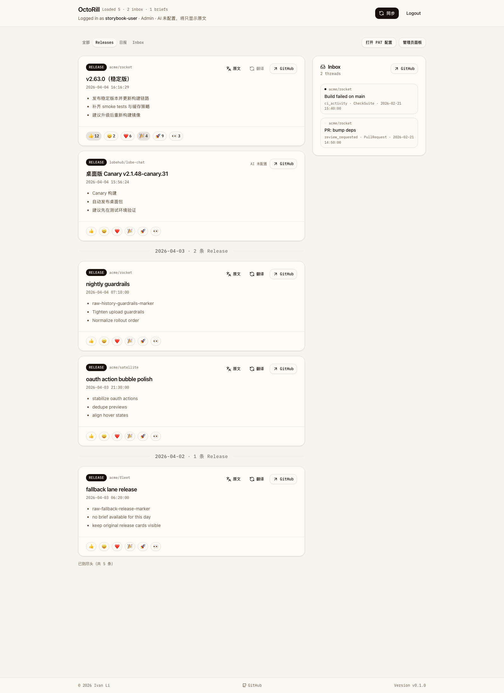
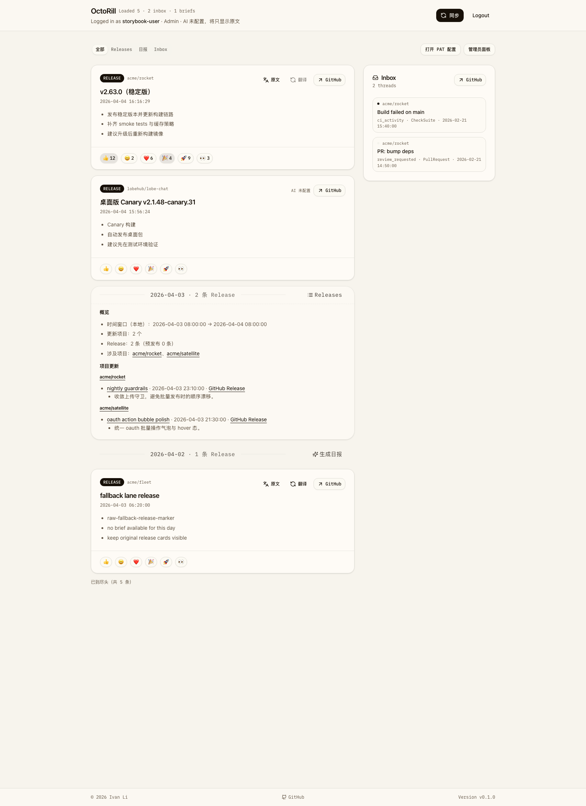
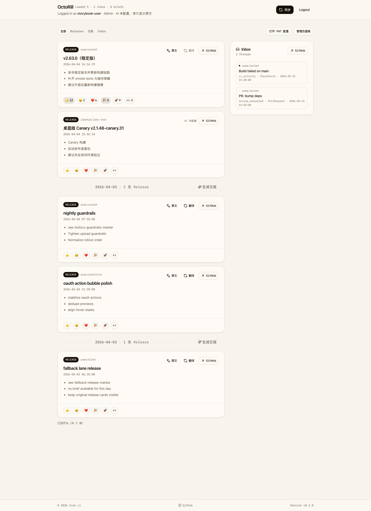

# Dashboard 按日报边界分组与历史日报折叠（#xaycu）

## 背景 / 问题陈述

- Dashboard 首页当前把 `全部` 与 `发布` 两个 tab 都渲染为同一条平铺 Release feed，缺少“按天阅读”的结构感。
- 用户在连续浏览多天 Release 时，很难快速分辨“今天”和“之前每天”的边界，也无法先看日报、再按需展开某一天的原始 Release 细节。
- 现有前端只有 `/api/briefs` 返回的日报样本窗口，没有一个稳定的 Dashboard 启动期“日报边界”配置可用于对 feed 做统一分组。

## 目标 / 非目标

### Goals

- 让 `发布` tab 按统一日报边界分组，并仅在日组切换处显示弱化的日期分隔线。
- 让 `全部` tab 保持“今天”直接展示原始 Release 卡片，而更早的日组优先以真实日报内容呈现。
- 历史日组在命中对应日报时，允许用户在“日报视图”和“日期分界 + 原始 Release 列表”之间来回切换。
- 当历史日组没有对应日报时，退回为 `发布` tab 同款的日期分隔线 + 原始 Release 卡片。
- 当历史日组没有对应日报时，允许用户按天手动触发日报生成，并在生成中看到占位日报卡片。
- 补齐 Dashboard 启动期可消费的日报边界配置，并同步更新 Storybook 与视觉证据。

### Non-goals

- 不改 `日报` tab 的列表与正文阅读流。
- 不改 `/api/feed`、`/api/briefs` 的主体列表语义、排序策略或分页方式。
- 不新增“缺日报时自动补生成”的后台任务。
- 不改 Release 详情弹窗、自动翻译、反馈表情、GitHub 跳转与现有 URL 规则。

## 范围（Scope）

### In scope

- `src/api.rs`
- `web/src/api.ts`
- `web/src/pages/Dashboard.tsx`
- `web/src/feed/**`
- `web/src/stories/Dashboard.stories.tsx`
- `docs/product.md`
- `docs/specs/README.md`

### Out of scope

- Dashboard 其他 tab 的信息架构调整
- Inbox / briefs API 与 UI 行为改造
- 非 Dashboard 页面

## 需求（Requirements）

### MUST

- Dashboard 必须拿到稳定的“日报边界本地时间”配置，不依赖从已有 brief 样本反推。
- `发布` tab 的 feed 必须按日报边界切分成多个日组。
- 每个日组的分隔线必须显示日期与当日 Release 数，视觉上弱化为结构分隔，而不是主标题；首个可见日组不显示前置分隔。
- `全部` tab 中，当前日组必须继续直接展示原始 Release 卡片。
- `全部` tab 中，历史日组若有对应日报，默认只展示真实日报内容，并提供切换到原始 Release 列表的入口。
- `全部` tab 中，历史日组若切换到原始 Release 列表，则不再同时显示日报卡片，且日期分界右侧必须提供返回日报视图的按钮。
- `全部` tab 中，历史日组若无对应日报，必须直接展示原始 Release 列表，不显示伪摘要。
- `全部` tab 中，历史日组若无对应日报，日期分界右侧必须提供“生成日报”按钮；触发后按钮进入 spinning 状态，同时显示占位日报卡片，待生成成功后替换为真实日报。
- 历史日组的展开状态必须彼此独立，且不写入 URL 或本地持久化。

### SHOULD

- 分组 helper 应该同时被运行时代码与 Storybook preview 复用，避免 mock 行为与真实页面分叉。
- 历史日报容器应弱化样式层级，避免比原始 Release 卡片更抢眼。
- 历史日报组应保留卡片形态，但卡头需要继承普通 divider 的线性视觉语言，避免分隔线悬浮在日报卡片之外。

### COULD

- 无。

## 功能与行为规格（Functional/Behavior Spec）

### Core flows

- 用户进入 `发布` tab 时，主列先按日报边界分组，再依序显示每个日组下的原始 Release 卡片。
- 用户进入 `全部` tab 时，当前日组保持原始 Release feed；更早的日组若命中日报，则优先显示一个卡头继承 divider 语言的日报卡片。
- 用户点击历史日组的“列表”后，该组切换为“日期分界 + 原始 Release 列表”，不再同时显示日报卡片。
- 用户点击历史日组分界右侧的“日报”后，该组重新切回日报卡片视图。
- 用户点击历史日组分界右侧的“生成日报”后，按钮进入 spinning 状态，组内容切换为占位日报卡片；生成成功后占位内容被真实日报替换。
- 用户点击嵌入日报中的内部 Release 链接时，沿用现有 Dashboard 行为：进入 `briefs` 上下文并打开 Release 详情弹窗。

### Edge cases / errors

- 当 feed 某日没有对应 brief 时，`全部` tab 不显示“日报不可用”错误文案，而是直接退回原始 Release 列表。
- 分组后仍需保留无限滚动与可见窗口自动翻译：新加载的 Release 进入正确日组，不得丢失 card ref 注册。
- 若 Dashboard 启动配置缺失或异常，前端必须回退到 `08:00` 作为日报边界，保持分组稳定。

## 接口契约（Interfaces & Contracts）

- `GET /api/me`
  - 新增 Dashboard 启动期字段：
  ```json
  {
    "dashboard": {
      "daily_boundary_local": "08:00",
      "daily_boundary_time_zone": "Asia/Shanghai",
      "daily_boundary_utc_offset_minutes": 480
    }
  }
  ```
  - `daily_boundary_local` 语义为 Dashboard feed 分组使用的本地日报边界时间，格式固定为 `HH:MM`。
  - `daily_boundary_time_zone` 语义为 Dashboard feed 分组时使用的服务端 IANA 时区；前端必须按该时区解释 feed timestamps 与 brief key date，避免浏览器本地时区漂移。
  - `daily_boundary_utc_offset_minutes` 语义为服务端当前本地 UTC 偏移分钟数；当前端拿不到可用 IANA 时区时，必须退回该固定偏移而不是浏览器本地时区。
- `GET /api/feed` 与 `GET /api/briefs`
  - 返回结构保持兼容；前端基于现有 feed items 与 brief items 组装日组视图模型。

## 验收标准（Acceptance Criteria）

- Given `发布` tab 存在跨多天的 Release 数据
  When 页面渲染完成
  Then 首个可见日组不显示前置分隔，后续日组都会出现一个弱化分隔线，且分隔线文本包含日期与当日 Release 数。

- Given `全部` tab 中存在“今天”与至少一个历史日组
  When 页面渲染完成
  Then 当前日组直接展示原始 Release 卡片，而历史日组默认不直接摊开原始 Release 列表。

- Given 历史日组命中了对应日报
  When 用户尚未点击展开
  Then 该日组默认展示一个卡头继承 divider 语言的真实日报卡片，并提供单独展开原始 Release 的入口。

- Given 历史日组没有对应日报
  When 页面渲染完成
  Then 该日组直接退回为分隔线 + 原始 Release 卡片，不显示伪日报。

- Given 历史日组命中了对应日报
  When 用户点击“列表”
  Then 该日组只显示日期分界与原始 Release 列表，日报卡片从当前组中移除，且分界右侧出现“日报”按钮。

- Given 历史日组没有对应日报
  When 用户点击“生成日报”
  Then 分界右侧按钮进入 spinning 状态，组内容先显示占位日报卡片，并在生成完成后替换为真实日报。

- Given 用户在某个历史日组中切换日报或 releases 视图
  When 切换完成
  Then 只影响当前日组，不会改动其他历史日组的显示状态。

## 实现前置条件（Definition of Ready / Preconditions）

- [x] 已确认 Dashboard 与 Storybook 均存在单独的 feed 展示入口。
- [x] 已确认 `docs/specs/` 为本仓库规格根目录。
- [x] 已确认当前需求属于 UI-affecting，需补 Storybook 与视觉证据。

## 非功能性验收 / 质量门槛（Quality Gates）

### Testing

- `cd web && bun run lint`
- `cd web && bun run build`
- `cd web && bun run storybook:build`

### Visual verification

- 使用 Storybook 稳定场景覆盖：
  - `发布` tab 按日报边界分组
  - `全部` tab 历史日报折叠
  - `全部` tab 历史组缺日报 fallback
  - `全部` tab 历史组手动生成日报
- 最终视觉证据必须写入本 spec 的 `## Visual Evidence`。

## Visual Evidence

- 交互态细节（`列表` 后切回原始列表、`生成日报` 的 spinning 与占位日报、生成完成后的替换）由 Storybook `play` 覆盖校验。

- `发布` tab 按日报边界分组


- `全部` tab 历史日报默认折叠为日报摘要


- `全部` tab 历史日报切换到 release-only 视图后，右侧 action slot 位置保持不变


- `全部` tab 历史日组缺少日报时显示“生成日报”入口并保留原始 Release 卡片流


## 方案概述（Approach, high-level）

- 在 Dashboard 启动数据中新增日报边界时间，让前端不再从 brief 样本推断分组规则。
- 基于“窗口起点日”生成 feed 日组：当前日组保持原始 Release；历史日组按“brief 优先，否则回退 release 列表”渲染。
- 把分组 helper 与新渲染容器沉到 `web/src/feed/`，由运行时 Dashboard 和 Storybook preview 共同消费。
- 保持 `FeedItemCard`、自动翻译注册、反应按钮与详情弹窗逻辑不变，只重排日组容器层。

## 风险 / 开放问题 / 假设（Risks, Open Questions, Assumptions）

- 风险：若分组 helper 与 brief 匹配规则不一致，历史日组可能错误回退到原始 Release 列表。
- 风险：若 Storybook mock 时间与分组边界不稳定，视觉证据会出现“今天/历史组”错位。
- 开放问题：无。
- 假设：当前 feed 中的时间戳可被浏览器可靠解析为本地 `Date`，足以支持前端分组。

## 参考（References）

- `web/src/pages/Dashboard.tsx`
- `web/src/feed/FeedList.tsx`
- `web/src/stories/Dashboard.stories.tsx`
