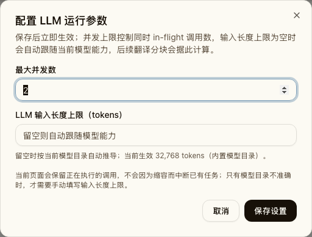
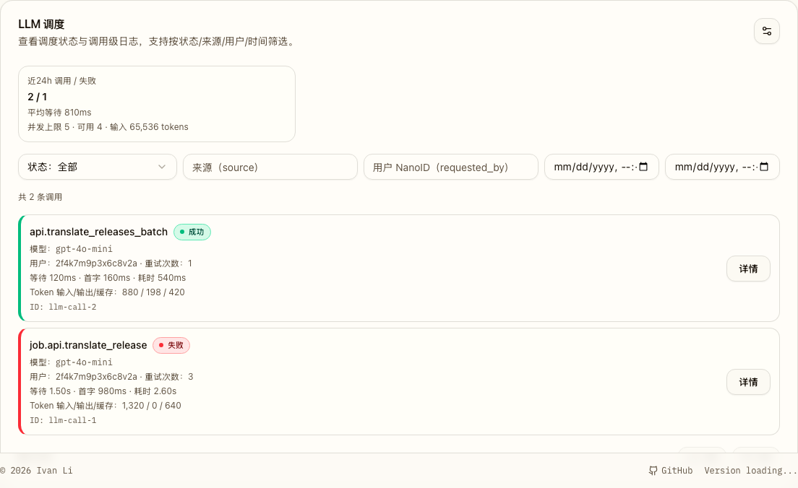
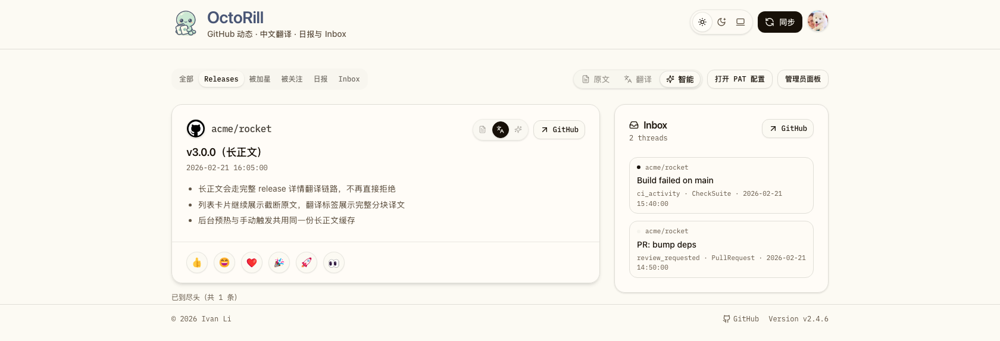

# Release 翻译输入预算与运行时设置收口（#y2yf8）

## 背景 / 问题陈述

- 现有 release feed 曾把“正文过长”直接视为不可翻译，并把列表正文裁切上限错误地混同为翻译限制。
- 实际限制来自上游 LLM 的输入窗口，而不是 release 正文长度本身。
- 管理端 `LLM 调度` 设置弹窗此前只允许调整并发数量，无法在线覆盖模型输入预算，也无法明确说明“超长正文会自动分块翻译”。
- `AI_MODEL_CONTEXT_LIMIT` 作为进程环境变量会制造第二真相源，不符合“后台设置持久化配置”的管理面预期。

## 目标 / 非目标

### Goals

- 把 release 翻译链路统一改成“按 LLM 输入能力计算分块预算”，不再因为正文长度直接拒绝翻译。
- 把管理员 `LLM 调度` 设置弹窗升级为“LLM 运行参数”，新增可选的 `ai_model_context_limit` 持久化配置。
- `GET/PATCH /api/admin/jobs/llm/*` 返回并保存该运行时设置；首次 seed 为空，由模型目录自动推导有效预算。
- release feed 的手动翻译、自动翻译、sync 后后台预热统一复用 `release_detail` 分块译文缓存。
- 文档口径改成“环境变量只负责 AI 接入与并发；模型输入上限由后台运行参数或模型目录决定”。

### Non-goals

- 不新增按用户、按仓库、按模型的细粒度翻译预算配置。
- 不修改 `release_detail` 现有分块 prompt 结构，只调整预算来源。
- 不把 feed 卡片正文的展示截断改成运行时可配置项。

## 范围（Scope）

### In scope

- `admin_runtime_settings` 新增 `ai_model_context_limit` 持久化字段与启动 seed 行为。
- `resolve_model_input_limit_with_source` / release detail chunk budget 改为优先读后台设置，再读模型目录。
- `GET /api/admin/jobs/llm/status`、`PATCH /api/admin/jobs/llm/runtime-config`、管理端弹窗、Storybook/E2E 覆盖同步更新。
- release feed / batch preheat 统一走 `release_detail` 译文与 source hash。
- README、`.env.example`、docs-site 与关联 spec 口径同步。

### Out of scope

- 不新增独立的“翻译正文长度上限”配置。
- 不改动 release smart lane 的生成规则。
- 不把历史已完成 spec 的实现细节整体重写，只补充“已被当前 contract 取代”的说明。

## 需求（Requirements）

### MUST

- release 翻译拆分必须由当前模型输入预算决定，而不是由正文字符数硬拦截。
- 管理端必须允许管理员保存 `ai_model_context_limit`，留空时自动跟随模型目录推导结果。
- release feed 卡片不得再出现“正文过长，无法直接翻译”的终态提示。
- feed 自动翻译 / 手动翻译 / sync 后预热都必须命中同一套 `release_detail` 分块缓存。
- `AI_MODEL_CONTEXT_LIMIT` 不再作为运行时有效值来源，也不再出现在开发文档与样例配置中。

### SHOULD

- 管理端状态摘要展示“当前生效输入上限 + 来源（后台覆盖/同步模型目录/内置模型目录/默认兜底）”。
- 列表正文继续允许 UI 截断，但提示文案必须明确这是展示裁切而不是翻译失败。

### COULD

- 在后续 spec 中为不同模型增加更细的预算调优观测项。

## 功能与行为规格（Functional/Behavior Spec）

### Core flows

- 管理员打开 `/admin/jobs/llm` 设置弹窗时，回填并发上限与 `ai_model_context_limit` 两个值。
- 管理员留空 `ai_model_context_limit` 并保存后，后端持久化 `NULL`；状态接口继续返回当前模型目录推导出的 `effective_model_input_limit`。
- 管理员填写正整数 `ai_model_context_limit` 并保存后，后端持久化该值；后续 release detail 分块预算优先使用这个值。
- release feed 请求翻译结果时，`release_summary/feed_body` 会 canonicalize 到 `release_detail/feed_body`，并使用完整正文 source hash。
- sync 触发的 `translate.release.batch` 统一调用 `translate_release_detail_batch_internal`，复用 detail 分块译文缓存与 ready/missing/error 语义。

### Edge cases / errors

- `ai_model_context_limit` 只能是正整数或 `null`；空串、`0`、负数、非整数都必须被拒绝。
- 当模型目录无法解析当前模型输入上限时，系统回落到内置目录或默认兜底值，并在状态接口中暴露来源。
- release feed 正文即便因 UI 截断而 `body_truncated=true`，翻译仍必须读取完整正文并走分块链路。

## 接口契约（Interfaces & Contracts）

### 接口清单（Inventory）

| 接口（Name） | 类型（Kind） | 范围（Scope） | 变更（Change） | 契约文档（Contract Doc） | 负责人（Owner） | 使用方（Consumers） | 备注（Notes） |
| --- | --- | --- | --- | --- | --- | --- | --- |
| `GET /api/admin/jobs/llm/status` | HTTP API | external | Modify | `./contracts/http-apis.md` | backend | web-admin | 增加 `ai_model_context_limit` 与有效输入预算字段 |
| `PATCH /api/admin/jobs/llm/runtime-config` | HTTP API | external | Modify | `./contracts/http-apis.md` | backend | web-admin | 增加可空 `ai_model_context_limit` |
| `admin_runtime_settings.ai_model_context_limit` | DB schema | internal | New | `./contracts/db.md` | backend | backend | 管理端 LLM 输入预算持久化真相源 |
| release feed canonical translation source | Runtime contract | internal | Modify | `./contracts/db.md` | backend | backend/web | feed 正文统一命中 `release_detail` 分块译文 |

### 契约文档（按 Kind 拆分）

- [contracts/http-apis.md](./contracts/http-apis.md)
- [contracts/db.md](./contracts/db.md)

## 验收标准（Acceptance Criteria）

- Given 管理员打开 `LLM 调度` 设置弹窗
  When 查看表单
  Then 标题为“配置 LLM 运行参数”，并同时展示并发上限与 `LLM 输入长度上限（tokens）` 输入。

- Given 管理员把 `LLM 输入长度上限（tokens）` 留空后保存
  When 再次读取 `/api/admin/jobs/llm/status`
  Then `ai_model_context_limit = null`，并返回非空的 `effective_model_input_limit` 与来源字段。

- Given 某个 release 正文超过 feed 卡片展示裁切长度
  When 触发手动翻译、自动翻译或 sync 后后台预热
  Then 系统仍会产出 `release_detail` 分块译文，而不是返回“正文过长无法翻译”。

- Given release feed 已存在与完整正文匹配的 `release_detail` ready 译文
  When 打开 Dashboard
  Then 列表卡片直接读取该译文，并只在原文区域提示“列表正文已截断显示”。

- Given 本地开发文档或样例配置
  When 查阅 AI 相关配置
  Then 不再出现 `AI_MODEL_CONTEXT_LIMIT` 环境变量说明。

## 实现前置条件（Definition of Ready / Preconditions）

- 主人已确认“限制来自 LLM 输入窗口，而非正文长度上限”。
- 管理端运行参数继续以数据库单例表为真相源。
- release detail 分块翻译链路已可复用，无需新增第二套 chunk pipeline。

## 非功能性验收 / 质量门槛（Quality Gates）

### Testing

- Rust tests: `cargo test`
- Rust lint: `cargo clippy --all-targets -- -D warnings`
- Web checks: `cd web && bun run lint`、`cd web && bun run build`
- Storybook/E2E: `cd web && bun run storybook:build`、`cd web && bun run e2e -- admin-jobs.spec.ts`

### UI / Storybook (if applicable)

- Stories to add/update: `web/src/stories/AdminJobs.stories.tsx`, `web/src/stories/Dashboard.stories.tsx`, `web/src/stories/TranslationWorkerBoard.stories.tsx`
- `play` / interaction coverage to add/update: `LLM 调度` 设置弹窗打开、校验、保存成功；Dashboard 长正文翻译状态
- Visual evidence: 管理端 `LLM 调度` 弹窗与 Dashboard 长正文译文各至少一张 Storybook canvas 图

### Quality checks

- `cargo fmt`
- `bun run lint`
- `bun run build`
- `bun run storybook:build`

## Visual Evidence

## 方案概述（Approach, high-level）

- 保留 feed 卡片的展示裁切常量，仅把它用于 UI 呈现。
- 翻译链路统一 canonicalize 到完整 release detail 正文，并复用现有 detail chunk translator。
- 管理端只提供一个可选的后台覆盖值；留空时完全依赖模型目录/兜底目录推导。

## 风险 / 开放问题 / 假设（Risks, Open Questions, Assumptions）

- 风险：若模型目录缺失当前模型，需要回退到兜底输入预算；过小会增加分块数量，过大可能导致上游拒绝。
- 需要决策的问题：PR/线上部署前是否允许把视觉证据图片随提交一起 push。
- 假设（需主人确认）：feed 卡片原文继续保持固定展示裁切，不把 UI 呈现上限改成管理员配置项。

## 参考（References）

- `docs/specs/3k9fd-release-feed-body-translation/SPEC.md`
- `docs/specs/epn56-admin-jobs-runtime-worker-settings/SPEC.md`
- `docs/specs/g4456-llm-batch-efficiency/SPEC.md`
