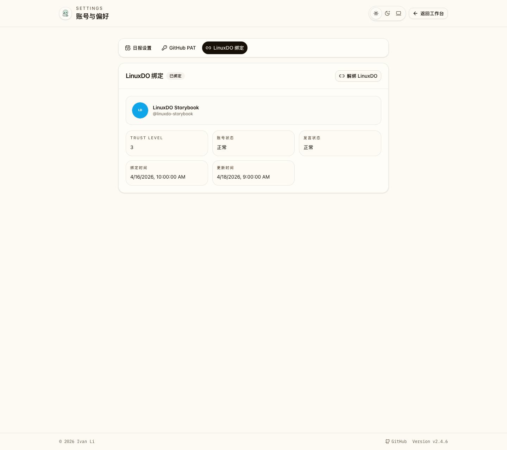
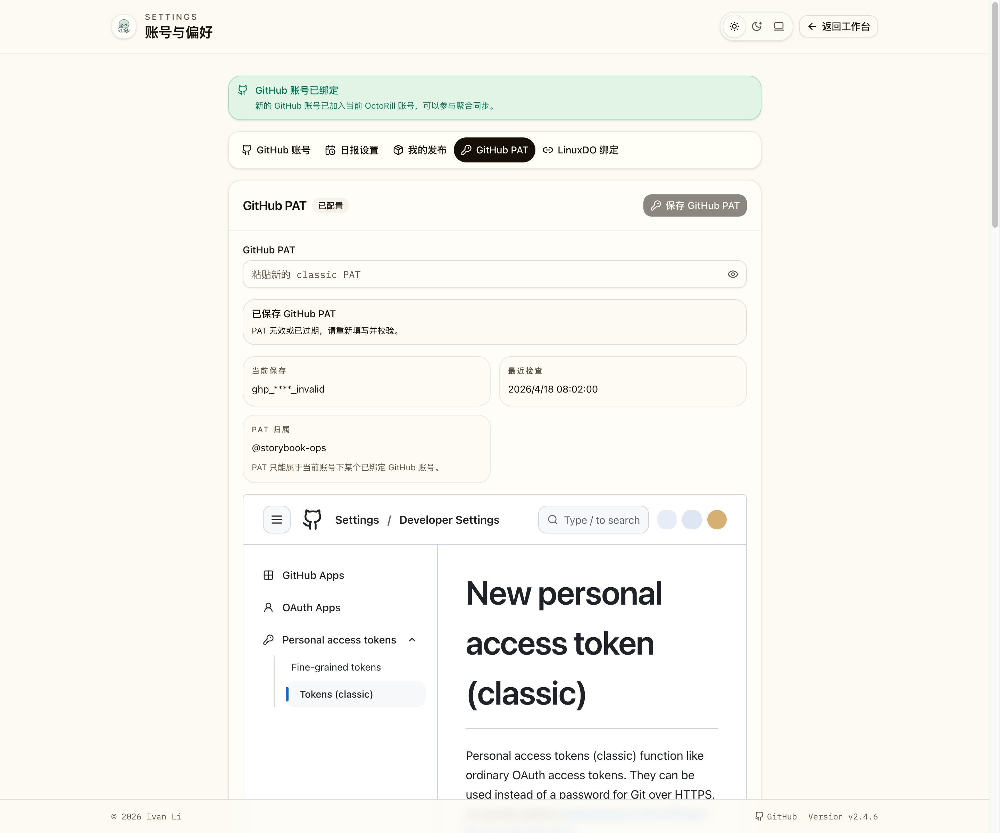
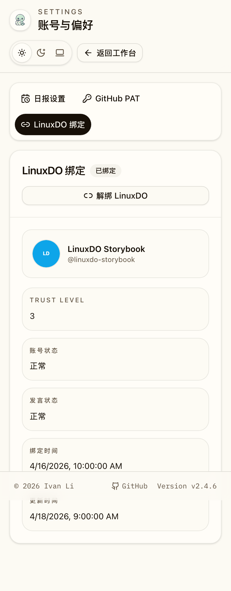
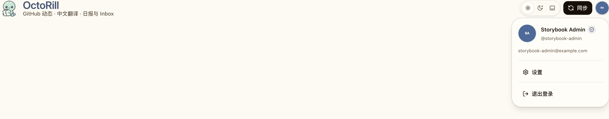
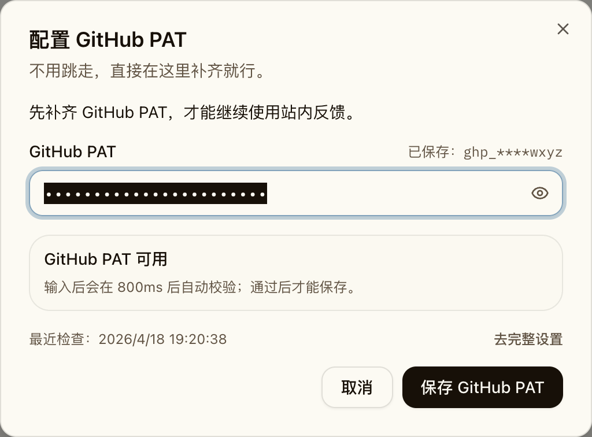

# LinuxDO 绑定与用户设置页改造（#y9ngx）

## 状态

- Status: 已完成
- Created: 2026-04-18
- Last: 2026-04-22

## 背景 / 问题陈述

- 当前普通用户设置分散在 Dashboard 顶部按钮与 Release reaction 的临时 PAT 对话框里，入口零散，后续难以扩展更多账号能力。
- 产品需要新增 LinuxDO Connect 账号绑定，但现有前台没有独立的用户设置承载面。
- GitHub PAT 仍然是站内 reaction 的必要前置条件，但把配置流程挂在触发时临时弹窗里，会打断阅读流，也不利于用户复查当前 token 状态。

## 目标 / 非目标

### Goals

- 新增独立 `/settings` 用户设置页，并从 Dashboard 右上角账号菜单进入。
- 将 LinuxDO OAuth 绑定、GitHub PAT 设置、日报设置统一整合到同一前台设置页。
- 新增 LinuxDO Connect OAuth 绑定链路与本地绑定快照存储，只支持绑定 / 查看 / 解绑，不消费 LinuxDO `api_key`。
- 将 reaction 的 PAT fallback 改成“默认可在弹层内直接补齐 GitHub PAT，仍保留进入 `/settings` 的完整设置入口”。

### Non-goals

- 不新增 LinuxDO PAT 存储、校验或任何 LinuxDO 内容同步能力。
- 不修改 GitHub reaction 的后端语义、权限判断或计数更新逻辑。
- 不改管理员设置体系，也不把普通设置页扩展为后台管理入口。

## 范围（Scope）

### In scope

- `src/config.rs` / `src/state.rs` / `src/auth.rs`：LinuxDO OAuth 可选配置与绑定回调。
- `src/api.rs` / `src/server.rs` / migration：LinuxDO 绑定状态接口与落库。
- `web/src/routes/settings.tsx`、`web/src/pages/Settings.tsx`、相关 settings 组件。
- `web/src/pages/Dashboard.tsx`、`web/src/pages/DashboardHeader.tsx`：账号菜单入口与 PAT fallback UX。
- `web/src/stories/**`、`web/e2e/**`：设置页与账号菜单的可视化覆盖。

### Out of scope

- LinuxDO 内容读取、刷新 token、后台任务、管理员代绑或跨账号绑定。
- 新增独立 Settings API namespace 以外的产品信息架构重构。

## 需求（Requirements）

### MUST

- Dashboard 右上角账号菜单必须新增“设置”入口，并跳转 `/settings`。
- `/settings` 必须至少包含 `linuxdo`、`github-pat`、`daily-brief` 三个稳定 section，并支持 `?section=<id>` 深链定位。
- LinuxDO section 必须能展示“未绑定 / 已绑定 / 服务端未配置”三种状态，并支持发起 OAuth 绑定与解绑。
- GitHub PAT section 必须保留现有 800ms 防抖校验、masked token 展示与仅 `valid` 可保存的门禁。
- Dashboard 弹层与 `/settings` 内的 GitHub PAT 输入框都必须在默认隐藏态使用非 `password` 的文本输入语义，设置 `autocomplete="off"`，并在隐藏态使用视觉掩码隐藏真实内容；仅在用户显式点亮后切到明文，同时补充密码管理器忽略提示，避免被当成当前站点登录密码框自动填充或触发生成密码建议。隐藏态还必须继续保留在辅助功能树中的可聚焦、可编辑语义，并提供额外提示说明当前处于掩码编辑态。
- GitHub PAT 输入框在隐藏态下保留原生文本编辑体验：词级删除、拖放插入与撤销/重做不能因为防自动填充处理而回退。
- GitHub PAT 输入框从明文切回隐藏态时，焦点必须回到显隐切换按钮，避免键盘用户与辅助技术继续停留在刚刚暴露过明文的编辑控件上。
- reaction 在 PAT 缺失或失效时，必须提供可直接输入、校验并保存 GitHub PAT 的快捷弹层；同时保留进入 `/settings?section=github-pat` 的完整设置入口。
- Dashboard 顶部独立“日报设置”按钮必须移除，日报设置迁入 `/settings`。

### SHOULD

- LinuxDO 已绑定态应展示头像、昵称/用户名、信任等级与最近更新时间。
- 设置页应复用现有前台视觉语言与账号菜单组件，不引入第二套用户身份入口。

### COULD

- 设置页可在后续扩展更多用户偏好，但本轮不预埋空白配置项。

## 功能与行为规格（Functional/Behavior Spec）

### Core flows

- 用户在 Dashboard 点击头像菜单中的“设置”后进入 `/settings`，看到 LinuxDO、GitHub PAT、日报设置三块卡片。
- 用户在 LinuxDO 未绑定态点击“连接 LinuxDO”后，浏览器跳转到 LinuxDO Connect 授权页；授权成功回到 `/settings?section=linuxdo`，页面刷新后显示已绑定态。
- 用户在 LinuxDO 已绑定态点击解绑后，本地绑定快照被删除，页面立即回到未绑定态。
- 用户在 GitHub PAT section 输入 token 后，页面用现有 `/api/reaction-token/check` 做 800ms 防抖校验，只有有效时允许保存。
- 用户从 Release reaction 触发缺失/失效 PAT 路径时，页面显示快捷补录弹层；用户可以就地完成 PAT 输入与保存，也可以进入 `/settings?section=github-pat` 查看完整设置。
- 用户在设置页编辑日报设置后，仍通过既有 `/api/me/profile` 保存并回显最新值。

### Edge cases / errors

- 若 LinuxDO OAuth 未配置，设置页展示“暂未启用 LinuxDO 绑定”，连接按钮禁用；手动访问 `/auth/linuxdo/login` 返回明确错误。
- 若 LinuxDO callback 缺少有效 state 或 code，回跳 `/settings?section=linuxdo` 并附带失败标记；前端显示失败提示但保留当前绑定态。
- 若 GitHub PAT 校验返回 401，会继续使用当前已有 session 失效提示文案，不把问题归因为 PAT 本身。
- 若绑定 LinuxDO 时回调返回的 LinuxDO 账号已被其他 OctoRill 用户占用，后端拒绝绑定并返回冲突错误。

## 接口契约（Interfaces & Contracts）

### 接口清单（Inventory）

| 接口（Name） | 类型（Kind） | 范围（Scope） | 变更（Change） | 契约文档（Contract Doc） | 负责人（Owner） | 使用方（Consumers） | 备注（Notes） |
| --- | --- | --- | --- | --- | --- | --- | --- |
| `/settings` + `section` search | Route | internal | New | ./contracts/http-apis.md | web | 前台用户 | `section` 仅允许 `linuxdo` / `github-pat` / `daily-brief` |
| `/auth/linuxdo/login` | HTTP API | external | New | ./contracts/http-apis.md | backend | web | 发起 LinuxDO Connect OAuth |
| `/auth/linuxdo/callback` | HTTP API | external | New | ./contracts/http-apis.md | backend | LinuxDO Connect | 绑定当前已登录用户 |
| `GET /api/me/linuxdo` | HTTP API | external | New | ./contracts/http-apis.md | backend | web | 读取 LinuxDO 绑定状态与可用性 |
| `DELETE /api/me/linuxdo` | HTTP API | external | New | ./contracts/http-apis.md | backend | web | 解绑 LinuxDO |
| `linuxdo_connections` | DB | internal | New | ./contracts/db.md | backend | backend | 存 LinuxDO 绑定快照，不存 token |

### 契约文档（按 Kind 拆分）

- [contracts/README.md](./contracts/README.md)
- [contracts/http-apis.md](./contracts/http-apis.md)
- [contracts/db.md](./contracts/db.md)
- [contracts/deployment.md](./contracts/deployment.md)

## 自托管部署方案（Deployment / Self-hosting）

- LinuxDO 绑定属于可选能力；自托管实例未配置 LinuxDO OAuth 时，设置页会展示“暂未启用 LinuxDO 绑定”，功能保持禁用。
- 自托管启用 LinuxDO 绑定时，必须同时设置 `LINUXDO_CLIENT_ID`、`LINUXDO_CLIENT_SECRET`、`LINUXDO_OAUTH_REDIRECT_URL` 三项环境变量。
- `LINUXDO_OAUTH_REDIRECT_URL` 必须使用 LinuxDO Connect 可访问的公开 callback URL，并与 LinuxDO Connect 后台登记值逐字一致。
- 反向代理部署必须保证 `/auth/linuxdo/callback` 回到 OctoRill 后端；公网域名、端口与协议不一致都视为错误配置。
- 完整步骤、验证方式与常见错误见 [contracts/deployment.md](./contracts/deployment.md)。

## 验收标准（Acceptance Criteria）

- Given 用户已登录 OctoRill Dashboard
  When 打开右上角账号菜单
  Then 菜单中出现“设置”入口，并可跳转到 `/settings`。

- Given 用户访问 `/settings?section=github-pat`
  When 页面渲染完成
  Then 页面滚动/定位到 GitHub PAT section，展示当前 masked token 与 PAT 校验状态，且输入框默认以非 `password` 的文本语义渲染，在隐藏态使用视觉掩码隐藏真实内容、默认关闭自动填充提示、支持显隐切换并附带密码管理器忽略提示，同时保持屏幕阅读器可感知/可编辑并能读到掩码编辑提示。

- Given 用户先显示 GitHub PAT 再点击“隐藏 GitHub PAT”
  When 输入框回到掩码态
  Then 焦点返回显隐切换按钮，避免继续停留在刚刚显示过明文的编辑控件上。

- Given LinuxDO OAuth 已配置且用户尚未绑定
  When 用户在设置页点击“连接 LinuxDO”并完成授权
  Then 用户回到 `/settings?section=linuxdo`，并能看到 LinuxDO 头像、用户名与绑定状态。

- Given 用户已经绑定 LinuxDO
  When 用户点击解绑
  Then 本地 LinuxDO 绑定快照被删除，设置页回到未绑定态。

- Given 用户点击 Release reaction 且 GitHub PAT 缺失或失效
  When 前端处理 fallback
  Then 会出现可直接保存 GitHub PAT 的快捷弹层，并保留跳转 `/settings?section=github-pat` 的入口，且弹层输入框默认保持非 `password` 文本语义、在隐藏态使用视觉掩码隐藏真实内容、默认关闭自动填充提示，仅在用户显式点亮后显示明文，并附带密码管理器忽略提示，同时继续支持隐藏态下的词级删除、拖放插入与撤销/重做。

- Given 用户在设置页修改日报时间或时区
  When 提交保存
  Then 系统继续通过既有 `/api/me/profile` 保存并返回最新设置，不回退原有校验。

## 实现前置条件（Definition of Ready / Preconditions）

- LinuxDO Connect 端点固定为 `https://connect.linux.do/oauth2/authorize`、`/oauth2/token`、`/api/user`
- 前台设置 IA 固定为单页三 section，不另起多标签设置子系统
- LinuxDO 绑定对象固定为“当前已登录 OctoRill 用户”，不支持匿名预绑定或后台改绑

## 非功能性验收 / 质量门槛（Quality Gates）

### Testing

- Rust tests: LinuxDO OAuth config / callback / binding persistence / duplicate binding guard
- Web tests: settings route deep-link, PAT fallback inline editor, LinuxDO section state rendering
- E2E tests: 账号菜单设置入口、设置页 section、PAT fallback 快速补录

### UI / Storybook (if applicable)

- Stories to add/update: Settings page、Dashboard header/account menu、Dashboard PAT fallback state
- Docs pages / state galleries to add/update: Settings state gallery
- `play` / interaction coverage to add/update: 设置入口可见性、深链 section、PAT 快速补录流

### Quality checks

- `cargo check`
- `cargo test`
- `cd web && npm run lint`
- `cd web && npm run build`
- `cd web && npm run storybook:build`
- targeted Playwright

## 文档更新（Docs to Update）

- `docs/specs/README.md`: 新增本规格索引行，并在进度推进时更新状态/备注
- `docs/product.md`: 如设置入口或 LinuxDO 绑定成为用户可见能力，需要同步补充口径

## 计划资产（Plan assets）

- Directory: `docs/specs/y9ngx-linuxdo-user-settings/assets/`
- In-plan references: ``
- Visual evidence source: maintain `## Visual Evidence` in this spec when owner-facing or PR-facing screenshots are needed.

## Visual Evidence

PR: include
设置页桌面端总览（LinuxDO / GitHub PAT / 日报设置）

PR: include
GitHub PAT section 深链态（保留 masked token / 校验状态，输入框默认使用视觉掩码隐藏并支持显隐切换）

PR: include
设置页移动端总览

PR: include
账号菜单中的“设置”入口与 LinuxDO 绑定入口

PR: include
PAT fallback 快速补录弹层（默认使用视觉掩码隐藏、支持显隐切换，并保留完整设置入口）

## 资产晋升（Asset promotion）

None

## 实现里程碑（Milestones / Delivery checklist）

- [x] M1: 新增 LinuxDO 绑定 migration、配置解析、OAuth callback 与 `/api/me/linuxdo` 接口
- [x] M2: 前台 `/settings` 页面落地，并迁移 GitHub PAT / 日报设置入口
- [x] M3: Dashboard 账号菜单与 PAT fallback UX 完成切换
- [x] M4: Storybook、Playwright、视觉证据与文档同步完成

## 方案概述（Approach, high-level）

- 后端复用现有 GitHub OAuth / session 模式，只在 LinuxDO callback 阶段使用临时 access token 获取用户资料，然后落本地绑定快照，不持久化 LinuxDO token。
- 前端新增独立 settings route，以单页 section + anchor 深链承载三类设置，避免继续在 Dashboard 顶部堆叠次级操作。
- Release reaction 继续依赖既有 `/api/reaction-token/*`，仅替换触发 PAT 配置时的交互路径。

## 风险 / 开放问题 / 假设（Risks, Open Questions, Assumptions）

- 风险：LinuxDO Connect 若调整 OAuth 参数或用户字段，需同步更新绑定解析逻辑。
- 风险：新增 settings route 后，route tree 生成与 Storybook mock 需要同步更新，否则容易出现构建漂移。
- 需要决策的问题：None
- 假设（需主人确认）：LinuxDO 绑定只服务于未来的账号关联展示/权限扩展，本轮不需要在产品其它位置消费绑定态。

## 变更记录（Change log）

- 2026-04-22：将 GitHub PAT 输入契约调整为默认保持非 `password` + `autocomplete="off"` + 原生文本编辑配合视觉掩码隐藏、显式点亮后再切到明文，并补充密码管理器忽略提示，同时补齐隐藏态对屏幕阅读器可编辑性的要求、切回隐藏态后的焦点回收、隐藏态快捷键回归覆盖以及原生撤销体验。
- 2026-04-20：补充 GitHub PAT 输入框的非登录自动填充语义要求，覆盖 Dashboard 快捷弹层与 `/settings` 页面。

- 2026-04-18: 新建规格，冻结为 LinuxDO OAuth 绑定 + 统一用户设置页方案。
- 2026-04-19: 设置页文案与布局收敛，补齐桌面端 / 移动端视觉证据并完成实现验证。
- 2026-04-19: 将 PAT fallback 从纯引导弹层调整为可就地保存 GitHub PAT 的快捷弹层，保留完整设置入口。

## 参考（References）

- `docs/specs/76bxs-dashboard-header-brand-layout/SPEC.md`
- `docs/specs/bt8w2-brief-snapshot-timezone/SPEC.md`
- Linux DO Connect wiki: [Linux DO Connect](https://wiki.linux.do/Community/LinuxDoConnect)
