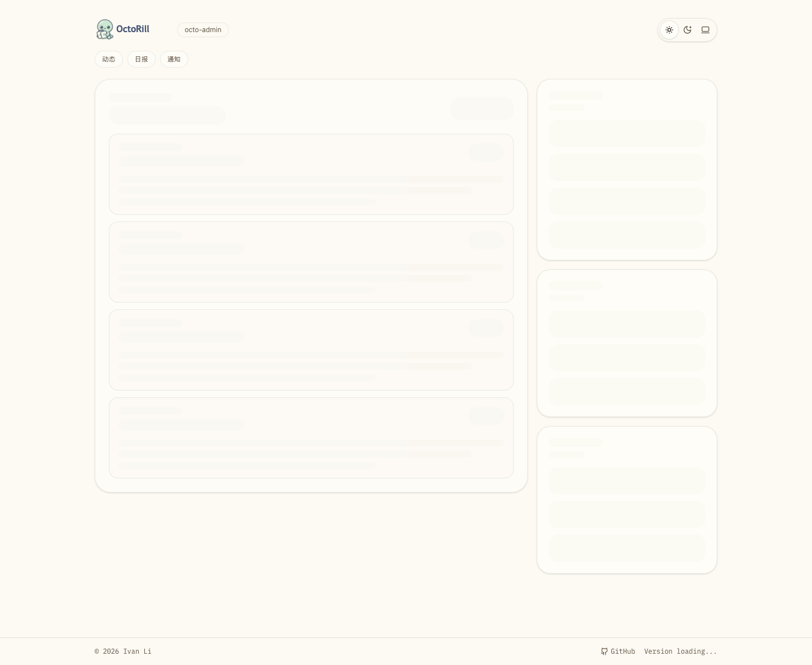
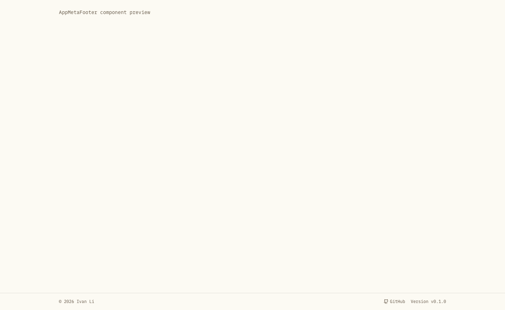

# TanStack Router 接管前端路由并消除登录页闪现（#y9qpf）

## 状态

- Status: 部分完成（3/4）
- Created: 2026-04-15
- Last: 2026-04-15

## 背景 / 问题陈述

当前前端仍停留在“伪 SPA”状态：

- 根组件直接读取 `window.location`，站内切页会触发整页重载。
- Dashboard、Admin Jobs 仍有手写 `history.pushState` / `popstate` / `<a href>` 内部跳转。
- 已登录用户在首屏或站内切页时，会短暂回退到 Landing 登录页，再切回 Dashboard / Admin。

这个闪现既不符合已登录用户预期，也会暴露不该出现的登录 UI。

## 目标 / 非目标

### Goals

- 用 TanStack Router file-based 接管 `/`、`/admin`、`/admin/jobs` 及其现有子路径。
- 将认证 bootstrap 提升到根路由，只在首次进入站点时请求一次 `/api/me`。
- 启动改为三层模型：冷启动品牌初始化态、1 小时内热缓存复用、已识别登录但无热缓存时显示目标页 layout skeleton。
- SPA 导航与页面首次 mount 统一走同一策略：有热缓存先显示上次数据；没有热缓存但已知登录时显示当前页骨架。
- 保留现有关键 deep link 与 URL 语义，并把手写 search/path 状态迁到路由层校验与规范化。
- 为未来 PWA 预留本地缓存启动路径：当前先落 `localStorage` 热缓存，后续可平滑扩展到更重的数据层。
- Footer 版本号改为前端构建期内嵌版本；运行期轮询 `/api/version` / `/api/health` 仅用于比较后端当前版本并提示发现更新，不再显示 `Version loading...` 之类的占位文案。
- 补齐 Storybook、Playwright 与浏览器可视化证据，证明“已登录用户不会再看见登录页闪现”。

### Non-goals

- 不调整 `/api/me`、OAuth、服务端 HTML 注入或 session 契约。
- 不重做公开 URL 体系；继续保留 `/`、`/admin`、`/admin/jobs` 作为主要入口。
- 不改外部 GitHub 链接、`/auth/github/login`、`/auth/logout` 的硬导航语义。

## 范围（Scope）

### In scope

- `web/src/routes/**`、`web/src/router.tsx`、`web/src/App.tsx`
- 根级 auth bootstrap 与 boot surface
- Dashboard / Admin / Admin Jobs 的路由状态迁移
- 站内内部链接改造
- Storybook 审阅入口与 e2e 回归
- `docs/specs/README.md` 与本规格同步

### Out of scope

- 后端 API、数据库、会话刷新逻辑
- SSR、服务端首屏注入
- 站外文档与 GitHub 页面导航策略

## 路由与鉴权契约

- 根路由在首次进入站点时只请求一次 `/api/me`。
- 启动展示按三层优先级决策：
  1. 无可用缓存 => 品牌初始化态（居中 Logo，非移动端附带项目名）
  2. 已识别登录且 1 小时内有匹配热缓存 => 直接复用上次页面数据
  3. 已识别登录但 1 小时内无匹配热缓存 => 显示当前目标页 layout skeleton
- 任一路径在 `/api/me` 返回前都不得出现登录 CTA，也不得暗示“正在检查你是否登录”。
- `/`：
  - 已登录 => Dashboard
  - 未登录 / 401 => Landing
  - 非 401 错误 => Landing + `bootError`
- `/admin`、`/admin/jobs`：仅在 auth bootstrap 完成后执行管理员权限判断；匿名或非管理员统一回到 `/`。
- Dashboard deep links：
  - `/?tab=<tab>` 继续可用
  - `/?release=<id>` 与 `/?tab=briefs&release=<id>` 继续可用，并规范化到合法 search
- Admin Jobs deep links：
  - `/admin/jobs`
  - `/admin/jobs/scheduled`
  - `/admin/jobs/llm`
  - `/admin/jobs/translations?view=queue|history`
  - `/admin/jobs/tasks/:taskId`
  - `/admin/jobs/tasks/:taskId/llm/:callId`

## 验收标准（Acceptance Criteria）

- Given 首次冷启动且本地没有可用缓存
  When `/api/me` 仍未返回
  Then 页面只显示品牌初始化态，`连接到 GitHub` CTA 数量始终为 `0`。

- Given 已识别登录且当前路由在 1 小时内有匹配热缓存
  When 页面启动
  Then 直接先显示上次页面数据，并在后台完成 `/api/me` 与页面数据刷新。

- Given 已识别登录但 1 小时内没有匹配热缓存
  When 页面启动或该页面首次 mount
  Then 先显示当前目标页的 layout skeleton，而不是回退到 Landing 登录卡。

- Given 未登录用户首次打开 `/`
  When `/api/me` 被延迟后返回 `401`
  Then 启动阶段只显示品牌初始化态；请求完成后 Landing 才出现。

- Given 已登录管理员从 Dashboard 切到 `/admin` 再切回 `/`
  When 站内导航完成
  Then 不触发整页 reload，不重复请求 `/api/me`，且不出现 Landing 登录卡闪现。

- Given 用户访问 `/?tab=briefs&release=123` 或 `/?release=123`
  When 页面完成首载
  Then 仍能打开对应 release detail，并把 URL 规范化到合法 search。

- Given 用户访问 `/admin/jobs/translations`
  When 路由校验完成
  Then 页面会规范化到 `/admin/jobs/translations?view=queue`，且后续切换 `history` 仍可直达。

## 非功能性验收 / 质量门槛

### Testing

- Storybook：新增 `Pages/App Boot` 稳定审阅入口，至少覆盖冷启动品牌初始化态、Dashboard skeleton、Admin skeleton。
- Playwright：覆盖首次 cold init、未登录 boot、Dashboard/Admin SPA 导航不重复 boot、关键 deep link 兼容。
- Browser verification：通过本地预览复核 boot surface、Dashboard → Admin → Dashboard 导航，以及 Admin Jobs 深链。

### Quality checks

- `cd web && bun run lint`
- `cd web && bun run build`
- `cd web && bun run storybook:build`
- `cd web && bun run e2e -- app-auth-boot.spec.ts landing-login.spec.ts dashboard-access-sync.spec.ts admin-jobs.spec.ts release-detail.spec.ts`

## 实现里程碑（Milestones / Delivery checklist）

- [x] M1: 接入 TanStack Router file-based 基建，并由根路由统一承接 auth bootstrap。
- [x] M2: `/`、`/admin`、`/admin/jobs` 与相关 URL 状态迁入 Router，站内导航改为 SPA。
- [x] M3: 补齐 Storybook、Playwright 与可视化验证证据。
- [ ] M4: 完成 spec 同步、review-loop 与 merge-ready PR 收口。

## Visual Evidence

- 证据绑定：本地 `HEAD`（2026-04-15）
- 证据源：Storybook stable canvas + Playwright 路由回归
- 浏览器说明：Chrome DevTools 会话在本轮发生连接超时，最终截图改由本地 Playwright 对同一 Storybook iframe 稳定捕获；路由行为仍由 Playwright e2e 全量验证。

### 冷启动品牌初始化态（无登录 CTA）

#### 非移动端

- Story: `Pages/App Boot / Cold Init`
- 证明点：桌面冷启动只显示裸露的 `wordmark` 品牌识别体与软光效，不再套 icon 背景卡片或轮廓圆环；同时不出现 `连接到 GitHub` CTA，也不暗示用户是否已登录。

#### 移动端

- Story: `Pages/App Boot / Cold Init`
- 证明点：移动端冷启动切到单一 `mark` 品牌识别体，仅保留软光效，不再叠加 app icon 背景或额外轮廓圆圈；维持同一中性初始化语义，不因为窄视口退化成登录卡或双 Logo。

### Dashboard 路由骨架（已识别登录但无热缓存）

- Story: `Pages/App Boot / Dashboard Warm Skeleton`
- 证明点：已识别登录但没有匹配热缓存时，直接显示当前目标页的 Dashboard layout skeleton，而不是回退到 Landing 或露出登录 CTA。

### Footer 内嵌版本（无 loading 占位）

- Story: `Layout/App Meta Footer / Default`
- 证明点：footer 直接显示当前前端构建已加载版本，不再出现 `Version loading...`；后端版本变化只通过顶部轻提示表达。

### 登录后稳态页头（保留站内导航入口）

- Story: `Pages/Dashboard Header / Default`
- 证明点：登录后稳态页头保留站内“管理员面板”入口，配合 `app-auth-boot.spec.ts` 证明 Dashboard → Admin → Dashboard 为 SPA 导航且不回退 Landing。

## 风险 / 假设

- 风险：file-based route 与现有手写 URL helper 并存时，若规范化逻辑不一致，可能导致重复 replace/navigation。
- 风险：Storybook 中的内部链接若直接走真实导航，会破坏审阅稳定性；需要保持 mock/stories 中的站内跳转可控。
- 假设：现有 `/api/me` 只负责返回当前用户与 dashboard bootstrap，不引入额外刷新 token 语义。
- 假设：Dashboard 与 Admin Jobs 的 deep link 兼容优先级高于对 public URL 进行产品层面的重命名。
