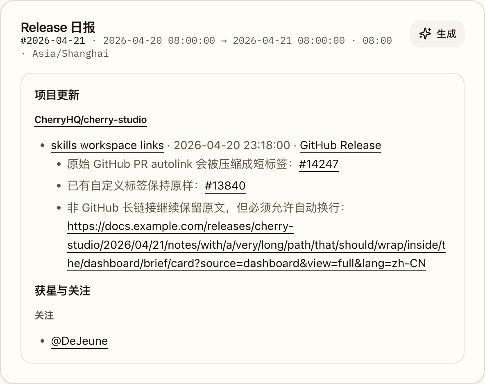
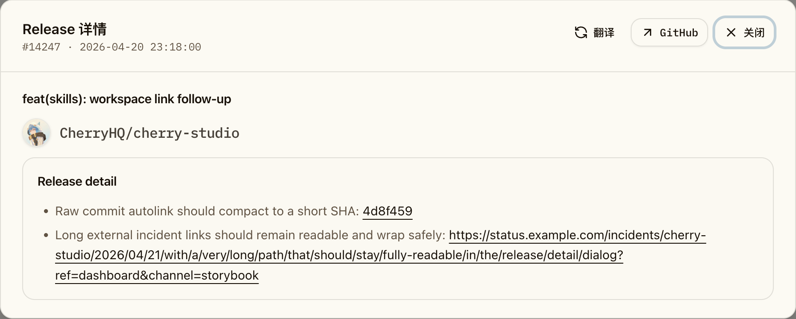

# 共享 Markdown GitHub 链接短标签与自动换行防裁剪（#yhyaj）

## 状态

- Status: 部分完成（3/4）
- Created: 2026-04-21
- Last: 2026-04-21

## 背景 / 问题陈述

- Dashboard `日报` 与历史摘要卡片会直接渲染 shared Markdown；当正文里出现裸 GitHub PR URL 时，当前前端会把整段 URL 原样显示出来，阅读密度很差。
- 同一条 Markdown 复用在 `日报` tab、`全部` tab 历史摘要与 `Release 详情` 弹窗里，任何长链接一旦不允许自然换行，就容易把正文撑出卡片边界，或在圆角容器里出现被裁剪的末尾文本。
- `qvfxq` 已经在后端 canonical brief 里收敛 related links，但前端 shared Markdown 仍需要补一层“只压缩裸 GitHub autolink、保持已有自定义标签不变”的展示守卫，避免历史数据或其它 Markdown 来源继续泄漏超长链接。

## 目标 / 非目标

### Goals

- 对 shared Markdown 中的裸 GitHub autolink 做 GitHub-aware 短标签收敛：PR / Issue -> `#编号`，commit -> 7 位短 SHA，release/tag -> 紧凑标签。
- 保持已有自定义链接文本不变，例如 `GitHub Release`、`#13840`、repo 名称、`@user` 等不得被二次改写。
- 让 shared Markdown 中的超链接在 briefs 卡片、历史摘要与 release detail 弹窗里都能自动换行，不再撑破或被容器裁剪。
- 补齐 Storybook 稳定证据场景、共享 Markdown 回归断言与视觉证据。

### Non-goals

- 不修改 Rust 后端、brief 历史回刷、数据库或任何 API/schema。
- 不调整 Markdown 代码块与表格的横向滚动策略。
- 不处理非 Markdown 区域里的其他 `truncate`/列表型 UI。

## 范围（Scope）

### In scope

- `web/src/components/Markdown.tsx`
- `web/src/stories/Dashboard.stories.tsx`
- `web/e2e/release-detail.spec.ts`
- `docs/specs/README.md`
- `docs/specs/yhyaj-shared-markdown-github-link-wrap/SPEC.md`

### Out of scope

- `src/**`
- 历史 brief snapshot 内容重写
- Release feed / Inbox 等非 shared Markdown 卡片头部布局

## 接口契约（Interfaces & Contracts）

- 不新增或修改任何公开 API、DB schema、后端任务契约或路由参数。
- 仅新增前端内部数据钩子：`data-markdown-root`，用于共享 Markdown 防溢出验证与视觉证据定位。

## 功能与行为规格（Functional / Behavior Spec）

### Shared Markdown 链接文案规则

- 当链接文本等于裸 URL/autolink 时，前端只对 GitHub 链接做短标签收敛。
- GitHub `pull/<number>` 与 `issues/<number>` 渲染为 `#<number>`。
- GitHub `commit/<sha>` 渲染为 7 位短 SHA。
- GitHub `releases/tag/<tag>` 渲染为紧凑 tag 文案；其它 GitHub path 允许回退为截断后的紧凑 path label。
- 非 GitHub 链接保持原始显示文本，不做短标签替换。
- 任何已有 markdown 自定义标签都必须保持原样，不得被再次改写。

### Shared Markdown 防裁剪规则

- shared Markdown 根容器、段落、列表项、引用块、标题与链接都必须允许长文本自然换行。
- briefs 卡片、历史摘要卡片与 release detail 弹窗中的 shared Markdown 不得出现横向撑破、父容器裁剪或链接末尾被遮挡。
- 代码块与表格继续保留各自横向滚动，不被全局换行策略误伤。

### Storybook / 回归

- Dashboard Storybook 必须提供稳定 evidence 场景，覆盖 briefs 卡片中的裸 GitHub PR autolink -> `#14247`。
- 同一组 Storybook 证据还应覆盖 release detail 弹窗中的裸 GitHub commit autolink -> 7 位短 SHA。
- Playwright 回归至少覆盖一次 shared Markdown 复用面：briefs 卡片 + release detail 弹窗都验证短标签与无横向溢出。

## 验收标准（Acceptance Criteria）

- Given briefs 正文中存在裸 GitHub PR URL
  When shared Markdown 渲染完成
  Then 页面显示 `#14247` 这类短标签，而不是完整 GitHub URL。

- Given 正文中已经存在 `GitHub Release`、`#13840`、repo 链接或 `@user` 链接
  When shared Markdown 渲染完成
  Then 这些已有自定义标签保持不变。

- Given briefs 卡片或 release detail 弹窗中存在长外链
  When shared Markdown 渲染完成
  Then 链接允许自动换行，正文不会横向撑破或被圆角容器裁剪。

- Given Markdown 正文中存在代码块或表格
  When 页面渲染完成
  Then 代码块与表格继续使用既有横向滚动策略，不会被强制拆断。

## 非功能性验收 / 质量门槛（Quality Gates）

### Testing

- `cd /Users/ivan/.codex/worktrees/6747/octo-rill/web && bun run lint`
- `cd /Users/ivan/.codex/worktrees/6747/octo-rill/web && bun run build`
- `cd /Users/ivan/.codex/worktrees/6747/octo-rill/web && bun run storybook:build`
- `cd /Users/ivan/.codex/worktrees/6747/octo-rill/web && bun run e2e -- release-detail.spec.ts --grep "shared markdown compacts raw GitHub links and keeps long links wrapped"`

### Visual verification

- 视觉证据目标源固定为 `storybook_canvas`。
- 必须先在聊天里展示最终证据图，再决定是否允许把含截图资产的改动推到远端。
- 证据需要绑定当前本地实现的最新 `HEAD`。

## Visual Evidence

- evidence_head_sha: `06654c6a73b258493904f2518ad74d5334af88e8`
- source_type: `storybook_canvas`
  story_id_or_title: `Pages/Dashboard/Evidence / Briefs GitHub Autolink Wrap`
  state: `brief-card-github-autolink-wrap`
  evidence_note: 验证 briefs 卡片中的裸 GitHub PR autolink 已收敛为 `#14247`，已有 `GitHub Release` / `#13840` 文案保持不变，同时长外链不会撑破卡片。
  image:
  

- source_type: `storybook_canvas`
  story_id_or_title: `Pages/Dashboard/Evidence / Briefs GitHub Autolink Wrap Detail`
  state: `release-detail-github-autolink-wrap`
  evidence_note: 验证 release detail 弹窗中的裸 GitHub commit autolink 已压缩为短 SHA，长外链仍保持原文并允许自动换行。
  image:
  

## 实现里程碑（Milestones / Delivery checklist）

- [x] M1: 冻结 shared Markdown GitHub 短标签与防裁剪 follow-up spec。
- [x] M2: 落地 shared Markdown 链接文案压缩与自动换行样式守卫。
- [x] M3: 补齐 Storybook 场景、共享 Markdown 回归与本地视觉证据。
- [ ] M4: 在得到截图 push 授权后推进远端 PR 收敛到 merge-ready。

## 风险 / 假设

- 风险：shared Markdown 的 wrap 策略若作用域过宽，可能误伤代码块或表格；本轮明确只对常规文本容器与链接加守卫。
- 风险：历史 raw URL brief 仍会依赖前端展示层兜底，若后续需要彻底清洗落库内容，应另开后端 follow-up。
- 假设：shared Markdown 中的裸 URL 主要通过 `remark-gfm` autolink literal 进入前端渲染，因此可以通过“链接文本等于 href”稳定识别。

## 当前收口状态

- 本地实现、Storybook 证据、Playwright 回归、`bun run lint`、`bun run build` 与 `bun run storybook:build` 均已完成。
- `codex review --base origin/main` 已收敛到 clear；最后一轮未发现新的离散可执行问题。
- 下一步仅剩 owner-facing 证据图展示与截图 push 授权；在拿到明确授权前，保持 `部分完成（3/4）`，不推进远端 push / PR。

## References

- `docs/specs/qvfxq-release-daily-brief-v2/SPEC.md`
- `docs/specs/r8m4k-dashboard-brief-detail-auto-height/SPEC.md`
