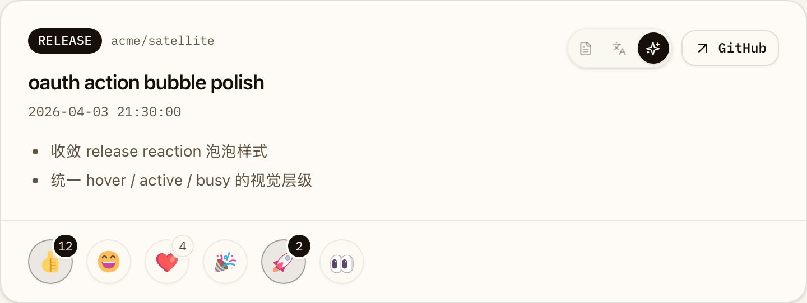

# Release Reaction 扁平化重绘与圆形按钮收敛（#zcp33）

## 状态

- Status: 部分完成（3/4）
- Created: 2026-04-10
- Last: 2026-04-10

## 背景 / 问题陈述

当前 Dashboard release card 底部的 reaction 直接使用系统原生 emoji 字形，不同平台/浏览器下视觉差异较大，也和当前卡片头部、tabs、按钮的扁平化 UI 语气不一致。

同时 reaction 触发器虽然已经使用 `rounded-full`，但按钮宽度仍会被内部计数撑开，视觉上更接近胶囊而不是真正的圆形操作泡泡。

## 目标 / 非目标

### Goals

- 将 `👍 😄 ❤️ 🎉 🚀 👀` 六个 reaction 改为本地入仓、稳定可审阅的扁平化 SVG 图标。
- reaction 按钮改为固定宽高的真圆触发器。
- reaction 计数从按钮内部迁移到按钮外侧独立 badge，避免撑宽按钮。
- 保持现有 reaction 语义、PAT fallback、`aria-pressed` 与 toggle 行为不变。
- 补齐 Dashboard Storybook 预览、视觉证据与 Playwright 回归，并推进到 PR merge-ready。

### Non-goals

- 不改动后端 reaction API、数据库、PAT 校验与 OAuth 流程。
- 不扩展 release detail 弹窗或其他页面的 reaction 样式。
- 不引入完整 emoji 运行时依赖，不做全局 emoji 风格替换。

## 范围（Scope）

### In scope

- `web/src/feed/FeedItemCard.tsx`
- `web/public/reactions/*`
- `web/src/stories/Dashboard.stories.tsx`
- `web/e2e/release-detail.spec.ts`
- `docs/specs/README.md`

### Out of scope

- Rust 后端与 reaction 数据来源
- PAT dialog 布局与行为
- release detail reaction 展示层
- 其他 emoji 或图标系统统一替换

## 需求（Requirements）

### MUST

- 六个 reaction 必须使用同一套扁平化 SVG 资产，不能继续直接渲染原生 emoji 文本。
- reaction trigger 必须为固定宽高圆形，`count=0` 与 `count>0` 两种情况下按钮尺寸一致。
- `count>0` 时 badge 作为按钮外侧独立元素显示；`count=0` 时不显示 badge。
- 保留 reaction 中文 label、`title`、`aria-pressed` 与当前 click/toggle 行为。
- PAT 未配置时，点击 reaction 仍打开现有 PAT 对话框。
- Storybook 必须提供稳定的 reaction-focused 预览面，并写入本 spec 的 `## Visual Evidence`。

### SHOULD

- 资产来源与许可证应在仓库中留有可追溯说明。
- active / hover / busy 状态应延续当前交互层级，只调整视觉表达，不额外增加新交互语义。

## 功能与行为规格（Functional/Behavior Spec）

### Reaction asset source

- 默认采用 `@lobehub/fluent-emoji-flat` 的 SVG 资产子集，仅入仓当前 6 个 reaction 对应文件。
- 资产按语义命名存放在 `web/public/reactions/`，避免运行时依赖远端 CDN 或完整包体。

### Reaction trigger layout

- 每个 reaction 由“圆形按钮 + 可选 badge”组成。
- 圆形按钮尺寸固定；图标永远居中显示。
- badge 作为按钮外侧浮层，显示在右上角偏外位置，不参与按钮宽度计算。
- active 状态继续使用更强的边框/底色层级；busy 状态继续弱化透明度。

### Accessibility

- 按钮保留 `title` 作为悬浮信息。
- `aria-label` 需包含 reaction 中文 label；当存在 count 时可附带数值，确保 badge 外移后读屏信息仍完整。
- 图标作为纯装饰资源，不单独暴露为可访问名称。

## 验收标准（Acceptance Criteria）

- Given release card 渲染 reaction footer
  When UI 显示完成
  Then 六个 reaction 显示为同风格扁平化 SVG，而不是系统原生 emoji。

- Given 某个 reaction 有计数
  When reaction footer 渲染
  Then 圆形按钮尺寸不被撑宽，计数显示在按钮外侧 badge 中。

- Given 某个 reaction 没有计数
  When reaction footer 渲染
  Then 按钮仍保持与有计数时相同的圆形尺寸，且不显示 badge。

- Given 用户点击任一 reaction 且 PAT 未配置
  When 按钮触发 toggle
  Then 仍打开现有 PAT 对话框，而不是出现新的错误路径。

- Given Storybook reaction-focused 场景
  When 查看默认、active、busy 与 zero-count 状态
  Then 可以稳定审阅按钮圆形、外侧 badge 与图标一致性。

## 非功能性验收 / 质量门槛（Quality Gates）

### Testing

- `cd web && bun run lint`
- `cd web && bun run build`
- `cd web && bun run storybook:build`
- `cd web && bun run e2e -- release-detail.spec.ts`

### Visual verification

- 使用 Storybook 稳定场景生成至少一张 reaction owner-facing 视觉证据。
- 视觉证据需写入本 spec 的 `## Visual Evidence`。

## 文档更新（Docs to Update）

- `docs/specs/README.md`
- `docs/specs/zcp33-release-reaction-bubble-polish/SPEC.md`

## 计划资产（Plan assets）

- Directory: `docs/specs/zcp33-release-reaction-bubble-polish/assets/`

## Visual Evidence

- source_type: storybook_canvas
  story_id_or_title: Pages/Dashboard · Evidence / Reaction Bubble Polish
  state: reaction footer polish
  evidence_note: 验证 6 个 reaction 已切换为本地扁平化 SVG，按钮保持真圆，计数 badge 独立浮在按钮外侧。

## 实现里程碑（Milestones / Delivery checklist）

- [x] M1: 新 spec、index 行与 reaction 资产来源说明落盘。
- [x] M2: release card reaction SVG、圆形按钮与外侧 badge 完成。
- [x] M3: Dashboard Storybook reaction-focused 场景与 Playwright 回归完成。
- [ ] M4: 视觉证据、PR 与 review-loop 收敛到 merge-ready。

## 方案概述（Approach, high-level）

- 复用现有 `FeedItemCard` reaction footer 逻辑，只替换表现层和局部结构。
- 使用本地 SVG 资产确保视觉稳定与可追溯。
- 使用 Storybook 作为 reaction 视觉验收与截图的主来源，并让 Playwright 直接验证圆形按钮与 badge 结构。

## 风险 / 开放问题 / 假设（Risks, Open Questions, Assumptions）

- 风险：如果按钮宽高只通过文本流样式控制，后续小改动可能再次退化成胶囊，需要用稳定的固定尺寸与回归断言锁住。
- 开放问题：无。
- 假设：reaction 资产允许以 MIT 许可子集形式随仓库存放。

## Change log

- 2026-04-10：创建规格，冻结“Fluent Flat 子集 + 真圆按钮 + 外侧 badge + Storybook 视觉证据”的执行口径。
- 2026-04-10：完成 `FeedItemCard` reaction footer 的本地 SVG 替换、圆形按钮与外侧 badge 结构，并补入 Storybook reaction-focused 场景与 Playwright 回归。
- 2026-04-10：通过 `bun run lint`、`bun run build`、`bun run storybook:build`、`bun run e2e -- release-detail.spec.ts`，并写入 Storybook 视觉证据，状态更新为 `部分完成（3/4）`。

## 参考（References）

- `web/src/feed/FeedItemCard.tsx`
- `web/src/stories/Dashboard.stories.tsx`
- `web/e2e/release-detail.spec.ts`
- `web/public/reactions/README.md`
